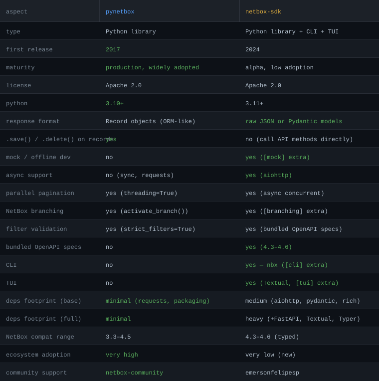

# netbox-sdk

**SDK-first NetBox integration package for Python automation, terminal workflows, and Textual UIs.**

`netbox-sdk` is an SDK-first NetBox toolkit with terminal interfaces built on
one shared runtime:

- `netbox_cli` — Typer command-line interface
- `netbox_tui` — Textual terminal applications
- `netbox_mcp` — schema-driven Model Context Protocol server
- `netbox_sdk` — standalone REST API SDK shared by both

Published package name: `netbox-sdk`. `netbox-console` was a legacy alias published in earlier releases and is no longer shipped from this project.

## Integration Package Details

`netbox-sdk` is an integration package, not a NetBox plugin. It is not installed
into NetBox with `PLUGINS`, does not add Django models or views, and does not
need a plugin config name. Its certification evidence therefore focuses on the
same quality criteria that apply to ecosystem packages: open-source licensing,
package metadata, API compatibility, tests, documentation, support channels, and
release maintainability.

| Area | Evidence |
| --- | --- |
| License | Apache-2.0 in `LICENSE.txt` and `pyproject.toml` package metadata |
| Package | `netbox-sdk` on PyPI, with `netbox_sdk`, `netbox_cli`, `netbox_tui`, and `netbox_mcp` import packages |
| Python | Python `3.11`, `3.12`, and `3.13` |
| NetBox API compatibility | Typed clients for NetBox `4.6`, `4.5`, `4.4`, and `4.3`; live CI against `v4.6.6`, `v4.6.3`, `v4.6.2`, and `v4.5.10` |
| Tests | Mock API suite, live NetBox suite, security tests, type checks, package metadata checks, and strict docs builds in GitHub Actions |
| Support | GitHub issues for bugs/features/docs requests; docs at <https://emersonfelipesp.github.io/netbox-sdk/> |

## Quick Start with the Demo Instance

Install:

```bash
pip install 'netbox-sdk[all]'
```

Authenticate against the public demo instance:

```bash
nbx demo init
```

Try a few commands:

```bash
nbx demo dcim devices list
nbx demo ipam prefixes list
nbx demo tui
nbx demo dev tui
```

## Install

Current release documented on the docs site matches **`docs/snippets/package-version.txt`** (aligned with `pyproject.toml`). For the latest PyPI build you can omit the pin; add `==<version>` to match that documentation snapshot.

Minimal SDK only:

```bash
pip install netbox-sdk
```

CLI:

```bash
pip install 'netbox-sdk[cli]'
```

TUI:

```bash
pip install 'netbox-sdk[tui]'
```

MCP server:

```bash
pip install 'netbox-sdk[mcp]'
```

OpenTelemetry tracing:

```bash
pip install 'netbox-sdk[otel]'
```

Everything:

```bash
pip install 'netbox-sdk[all]'
```

Pinned (same version as the docs site / `package-version.txt`):

```bash
pip install 'netbox-sdk[all]==0.0.9.post2'
```

With `uv` as a user tool:

```bash
uv tool install --force 'netbox-sdk[cli]'
```

Developer checkout:

```bash
git clone https://github.com/emersonfelipesp/netbox-sdk.git
cd netbox-sdk
uv sync --dev --extra cli --extra tui --extra demo --extra mcp
uv run nbx --help
```

## Common Commands

```bash
# Basic CRUD
nbx init
nbx dcim devices list
nbx dcim devices get --id 1
nbx dcim devices create --body-json '{"name":"sw01","site":1}' --confirm
nbx dcim devices patch --id 1 --body-json '{"status":"active"}' --confirm
nbx dcim devices delete --id 1 --confirm

# NetBox version selection
# Default command discovery uses the bundled 4.6 schema; execution detects configured instances.
nbx dcim cable-bundles list --help
nbx --netbox-version 4.5 dcim devices list
NETBOX_SDK_NETBOX_VERSION=4.5 nbx resources dcim

# Auto-pagination — fetch every page in one call
nbx dcim devices list --all
nbx dcim devices list --all --max-records 500

# Filtering
nbx dcim devices list -q status=active -q site=nyc01
nbx dcim devices list -q tag=prod -q tag=edge

# Discover available filter parameters (no HTTP call)
nbx dcim devices filters

# HTTP headers for ETag / conditional update workflows
nbx dcim devices patch --id 1 -H 'If-Match: "etag-value"' --body-json '{"status":"active"}' --confirm
nbx call PATCH /api/dcim/devices/1/ -H 'If-Match: "etag-value"' --body-json '{"status":"active"}' --confirm
nbx dev http patch --path /api/dcim/devices/ --id 1 --body-json '{"status":"active"}' --confirm

# NetBox Branching writes use the same confirmation gate
nbx branching create --name feature-x --confirm
nbx branching sync 7 --confirm

# Bulk operations (array body to list path)
nbx extras tags bulk-patch --body-json '[{"id":1,"color":"aa1409"},{"id":2,"color":"0c7a00"}]' --confirm
nbx extras tags bulk-update --body-json '[{"id":1,"name":"tag-a","slug":"tag-a","color":"ff0000"}]' --confirm
nbx extras tags bulk-delete --body-json '[{"id":1},{"id":2}]' --confirm

# Proxbox plugin catalog, CRUD, TUI, and sync jobs
nbx proxbox resources
nbx proxbox ops firewall/rules
nbx proxbox endpoints proxmox list -q name=pve-prod
nbx proxbox firewall rules patch --id 7 --dry-run --body-json '{"enabled":false}'
nbx proxbox tui --theme
nbx proxbox tui --theme dracula --confirm
nbx proxbox sync --confirm
nbx proxbox sync pve-prod -t virtual-machines -t storage --confirm
nbx proxbox sync-types

# TUI and developer tools
nbx tui
nbx dev tui
nbx cli tui
nbx logs
```

## MCP Server and Agent Safety

Install the `mcp` extra and run the server over stdio (the default):

```bash
pip install 'netbox-sdk[mcp]'
nbx-mcp
```

Streamable HTTP is also available at `/mcp`:

```bash
NETBOX_MCP_AUTH_TOKEN="$NETBOX_MCP_AUTH_TOKEN" nbx-mcp --transport streamable-http --host 127.0.0.1 --port 8000
```

Every Streamable HTTP bind requires a shared-secret bearer token via
`--auth-token` or `NETBOX_MCP_AUTH_TOKEN`; the server refuses to start
without one, including on loopback hosts (`127.0.0.1`/`localhost`/`::1`).
Binding to loopback only restricts *reachability* to this machine — it does
not *authenticate* other local processes or users, who could otherwise reach
the server's loaded NetBox credential (and any active `--allow-mutations`
window) unauthenticated. Prefer `NETBOX_MCP_AUTH_TOKEN` over `--auth-token`
on any shared host: a CLI argument is visible to other local users through
`ps` and `/proc/<pid>/cmdline`, while the environment variable is not:

```bash
NETBOX_MCP_AUTH_TOKEN="$NETBOX_MCP_AUTH_TOKEN" nbx-mcp --transport streamable-http --host 0.0.0.0
```

Every request must then send `Authorization: Bearer <token>`; requests
without it receive `401`.

The server exposes a narrow schema-driven tool set for introspection, reads,
mutations, plugin discovery, and guarded raw calls. It reads the existing
`netbox_sdk.config` profile for stdio credentials and accepts an optional
per-call bearer token. Live mutations are denied by default; enable them only
for a reviewed execution window with `NETBOX_MCP_ALLOW_MUTATIONS=1` or
`--allow-mutations`. A mutation `dry_run=true` only resolves the local request
and does not validate it against NetBox.

Agents can inspect the same JSON capability contract through the CLI:

```bash
nbx groups --json
nbx resources dcim --json
nbx ops dcim devices --json
nbx capabilities --json
```

The `nbx` process itself refuses every dynamic action resolving to a write
method (including raw `POST`/`PUT`/`PATCH`/`DELETE` action spellings),
write-method `nbx call` and `nbx dev http` requests, mutating
`nbx branching`/`nbx branch` verbs, Proxbox CRUD, and Proxbox sync scheduling
unless the invocation includes `--confirm` or its environment contains
`NETBOX_SDK_CONFIRM_WRITE=1`. Dry runs remain available without confirmation.
Repository-local Claude Code and Codex hooks provide an earlier defense-in-depth
denial for recognizable Bash commands, but arbitrary decoded/generated shell
input is ultimately enforced by the CLI gate. The mirrored
`netbox-sdk-operations` Skill in
`.claude/skills/` and `.codex/skills/` documents introspect → preview → execute
→ verify.

## Architecture

- `netbox_sdk` owns config, auth, caching, schema parsing, request resolution, shared formatting, and demo helpers.
- `netbox_cli` owns the `nbx` command tree and lazy-loads `netbox_tui` where needed.
- `netbox_tui` owns all Textual apps, themes, widgets, and TCSS.
- `netbox_mcp` owns the validated MCP tools and imports only `netbox_sdk`.

## Runtime Dependencies

Base SDK installs depend on `aiohttp`, `pydantic`, `email-validator`, `rich`, and
`pyyaml`. Optional extras add the terminal surfaces and local test tools:

- `cli`: Typer-powered `nbx` command tree
- `tui`: Textual terminal applications
- `mcp`: official Python MCP SDK and the `nbx-mcp` server
- `mock`: FastAPI/uvicorn mock NetBox API for integration tests
- `demo`: Playwright-powered demo setup automation
- `branching`: semantic marker for NetBox Branching workflows; no extra runtime
  dependency is required today
- `otel`: OpenTelemetry API, SDK, and OTLP HTTP/protobuf exporter for opt-in
  request tracing

External services are optional at runtime. The Python SDK can target any NetBox
instance reachable over HTTPS/HTTP, and the local mock API can be used for
offline tests.

## OpenTelemetry Request Tracing

Tracing is disabled by default. Install the `otel` extra and enable it with
`NETBOX_OTEL_ENABLED=true` or `Config(otel_enabled=True)` to emit one
OpenTelemetry CLIENT span for each `NetBoxApiClient.request()` call. Spans use
HTTP-client semantic attributes for method, server address, URL path, and final
response status; authorization headers, tokens, and query strings are never added
as span attributes.

The SDK uses an existing global OpenTelemetry provider when the host application
has configured one. Otherwise, when tracing is explicitly enabled, it installs a
provider with a BatchSpanProcessor and the OTLP HTTP/protobuf exporter. Collector
endpoint, headers, service name, resource attributes, sampler, and exporter
selection are controlled by the standard OpenTelemetry environment variables.

| Variable | Purpose |
| --- | --- |
| `NETBOX_OTEL_ENABLED` | SDK-specific opt-in toggle (`true`/`false`) |
| `OTEL_SDK_DISABLED` | Standard OpenTelemetry kill switch; disables SDK tracing when true |
| `OTEL_EXPORTER_OTLP_ENDPOINT` | OTLP collector endpoint for the HTTP exporter |
| `OTEL_EXPORTER_OTLP_PROTOCOL` | Must be `http/protobuf` for the bundled HTTP exporter |
| `OTEL_EXPORTER_OTLP_HEADERS` | Standard OTLP exporter headers |
| `OTEL_SERVICE_NAME` | Service name, defaulting to `netbox-sdk` |
| `OTEL_RESOURCE_ATTRIBUTES` | Additional OpenTelemetry resource attributes |
| `OTEL_TRACES_SAMPLER` | Standard OpenTelemetry sampler selection |
| `OTEL_TRACES_EXPORTER` | Use `otlp` or `none` for the SDK-installed provider |

## netbox-sdk vs pynetbox



## Contributor Workflow

```bash
uv sync --dev --extra cli --extra tui --extra demo --extra mcp
uv run pre-commit install --hook-type pre-commit --hook-type pre-push
uv run pre-commit run --all-files
uv run ty check netbox_sdk netbox_cli netbox_tui netbox_mcp tests
uv run pytest
```

Gitea pull requests targeting `main` also run a secret-free quality gate on the
isolated `ci-untrusted-python312` runner. It covers workflow policy, both type
checkers, pre-commit, the complete offline mocked suite, SDK/CLI/TUI/MCP security
regressions, strict MkDocs, and wheel/sdist metadata plus an installed-wheel
smoke. GitHub retains the Python 3.11–3.13 and live-NetBox matrices. Do not merge
on queued or missing Gitea evidence; `runner_id: 0` means no eligible runner has
accepted the job.

## IDE Support

Open the repository in VS Code. When prompted, install the recommended
extensions (`ms-python.vscode-pylance`, `ms-python.python`,
`charliermarsh.ruff`). Pylance picks up types from all four packages
automatically — each ships a `py.typed` PEP 561 marker.

Type checking uses two gates: `ty` (Astral, fast, pre-commit + CI) and
`pyright` (Pylance-compatible, pre-commit). Both run at `typeCheckingMode =
"basic"`. To run them manually:

```bash
uv run ty check netbox_sdk netbox_cli netbox_tui netbox_mcp tests
uv run pyright netbox_sdk netbox_cli netbox_tui netbox_mcp
```

## Release Process

Use a single GitHub release title pattern for every release:

- `netbox-sdk vX.Y.Z`

Example:

```bash
gh release create v0.0.9.post2 \
  --title "netbox-sdk v0.0.9.post2"
```

When cutting a release, bump **`pyproject.toml`** and **`netbox_sdk.__version__`**, then keep docs in sync: **`docs/snippets/package-version.txt`**, **`mkdocs.yml`** → **`extra.package_version`**, and the version strings in **`docs/snippets/documented-release-*.md`** and **`docs/snippets/pip-pinned-*.txt`** / **`uv-pinned-cli.txt`**. **`uv lock`** must reflect the new version. **`tests/test_docs_alignment.py`** asserts snippet and MkDocs metadata match **`pyproject.toml`**.
