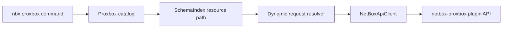

# Proxbox CLI

`nbx proxbox` is the dedicated command surface for the `netbox-proxbox` plugin.
It includes a stable catalog of Proxbox plugin endpoints, generated CRUD
commands, the existing streaming sync workflow, and a Proxbox-focused Textual
request workbench.

Use this surface when you want Proxbox operations without remembering raw plugin
paths such as `/api/plugins/proxbox/firewall/rules/{id}/`.

## Command Map

| Command | Purpose |
|---------|---------|
| `nbx proxbox resources` | Show the catalog with Rich-colored command, category, action, and description columns |
| `nbx proxbox ops RESOURCE` | Show the HTTP methods and paths behind one catalog resource |
| `nbx proxbox <category> <resource> list` | GET a Proxbox list endpoint |
| `nbx proxbox <category> <resource> get --id N` | GET a Proxbox detail endpoint |
| `nbx proxbox <category> <resource> create --body-json ...` | POST to writable list endpoints |
| `nbx proxbox <category> <resource> update --id N --body-json ...` | PUT to writable detail endpoints |
| `nbx proxbox <category> <resource> patch --id N --body-json ...` | PATCH writable detail endpoints |
| `nbx proxbox <category> <resource> delete --id N` | DELETE writable detail endpoints |
| `nbx proxbox sync` | Schedule a guided sync job and stream SSE progress |
| `nbx proxbox tui` | Open the Proxbox-only request workbench |

Read-only Proxbox resources only register read commands. For example,
`operations deletion-requests` and `operations apply-jobs` expose `list` and
`get` only; write subcommands are not present.

## Examples

```bash
# Find supported resources and actions.
nbx proxbox resources
nbx proxbox resources --json

# Inspect one resource before writing automation around it.
nbx proxbox ops firewall/rules
nbx proxbox ops operations/deletion-requests --json

# Standard CRUD commands.
nbx proxbox endpoints proxmox list -q name=pve-prod
nbx proxbox endpoints proxmox get --id 12
nbx proxbox endpoints proxmox create --body-json '{"name":"pve-prod","url":"https://pve.example.com:8006"}' --confirm
nbx proxbox firewall rules patch --id 7 --body-json '{"enabled":false}' --confirm
nbx proxbox sdn vnets delete --id 31 --confirm

# Dry-run write requests without sending them.
nbx proxbox firewall rules patch --id 7 --dry-run --body-json '{"enabled":false}'

# Low-level schedule endpoint. The guided command below is usually better.
nbx proxbox schedule create --dry-run --body-json '{"sync_types":["all"]}'

# Guided sync with live progress bars.
nbx proxbox sync pve-prod -t virtual-machines -t storage --confirm

# Proxbox-only TUI.
nbx proxbox tui
nbx proxbox tui --theme dracula
nbx proxbox tui --theme
```

Live Proxbox CRUD and sync scheduling require `--confirm` or
`NETBOX_SDK_CONFIRM_WRITE=1`; dry runs remain confirmation-free. If a sync SSE
stream fails after scheduling, the CLI still fetches the authoritative NetBox
job and reports its `job_id`, status, and stream error.

## Resource Families

The catalog groups plugin endpoints by operator workflow:

| Family | Examples |
|--------|----------|
| Endpoints | `endpoints proxmox`, `endpoints netbox`, `endpoints pbs`, `endpoints pdm` |
| Inventory | `inventory clusters`, `inventory nodes`, `inventory storage` |
| Virtual machines | `virtual-machines templates`, `virtual-machines cloudinit` |
| Operations | `operations backups`, `operations snapshots`, `operations task-history` |
| Firecracker | `firecracker host-pools`, `firecracker hosts`, `firecracker microvms` |
| Firewall | `firewall security-groups`, `firewall rules`, `firewall ipsets` |
| SDN | `sdn fabrics`, `sdn controllers`, `sdn zones`, `sdn vnets`, `sdn subnets` |
| Views | `views home`, `views dashboard`, `resource-views virtual-machines` |

## Flow



## TUI

`nbx proxbox tui` launches the same request workbench used by `nbx dev tui`,
but with a Proxbox-only schema index. The sidebar starts at the Proxbox catalog,
the method/path/body/response panels work the same way as the developer
workbench, and live plugin discovery is disabled so the catalog remains stable
even when the connected NetBox instance does not expose OpenAPI metadata for the
plugin.
