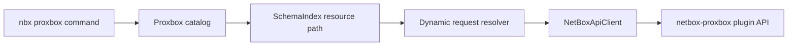

# Proxbox CLI

`nbx proxbox` is the dedicated command surface for the `netbox-proxbox` plugin.
It includes a stable catalog of Proxbox plugin endpoints, generated CRUD
commands, the existing streaming sync workflow, and a Proxbox-focused Textual
request workbench.

Use this surface when you want Proxbox operations without remembering raw plugin
paths such as `/api/plugins/proxbox/firewall/rules/{id}/`.

## Command Map

| Command | Purpose |
|---------|---------|
| `nbx proxbox resources` | Show the catalog with Rich-colored command, category, action, and description columns |
| `nbx proxbox ops RESOURCE` | Show the HTTP methods and paths behind one catalog resource |
| `nbx proxbox <category> <resource> list` | GET a Proxbox list endpoint |
| `nbx proxbox <category> <resource> get --id N` | GET a Proxbox detail endpoint |
| `nbx proxbox <category> <resource> create --body-json ...` | POST to writable list endpoints |
| `nbx proxbox <category> <resource> update --id N --body-json ...` | PUT to writable detail endpoints |
| `nbx proxbox <category> <resource> patch --id N --body-json ...` | PATCH writable detail endpoints |
| `nbx proxbox <category> <resource> delete --id N` | DELETE writable detail endpoints |
| `nbx proxbox sync` | Schedule a guided sync job and stream SSE progress |
| `nbx proxbox jobs list` | List past and running sync jobs with rich filtering |
| `nbx proxbox jobs get JOB_ID` | Show one sync job in full, including parameters and logs |
| `nbx proxbox tui` | Open the Proxbox-only request workbench |

Read-only Proxbox resources only register read commands. For example,
`operations deletion-requests` and `operations apply-jobs` expose `list` and
`get` only; write subcommands are not present.

## Examples

```bash
# Find supported resources and actions.
nbx proxbox resources
nbx proxbox resources --json

# Inspect one resource before writing automation around it.
nbx proxbox ops firewall/rules
nbx proxbox ops operations/deletion-requests --json

# Standard CRUD commands.
nbx proxbox endpoints proxmox list -q name=pve-prod
nbx proxbox endpoints proxmox get --id 12
nbx proxbox endpoints proxmox create --body-json '{"name":"pve-prod","url":"https://pve.example.com:8006"}' --confirm
nbx proxbox firewall rules patch --id 7 --body-json '{"enabled":false}' --confirm
nbx proxbox sdn vnets delete --id 31 --confirm

# Dry-run write requests without sending them.
nbx proxbox firewall rules patch --id 7 --dry-run --body-json '{"enabled":false}'

# Low-level schedule endpoint. The guided command below is usually better.
nbx proxbox schedule create --dry-run --body-json '{"sync_types":["all"]}'

# Guided sync with live progress bars.
nbx proxbox sync pve-prod -t virtual-machines -t storage --confirm

# Proxbox-only TUI.
nbx proxbox tui --confirm
nbx proxbox tui --theme dracula --confirm
nbx proxbox tui --theme
```

Live Proxbox CRUD, sync scheduling, and TUI launch require `--confirm` or
`NETBOX_SDK_CONFIRM_WRITE=1`; dry runs remain confirmation-free. Inside the
request workbench, every POST, PUT, PATCH, or DELETE also requires its own
confirmation dialog showing the method, path, and payload before dispatch. If a sync SSE
stream fails after scheduling, the CLI fetches the authoritative NetBox job
and polls that same job within the remaining timeout when needed. A completed
job stays successful with the disconnect in `warnings`; a failed or still
non-terminal job is reported from its authoritative status without implying
the scheduled work never happened. If the authoritative fetch itself fails,
JSON error output preserves the known `job_id`; automation must inspect that
existing job before considering another sync rather than blindly rescheduling.

## Sync Jobs (`nbx proxbox jobs`)

`nbx proxbox sync` *starts* a sync and streams one job. `nbx proxbox jobs`
answers the other half: which syncs ran, against which endpoints, with what
result, and what they reported.

| Command | Purpose |
|---------|---------|
| `nbx proxbox jobs list` | List Proxbox sync jobs with filters, bounded and reported |
| `nbx proxbox jobs get JOB_ID` | Show one job in full: core fields, parameters, response, log entries |
| `nbx proxbox jobs statuses` | Print the accepted `--status` values |

### How the listing works, and why it is bounded

netbox-proxbox has no job model of its own. A Proxbox sync is a **core NetBox
`core.Job` row** whose `data` carries a `proxbox_sync` block. `GET /api/core/jobs/`
serialises every field an operator needs and filters server-side on status,
name, queue, user, object type/id, id and the four timestamps — but it **cannot
filter on `data`**, which is the only reliable way to tell a Proxbox sync from
any other plugin's job (a run scheduled with a custom job name carries no
recognisable name at all).

So `list` pushes down every filter NetBox understands, then applies the Proxbox
predicate and the parameter filters locally over the rows that come back. Two
consequences are deliberate and visible:

* **A default time window of the last 30 days** bounds the scan. Widen it with
  `--since 90d`, target a different timestamp with `--date-field`, or remove it
  with `--all-time`. Naming explicit job PKs with `--id` also removes it.
* **Every result states its own completeness** — every time bound in effect
  (not just one of them), how many core job rows were scanned, how many matched,
  and, in bold, whether the scan stopped early at `--limit` or `--max-scan`, or
  because the job list shifted underneath it. Drift is caught three ways: a
  repeated page, a core job delivered twice, and — for a scan that believes it
  reached the end — fewer rows seen than NetBox advertised, which is what a
  deletion mid-scan looks like when nothing repeats. `--limit` reports truncation only
  when a further match actually exists, so exactly-`N` matches read as complete.
  A truncated listing never looks complete.

`--since`/`--until` and the explicit `--<field>-after`/`--<field>-before` bounds
are two answers to the same question when they name the same timestamp, so
combining them on one field is refused rather than silently resolved.
`--date-field` selects which timestamp the window applies to, including the
default 30-day look-back when no bound is given at all.

Because the whole job list is scanned, `--all-time` on a large instance is
expensive: core job rows carry their full `log_entries`, so a page of 100 rows
is several hundred kilobytes. Prefer a window or a server-side filter.

### Filters

| Flag | Matches |
|------|---------|
| `--status/-s` (repeatable) | Core job status; pushed down as a multi-value server filter |
| `--type/-t` (repeatable) | Proxbox sync-type slug |
| `--endpoint/-e` (repeatable) | Proxmox endpoint PK or exact name |
| `--cluster` (repeatable) | Proxmox cluster PK or name, matched through its endpoint |
| `--node` (repeatable) | Proxmox node PK or name, matched through its endpoint |
| `--vm` (repeatable) | NetBox virtual machine PK recorded in the run parameters |
| `--run-id` (repeatable) | Proxbox run identifier |
| `--batch-object-type` | Batch object type recorded in the run parameters |
| `--id` (repeatable) | Core job PK; also removes the default window |
| `--user` | NetBox **username** that enqueued the job (not a PK); matched locally |
| `--name`, `--name-contains` | Exact / case-insensitive substring job name |
| `--queue`, `--rq-job-id` | RQ queue name and RQ job UUID |
| `--since`, `--until`, `--date-field` | Relative (`24h`, `7d`, `2w`) or ISO-8601 bounds |
| `--created-after/-before`, `--started-*`, `--completed-*`, `--scheduled-*` | Explicit per-field bounds |
| `--errored` | Failed jobs, plus jobs that finished but recorded an error |
| `--recurring` / `--one-shot` | Jobs with, or without, a schedule interval |

`--endpoint`, `--cluster`, and `--node` are a **union**: a job that touched any
of the named scopes matches.

Three filter semantics are worth stating explicitly, because they decide whether
full syncs show up in scoped queries:

* **An empty endpoint list means "all endpoints".** That is what the schedule
  API stores when no endpoint is named, and such a run really did sync every
  endpoint — so it matches any `--endpoint`/`--cluster`/`--node`, and the
  endpoint column renders `all`.
* **A job recorded as `sync_types: ["all"]` matches every `--type`**, for the
  same reason. A job with no recorded types is treated the same way, since the
  plugin's own default is `all`.
* **`--errored` is broader than a failure status.** A run can finish `completed`
  while recording a stage error, and that is exactly the row an operator is
  looking for. So `--errored` deliberately does *not* narrow the server query to
  the failure statuses — it would discard those rows before they could be
  examined — which means it filters without shrinking the scan.
* **A scope that cannot be read matches nothing.** If a job's recorded endpoint
  or sync-type list is malformed — including a present `null`, which the plugin
  never writes — it is not treated as "everything": a scoped query skips it
  rather than answering from evidence it could not parse. The JSON output
  carries `endpoint_scope` / `sync_type_scope` / `vm_scope` so the distinction
  between *absent*, *empty*, *valid*, and *invalid* is visible.
* **Legacy single-VM jobs are reconstructed from their name.** Rows named
  `Proxbox Sync: Virtual machine <id>` predate the parameters block, so their
  scope is recovered from the name — the same way the plugin does it — and
  flagged with `params_inferred`. Without that, `--vm <id>` would miss the very
  job that targeted that VM.
* **`--user` is matched locally, not pushed to NetBox.** The core job API types
  that filter differently across supported release lines (4.5 expects a user PK,
  4.6+ a username), so a username sent to a 4.5 instance is a validation error
  rather than a filter. It therefore narrows the output but not the scan.

### Output

The default table shows id, status, created, name, sync types, endpoints, and
a truncated error, each column sized to the terminal so the narrow ones are
never squeezed away. `--wide` adds timings, user, queue, VM
targets, run id, and log counts. `--fields id,status,run_id` selects columns
explicitly, and `--json` emits the complete normalized record — every parameter
field, the runtime, the response summary — inside an envelope that also carries
the scan facts. `nbx proxbox jobs get --json` additionally returns the untouched
core job row under `raw`. Both JSON commands emit strict JSON: a non-finite
number anywhere in the job, including that raw row, comes out as `null` rather
than the non-standard literal `Infinity`. `get` takes any core job PK, so it will happily show
another plugin's job — it says so on the record rather than presenting absent
Proxbox parameters as empty ones.

```bash
# Recent sync jobs (last 30 days by default).
nbx proxbox jobs list

# Everything that failed in the last week, widest column set.
nbx proxbox jobs list --since 7d --errored --wide

# Storage syncs that touched one cluster, as JSON for automation.
nbx proxbox jobs list --cluster PVE-CLUSTER-02 --type storage --json

# Every sync for one endpoint, no time bound (expensive on a large instance).
nbx proxbox jobs list --endpoint pve-prod --all-time --max-scan 20000

# Currently running or queued syncs.
nbx proxbox jobs list -s running -s pending --all-time

# One job in full, warnings only.
nbx proxbox jobs get 24422 --log-level warning
nbx proxbox jobs get 24422 --json
```

Every `nbx proxbox jobs` command is **read-only** and needs no `--confirm`.

## Resource Families

The catalog groups plugin endpoints by operator workflow:

| Family | Examples |
|--------|----------|
| Endpoints | `endpoints proxmox`, `endpoints netbox`, `endpoints pbs`, `endpoints pdm` |
| Inventory | `inventory clusters`, `inventory nodes`, `inventory storage` |
| Virtual machines | `virtual-machines templates`, `virtual-machines cloudinit` |
| Operations | `operations backups`, `operations snapshots`, `operations task-history` |
| Firecracker | `firecracker host-pools`, `firecracker hosts`, `firecracker microvms` |
| Firewall | `firewall security-groups`, `firewall rules`, `firewall ipsets` |
| SDN | `sdn fabrics`, `sdn controllers`, `sdn zones`, `sdn vnets`, `sdn subnets` |
| Views | `views home`, `views dashboard`, `resource-views virtual-machines` |

## Flow



## TUI

`nbx proxbox tui` launches the same request workbench used by `nbx dev tui`,
but with a Proxbox-only schema index. The sidebar starts at the Proxbox catalog,
the method/path/body/response panels work the same way as the developer
workbench, and live plugin discovery is disabled so the catalog remains stable
even when the connected NetBox instance does not expose OpenAPI metadata for the
plugin. Launch requires `--confirm` (or `NETBOX_SDK_CONFIRM_WRITE=1`), and each
mutating send requires a second, request-specific confirmation in the TUI.
