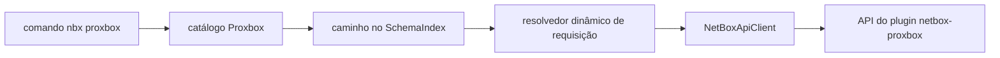

# CLI Proxbox

`nbx proxbox` é a superfície dedicada ao plugin `netbox-proxbox`. Ela inclui um
catálogo estável de endpoints do plugin, comandos CRUD gerados, o fluxo
existente de sincronização com stream e uma bancada Textual focada em Proxbox.

Use esta superfície quando quiser operar Proxbox sem memorizar caminhos brutos
como `/api/plugins/proxbox/firewall/rules/{id}/`.

## Mapa de Comandos

| Comando | Finalidade |
|---------|------------|
| `nbx proxbox resources` | Mostra o catálogo com colunas Rich coloridas de comando, categoria, ações e descrição |
| `nbx proxbox ops RESOURCE` | Mostra métodos HTTP e caminhos de um recurso do catálogo |
| `nbx proxbox <categoria> <recurso> list` | GET no endpoint de lista Proxbox |
| `nbx proxbox <categoria> <recurso> get --id N` | GET no endpoint de detalhe Proxbox |
| `nbx proxbox <categoria> <recurso> create --body-json ...` | POST em endpoints de lista graváveis |
| `nbx proxbox <categoria> <recurso> update --id N --body-json ...` | PUT em endpoints de detalhe graváveis |
| `nbx proxbox <categoria> <recurso> patch --id N --body-json ...` | PATCH em endpoints de detalhe graváveis |
| `nbx proxbox <categoria> <recurso> delete --id N` | DELETE em endpoints de detalhe graváveis |
| `nbx proxbox sync` | Agenda um job de sync guiado e transmite progresso SSE |
| `nbx proxbox tui` | Abre a bancada de requisições somente para Proxbox |

Recursos Proxbox somente leitura registram apenas comandos de leitura. Por
exemplo, `operations deletion-requests` e `operations apply-jobs` expõem apenas
`list` e `get`; subcomandos de escrita não aparecem.

## Exemplos

```bash
# Descobrir recursos e ações suportados.
nbx proxbox resources
nbx proxbox resources --json

# Inspecionar um recurso antes de criar automação.
nbx proxbox ops firewall/rules
nbx proxbox ops operations/deletion-requests --json

# Comandos CRUD padrão.
nbx proxbox endpoints proxmox list -q name=pve-prod
nbx proxbox endpoints proxmox get --id 12
nbx proxbox endpoints proxmox create --body-json '{"name":"pve-prod","url":"https://pve.example.com:8006"}' --confirm
nbx proxbox firewall rules patch --id 7 --body-json '{"enabled":false}' --confirm
nbx proxbox sdn vnets delete --id 31 --confirm

# Simular escritas sem enviar a requisição.
nbx proxbox firewall rules patch --id 7 --dry-run --body-json '{"enabled":false}'

# Endpoint baixo nível de agendamento. O comando guiado abaixo costuma ser melhor.
nbx proxbox schedule create --dry-run --body-json '{"sync_types":["all"]}'

# Sync guiado com barras de progresso ao vivo.
nbx proxbox sync pve-prod -t virtual-machines -t storage --confirm

# TUI somente para Proxbox.
nbx proxbox tui
nbx proxbox tui --theme dracula
nbx proxbox tui --theme
```

CRUD Proxbox real e agendamento de sync exigem `--confirm` ou
`NETBOX_SDK_CONFIRM_WRITE=1`; dry runs continuam sem confirmação. Se o stream
SSE de um sync falhar após o agendamento, a CLI busca o job autoritativo no
NetBox e consulta esse mesmo job dentro do timeout restante quando necessário.
Um job concluído continua bem-sucedido com a desconexão em `warnings`; um job
com falha ou ainda não terminal é informado pelo status autoritativo sem
sugerir que o trabalho agendado nunca ocorreu.

## Famílias de Recursos

O catálogo agrupa endpoints do plugin por fluxo operacional:

| Família | Exemplos |
|---------|----------|
| Endpoints | `endpoints proxmox`, `endpoints netbox`, `endpoints pbs`, `endpoints pdm` |
| Inventário | `inventory clusters`, `inventory nodes`, `inventory storage` |
| Máquinas virtuais | `virtual-machines templates`, `virtual-machines cloudinit` |
| Operações | `operations backups`, `operations snapshots`, `operations task-history` |
| Firecracker | `firecracker host-pools`, `firecracker hosts`, `firecracker microvms` |
| Firewall | `firewall security-groups`, `firewall rules`, `firewall ipsets` |
| SDN | `sdn fabrics`, `sdn controllers`, `sdn zones`, `sdn vnets`, `sdn subnets` |
| Views | `views home`, `views dashboard`, `resource-views virtual-machines` |

## Fluxo



## TUI

`nbx proxbox tui` lança a mesma bancada de requisições usada por `nbx dev tui`,
mas com índice de esquema somente Proxbox. A barra lateral começa no catálogo
Proxbox, os painéis de método/caminho/corpo/resposta funcionam como na bancada
de desenvolvedor, e a descoberta ao vivo de plugins fica desativada para manter
o catálogo estável mesmo quando a instância NetBox conectada não expõe metadados
OpenAPI do plugin.
