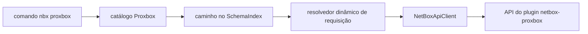

# CLI Proxbox

`nbx proxbox` é a superfície dedicada ao plugin `netbox-proxbox`. Ela inclui um
catálogo estável de endpoints do plugin, comandos CRUD gerados, o fluxo
existente de sincronização com stream e uma bancada Textual focada em Proxbox.

Use esta superfície quando quiser operar Proxbox sem memorizar caminhos brutos
como `/api/plugins/proxbox/firewall/rules/{id}/`.

## Mapa de Comandos

| Comando | Finalidade |
|---------|------------|
| `nbx proxbox resources` | Mostra o catálogo com colunas Rich coloridas de comando, categoria, ações e descrição |
| `nbx proxbox ops RESOURCE` | Mostra métodos HTTP e caminhos de um recurso do catálogo |
| `nbx proxbox <categoria> <recurso> list` | GET no endpoint de lista Proxbox |
| `nbx proxbox <categoria> <recurso> get --id N` | GET no endpoint de detalhe Proxbox |
| `nbx proxbox <categoria> <recurso> create --body-json ...` | POST em endpoints de lista graváveis |
| `nbx proxbox <categoria> <recurso> update --id N --body-json ...` | PUT em endpoints de detalhe graváveis |
| `nbx proxbox <categoria> <recurso> patch --id N --body-json ...` | PATCH em endpoints de detalhe graváveis |
| `nbx proxbox <categoria> <recurso> delete --id N` | DELETE em endpoints de detalhe graváveis |
| `nbx proxbox sync` | Agenda um job de sync guiado e transmite progresso SSE |
| `nbx proxbox jobs list` | Lista jobs de sync passados e em execução com filtros ricos |
| `nbx proxbox jobs get JOB_ID` | Mostra um job de sync completo, com parâmetros e logs |
| `nbx proxbox tui` | Abre a bancada de requisições somente para Proxbox |

Recursos Proxbox somente leitura registram apenas comandos de leitura. Por
exemplo, `operations deletion-requests` e `operations apply-jobs` expõem apenas
`list` e `get`; subcomandos de escrita não aparecem.

## Exemplos

```bash
# Descobrir recursos e ações suportados.
nbx proxbox resources
nbx proxbox resources --json

# Inspecionar um recurso antes de criar automação.
nbx proxbox ops firewall/rules
nbx proxbox ops operations/deletion-requests --json

# Comandos CRUD padrão.
nbx proxbox endpoints proxmox list -q name=pve-prod
nbx proxbox endpoints proxmox get --id 12
nbx proxbox endpoints proxmox create --body-json '{"name":"pve-prod","url":"https://pve.example.com:8006"}' --confirm
nbx proxbox firewall rules patch --id 7 --body-json '{"enabled":false}' --confirm
nbx proxbox sdn vnets delete --id 31 --confirm

# Simular escritas sem enviar a requisição.
nbx proxbox firewall rules patch --id 7 --dry-run --body-json '{"enabled":false}'

# Endpoint baixo nível de agendamento. O comando guiado abaixo costuma ser melhor.
nbx proxbox schedule create --dry-run --body-json '{"sync_types":["all"]}'

# Sync guiado com barras de progresso ao vivo.
nbx proxbox sync pve-prod -t virtual-machines -t storage --confirm

# TUI somente para Proxbox.
nbx proxbox tui --confirm
nbx proxbox tui --theme dracula --confirm
nbx proxbox tui --theme
```

CRUD Proxbox real, agendamento de sync e abertura da TUI exigem `--confirm` ou
`NETBOX_SDK_CONFIRM_WRITE=1`; dry runs continuam sem confirmação. Dentro da
bancada, cada POST, PUT, PATCH ou DELETE também exige seu próprio diálogo de
confirmação com método, caminho e payload antes do envio. Se o stream
SSE de um sync falhar após o agendamento, a CLI busca o job autoritativo no
NetBox e consulta esse mesmo job dentro do timeout restante quando necessário.
Um job concluído continua bem-sucedido com a desconexão em `warnings`; um job
com falha ou ainda não terminal é informado pelo status autoritativo sem
sugerir que o trabalho agendado nunca ocorreu. Se a própria busca autoritativa
falhar, a saída de erro JSON preserva o `job_id` conhecido; a automação deve
inspecionar esse job existente antes de considerar outro sync, sem reagendar às
cegas.

## Jobs de Sincronização (`nbx proxbox jobs`)

`nbx proxbox sync` *inicia* uma sincronização e transmite um job.
`nbx proxbox jobs` responde à outra metade: quais sincronizações rodaram, contra
quais endpoints, com qual resultado e o que reportaram.

| Comando | Finalidade |
|---------|------------|
| `nbx proxbox jobs list` | Lista jobs de sync Proxbox com filtros, limitada e reportada |
| `nbx proxbox jobs get JOB_ID` | Mostra um job completo: campos do core, parâmetros, resposta e log |
| `nbx proxbox jobs statuses` | Imprime os valores aceitos por `--status` |

### Como a listagem funciona, e por que é limitada

O netbox-proxbox não tem modelo de job próprio. Uma sincronização Proxbox é uma
linha **`core.Job` do NetBox** cujo `data` carrega um bloco `proxbox_sync`.
`GET /api/core/jobs/` serializa todos os campos necessários e filtra no servidor
por status, nome, fila, usuário, tipo/id de objeto, id e os quatro timestamps —
mas **não filtra por `data`**, que é a única forma confiável de distinguir uma
sincronização Proxbox do job de qualquer outro plugin (uma execução agendada com
nome customizado não carrega nome reconhecível algum).

Assim, `list` empurra para o servidor todo filtro que o NetBox entende e depois
aplica o predicado Proxbox e os filtros de parâmetros localmente sobre as linhas
retornadas. Duas consequências são deliberadas e visíveis:

* **Uma janela padrão dos últimos 30 dias** limita a varredura. Amplie com
  `--since 90d`, mire outro timestamp com `--date-field` ou remova com
  `--all-time`. Informar PKs explícitos com `--id` também remove a janela.
* **Todo resultado declara a própria completude** — todos os limites de tempo em
  vigor (não apenas um), quantas linhas de job foram varridas, quantas casaram
  e, em destaque, se a varredura parou cedo em `--limit`, em `--max-scan` ou
  porque a lista de jobs mudou durante a leitura. A deriva é detectada de três
  formas: uma página repetida, um job entregue duas vezes e — para uma varredura
  que acredita ter chegado ao fim — menos linhas vistas do que o NetBox anunciou,
  que é a aparência de uma exclusão no meio da leitura quando nada se repete. O `--limit` só reporta
  truncamento quando existe de fato mais um resultado, então exatamente `N`
  casos aparecem como completos. Uma listagem truncada nunca parece completa.

`--since`/`--until` e os limites explícitos `--<campo>-after`/`--<campo>-before`
são duas respostas para a mesma pergunta quando miram o mesmo timestamp, então
combiná-los no mesmo campo é recusado em vez de resolvido silenciosamente. O
`--date-field` escolhe a qual timestamp a janela se aplica, inclusive a janela
padrão de 30 dias quando nenhum limite é informado.

Como a lista inteira é varrida, `--all-time` em uma instância grande é caro: as
linhas de job carregam todos os seus `log_entries`, então uma página de 100
linhas já tem algumas centenas de kilobytes. Prefira uma janela ou um filtro
resolvido no servidor.

### Filtros

| Flag | Casa com |
|------|----------|
| `--status/-s` (repetível) | Status do job no core; enviado como filtro multi-valor ao servidor |
| `--type/-t` (repetível) | Slug de tipo de sync do Proxbox |
| `--endpoint/-e` (repetível) | PK ou nome exato do endpoint Proxmox |
| `--cluster` (repetível) | PK ou nome do cluster Proxmox, casado pelo endpoint dele |
| `--node` (repetível) | PK ou nome do node Proxmox, casado pelo endpoint dele |
| `--vm` (repetível) | PK da máquina virtual NetBox registrada nos parâmetros |
| `--run-id` (repetível) | Identificador da execução Proxbox |
| `--batch-object-type` | Tipo de objeto em lote registrado nos parâmetros |
| `--id` (repetível) | PK do job no core; também remove a janela padrão |
| `--user` | **Nome de usuário** NetBox que enfileirou o job (não o PK); casado localmente |
| `--name`, `--name-contains` | Nome exato / substring sem diferenciar maiúsculas |
| `--queue`, `--rq-job-id` | Nome da fila RQ e UUID do job RQ |
| `--since`, `--until`, `--date-field` | Limites relativos (`24h`, `7d`, `2w`) ou ISO-8601 |
| `--created-after/-before`, `--started-*`, `--completed-*`, `--scheduled-*` | Limites explícitos por campo |
| `--errored` | Jobs que falharam, mais jobs que terminaram registrando erro |
| `--recurring` / `--one-shot` | Jobs com, ou sem, intervalo de agendamento |

`--endpoint`, `--cluster` e `--node` formam uma **união**: um job que tocou
qualquer um dos escopos citados casa.

Três semânticas de filtro merecem destaque, porque decidem se sincronizações
completas aparecem em consultas com escopo:

* **Lista de endpoints vazia significa "todos os endpoints".** É o que a API de
  agendamento grava quando nenhum endpoint é informado, e essa execução de fato
  sincronizou todos — portanto ela casa com qualquer
  `--endpoint`/`--cluster`/`--node`, e a coluna de endpoint mostra `all`.
* **Um job com `sync_types: ["all"]` casa com qualquer `--type`**, pelo mesmo
  motivo. Um job sem tipos registrados recebe o mesmo tratamento, já que o
  padrão do próprio plugin é `all`.
* **`--errored` é mais amplo que um status de falha.** Uma execução pode
  terminar `completed` registrando erro de estágio, e é exatamente essa linha
  que o operador procura. Por isso `--errored` deliberadamente *não* restringe a
  consulta do servidor aos status de falha — isso descartaria essas linhas antes
  de examiná-las — ou seja, ele filtra sem reduzir a varredura.
* **Um escopo ilegível não casa com nada.** Se a lista de endpoints ou de tipos
  registrada em um job estiver malformada — inclusive um `null` presente, que o
  plugin nunca grava — ela não é tratada como "tudo": uma consulta com escopo
  pula a linha em vez de responder a partir de evidência que não conseguiu
  interpretar. A saída JSON traz `endpoint_scope` / `sync_type_scope` /
  `vm_scope`, tornando visível a diferença entre *ausente*, *vazio*, *válido* e
  *inválido*.
* **Jobs legados de VM única são reconstruídos pelo nome.** Linhas chamadas
  `Proxbox Sync: Virtual machine <id>` são anteriores ao bloco de parâmetros,
  então o escopo é recuperado do nome — do mesmo modo que o plugin faz — e
  marcado com `params_inferred`. Sem isso, `--vm <id>` perderia justamente o job
  que mirou aquela VM.
* **`--user` é casado localmente, não enviado ao NetBox.** A API de jobs do core
  tipa esse filtro de formas diferentes entre as linhas suportadas (4.5 espera o
  PK do usuário, 4.6+ o nome), então um nome enviado a uma instância 4.5 vira
  erro de validação em vez de filtro. Ele restringe a saída, não a varredura.

### Saída

A tabela padrão mostra id, status, criação, nome, tipos de sync, endpoints e um
erro truncado, com cada coluna dimensionada ao terminal para que as estreitas
nunca sejam espremidas. `--wide` acrescenta tempos, usuário, fila, alvos
de VM, run id e contagem de logs. `--fields id,status,run_id` escolhe colunas
explicitamente, e `--json` emite o registro normalizado completo — todo campo de
parâmetro, o tempo de execução, o resumo da resposta — dentro de um envelope que
também carrega os fatos da varredura. `nbx proxbox jobs get --json` ainda
devolve a linha original do job em `raw`. Os dois comandos JSON emitem JSON
estrito: um número não finito em qualquer ponto do job, inclusive nessa linha
original, sai como `null` em vez do literal não padronizado `Infinity`. O `get` aceita qualquer PK de job do
core, então também mostra o job de outro plugin — e avisa no registro, em vez de
apresentar parâmetros Proxbox ausentes como se estivessem vazios.

```bash
# Jobs recentes (últimos 30 dias por padrão).
nbx proxbox jobs list

# Tudo que falhou na última semana, com o conjunto amplo de colunas.
nbx proxbox jobs list --since 7d --errored --wide

# Syncs de storage que tocaram um cluster, em JSON para automação.
nbx proxbox jobs list --cluster PVE-CLUSTER-02 --type storage --json

# Todo sync de um endpoint, sem limite de tempo (caro em instância grande).
nbx proxbox jobs list --endpoint pve-prod --all-time --max-scan 20000

# Syncs em execução ou na fila.
nbx proxbox jobs list -s running -s pending --all-time

# Um job completo, apenas avisos.
nbx proxbox jobs get 24422 --log-level warning
nbx proxbox jobs get 24422 --json
```

Todos os comandos `nbx proxbox jobs` são **somente leitura** e não exigem
`--confirm`.

## Famílias de Recursos

O catálogo agrupa endpoints do plugin por fluxo operacional:

| Família | Exemplos |
|---------|----------|
| Endpoints | `endpoints proxmox`, `endpoints netbox`, `endpoints pbs`, `endpoints pdm` |
| Inventário | `inventory clusters`, `inventory nodes`, `inventory storage` |
| Máquinas virtuais | `virtual-machines templates`, `virtual-machines cloudinit` |
| Operações | `operations backups`, `operations snapshots`, `operations task-history` |
| Firecracker | `firecracker host-pools`, `firecracker hosts`, `firecracker microvms` |
| Firewall | `firewall security-groups`, `firewall rules`, `firewall ipsets` |
| SDN | `sdn fabrics`, `sdn controllers`, `sdn zones`, `sdn vnets`, `sdn subnets` |
| Views | `views home`, `views dashboard`, `resource-views virtual-machines` |

## Fluxo



## TUI

`nbx proxbox tui` lança a mesma bancada de requisições usada por `nbx dev tui`,
mas com índice de esquema somente Proxbox. A barra lateral começa no catálogo
Proxbox, os painéis de método/caminho/corpo/resposta funcionam como na bancada
de desenvolvedor, e a descoberta ao vivo de plugins fica desativada para manter
o catálogo estável mesmo quando a instância NetBox conectada não expõe metadados
OpenAPI do plugin. A abertura exige `--confirm` (ou
`NETBOX_SDK_CONFIRM_WRITE=1`) e cada envio mutável exige uma segunda confirmação
específica da requisição dentro da TUI.
