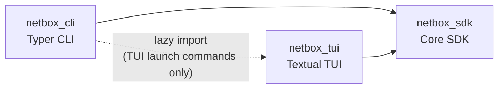
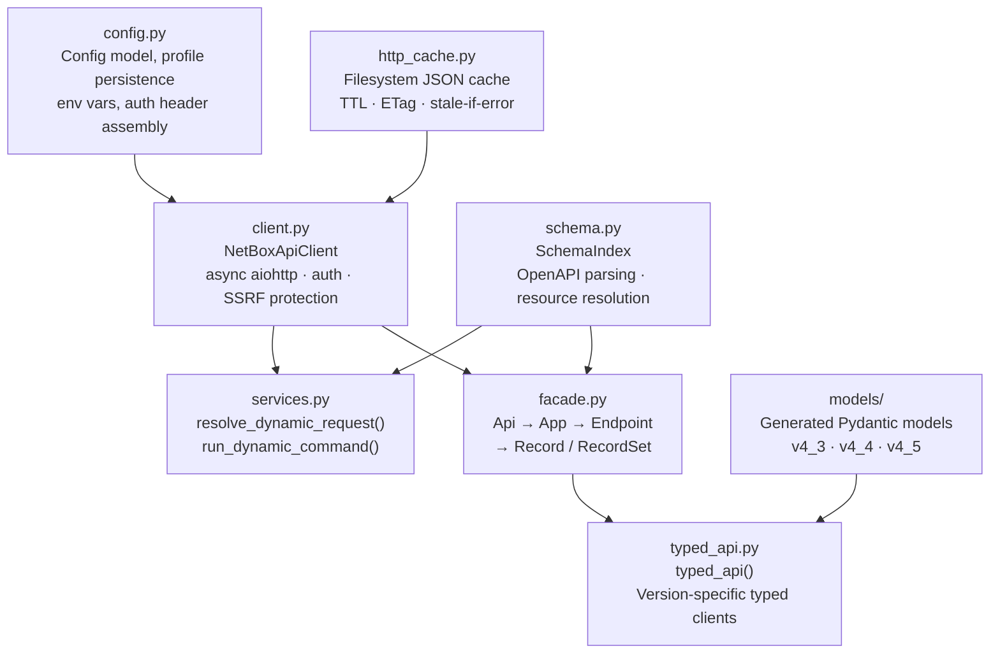

# Architecture

The repository is organized as three sibling Python packages sharing one runtime:

- `netbox_sdk` — standalone API/SDK layer (no CLI or TUI dependencies)
- `netbox_cli` — Typer CLI layer (requires `[cli]` extra)
- `netbox_tui` — Textual TUI layer (requires `[tui]` extra)

---

## Dependency Direction



`netbox_sdk` is the stable core. It must remain importable without Typer or Textual installed.

---

## SDK Internal Components



| Module | Role |
|---|---|
| `config.py` | Pydantic `Config` model, multi-profile persistence, token sanitization, environment variable loading |
| `client.py` | `NetBoxApiClient` — async aiohttp HTTP client, auth injection, HTTP cache integration, SSRF protection |
| `http_cache.py` | `HttpCacheStore` — filesystem JSON cache with TTL, ETag/If-Modified-Since, stale-if-error |
| `schema.py` | `SchemaIndex` — parses bundled OpenAPI JSON into groups, resources, operations, and filter params |
| `services.py` | `resolve_dynamic_request()` / `run_dynamic_command()` — maps CLI actions to HTTP calls |
| `facade.py` | `api()` — PyNetBox-style async facade: `Api → App → Endpoint → Record/RecordSet` |
| `typed_api.py` | `typed_api()` — version-specific typed clients with Pydantic request/response models |
| `models/` | Generated Pydantic models for NetBox 4.3, 4.4, and 4.5 |

---

## Package Layout

??? note "Full package tree"

    ```
    netbox_sdk/
      __init__.py
      client.py
      config.py
      http_cache.py
      schema.py
      services.py
      plugin_discovery.py
      formatting.py
      logging_runtime.py
      output_safety.py
      trace_ascii.py
      demo_auth.py
      facade.py
      typed_api.py
      typed_runtime.py
      versioning.py
      exceptions.py
      models/
        v4_3.py · v4_4.py · v4_5.py
      typed_versions/
        v4_3.py · v4_4.py · v4_5.py
      django_models/
      reference/openapi/
        netbox-openapi.json (default)
        netbox-openapi-4.3.json
        netbox-openapi-4.4.json
        netbox-openapi-4.5.json

    netbox_cli/
      __init__.py
      runtime.py
      dynamic.py
      support.py
      demo.py
      dev.py
      django_model.py
      markdown_output.py
      docgen_capture.py
      docgen_specs.py
      docgen/

    netbox_tui/
      __init__.py
      app.py
      cli_tui.py
      dev_app.py
      logs_app.py
      graphql_app.py
      django_model_app.py
      chrome.py
      navigation.py
      nav_blueprint.py
      panels.py
      widgets.py
      state.py
      dev_state.py
      django_model_state.py
      graphql_state.py
      filter_overlay.py
      theme_registry.py
      *.tcss
      themes/*.json
    ```

---

## Data Flow

=== "CLI"

    ```mermaid
    flowchart LR
        CMD["nbx dcim devices list"]
        INIT["netbox_cli.__init__\nroot Typer app"]
        DYN["netbox_cli.dynamic\n_register_openapi_subcommands()"]
        SVC["netbox_sdk.services\nresolve_dynamic_request()"]
        CLIENT["netbox_sdk.client\nNetBoxApiClient.request()"]
        OUT["netbox_cli.support\nmarkdown_output"]

        CMD --> INIT --> DYN --> SVC --> CLIENT --> OUT
    ```

    1. `nbx` dispatches to the root Typer app in `netbox_cli/__init__.py`
    2. `netbox_cli.dynamic` registers all `nbx <group> <resource> <action>` commands at startup from the OpenAPI schema
    3. `netbox_sdk.services.resolve_dynamic_request()` maps the action to `(method, path, query, payload)`
    4. `NetBoxApiClient.request()` executes the HTTP call with auth, caching, and SSRF protection
    5. `support` / `markdown_output` render the response as Rich tables or Markdown

=== "TUI"

    ```mermaid
    flowchart LR
        CMD2["nbx tui"]
        LAZY["netbox_cli\nlazy-imports netbox_tui"]
        APP["netbox_tui.app\nNetBoxTuiApp"]
        SDK2["netbox_sdk\nclient · schema · formatting"]
        TUI2["Textual\nwidgets · TCSS · theme registry"]

        CMD2 --> LAZY --> APP --> SDK2 --> TUI2
    ```

    1. `nbx tui` in `netbox_cli/__init__.py` lazy-imports `netbox_tui` (so `import netbox_cli` works without Textual)
    2. `NetBoxTuiApp` takes the active `NetBoxApiClient` and `SchemaIndex` from the CLI runtime
    3. All data queries go through `netbox_sdk.client` and `netbox_sdk.schema`
    4. Formatting (badges, labels, colors) comes from `netbox_sdk.formatting`
    5. UI layout is pure Textual: TCSS stylesheets + theme registry

---

## Responsibilities

### `netbox_sdk`

Owns:

- API client behavior (HTTP, auth, caching, token refresh, file upload)
- Profile and config loading from disk and environment variables
- HTTP response caching (filesystem-backed, ETag/If-Modified-Since)
- OpenAPI schema indexing and resource resolution
- Dynamic request resolution from `(group, resource, action)` tuples
- Plugin discovery helpers
- Shared formatting and output safety utilities
- Demo auth helpers and Django model parsing/cache helpers
- All three public API layers: `NetBoxApiClient`, `api()`, `typed_api()`

### `netbox_cli`

Owns:

- `nbx` entrypoint and root command registration
- Runtime config/index/client factories (`netbox_cli/runtime.py`)
- Dynamic command wiring from OpenAPI schema (`netbox_cli/dynamic.py`)
- CLI output rendering (`support.py`, `markdown_output.py`)
- Demo/dev/docgen command trees

CLI commands that launch a TUI must lazy-import `netbox_tui` and surface an install hint for `pip install 'netbox-sdk[tui]'` when needed.

### `netbox_tui`

Owns:

- All six Textual applications: `NetBoxTuiApp`, `NbxCliTuiApp`, `NetBoxDevTuiApp`, `NetBoxGraphqlTuiApp`, `NetBoxLogsTuiApp`, `DjangoModelTuiApp`
- Shared Textual widgets, chrome, panels, and state management
- TCSS stylesheets and theme registry

Shared data transformations (`semantic_cell`, `humanize_value`, row parsing) live in `netbox_sdk.formatting`, not in the TUI package.

---

## Packaging

| Install command | What you get |
|---|---|
| `pip install netbox-sdk` | `netbox_sdk` only — SDK, no CLI or TUI |
| `pip install 'netbox-sdk[cli]'` | `netbox_sdk` + `netbox_cli` |
| `pip install 'netbox-sdk[tui]'` | `netbox_sdk` + `netbox_tui` |
| `pip install 'netbox-sdk[all]'` | Everything including demo tooling |

---

## Verification

For architecture-affecting changes, run:

```bash
uv sync --dev --extra cli --extra tui --extra demo
uv run pre-commit run --all-files
uv run pytest
```
