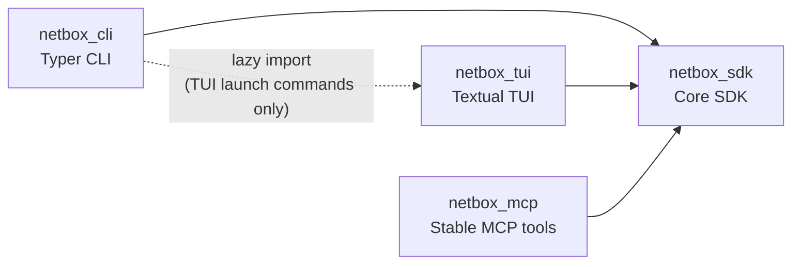
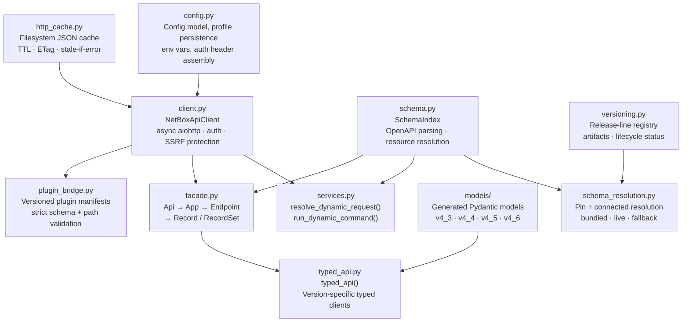

# Architecture

The repository is organized as four sibling Python packages sharing one runtime:

- `netbox_sdk` — standalone API/SDK layer (no CLI or TUI dependencies)
- `netbox_cli` — Typer CLI layer (requires `[cli]` extra)
- `netbox_tui` — Textual TUI layer (requires `[tui]` extra)
- `netbox_mcp` — stable Model Context Protocol adapter (requires `[mcp]` extra)

---

## Dependency Direction


```mermaid
flowchart LR
    CLI["netbox_cli\nTyper CLI"]
    TUI["netbox_tui\nTextual TUI"]
    SDK["netbox_sdk\nCore SDK"]
    MCP["netbox_mcp\nStable MCP tools"]

    CLI --> SDK
    TUI --> SDK
    MCP --> SDK
    CLI -. "lazy import\n(TUI launch commands only)" .-> TUI
```

`netbox_sdk` is the stable core. It must remain importable without Typer or Textual installed.

---

## SDK Internal Components


```mermaid
flowchart TB
    config["config.py\nConfig model, profile persistence\nenv vars, auth header assembly"]
    cache["http_cache.py\nFilesystem JSON cache\nTTL · ETag · stale-if-error"]
    client["client.py\nNetBoxApiClient\nasync aiohttp · auth · SSRF protection"]
    schema["schema.py\nSchemaIndex\nOpenAPI parsing · resource resolution"]
    versions["versioning.py\nRelease-line registry\nartifacts · lifecycle status"]
    resolution["schema_resolution.py\nPin + connected resolution\nbundled · live · fallback"]
    services["services.py\nresolve_dynamic_request()\nrun_dynamic_command()"]
    facade["facade.py\nApi → App → Endpoint\n→ Record / RecordSet"]
    typed["typed_api.py\ntyped_api()\nVersion-specific typed clients"]
    models["models/\nGenerated Pydantic models\nv4_3 · v4_4 · v4_5 · v4_6"]
    bridge["plugin_bridge.py\nVersioned plugin manifests\nstrict schema + path validation"]

    config --> client
    cache --> client
    versions --> resolution
    schema --> resolution
    schema --> services
    client --> services
    client --> facade
    schema --> facade
    facade --> typed
    models --> typed
    client --> bridge
```

| Module | Role |
|---|---|
| `config.py` | Pydantic `Config` model, multi-profile persistence, token sanitization, environment variable loading |
| `client.py` | `NetBoxApiClient` — async aiohttp HTTP client, auth injection, HTTP cache integration, SSRF protection |
| `http_cache.py` | `HttpCacheStore` — filesystem JSON cache with TTL, ETag/If-Modified-Since, stale-if-error |
| `schema.py` | `SchemaIndex` — parses bundled OpenAPI JSON into groups, resources, operations, and filter params |
| `versioning.py` | Frozen release-line registry owning the OpenAPI asset, generated-model module, typed module, and lifecycle status for each supported line |
| `schema_resolution.py` | Shared override parsing, process-cached clone-isolated bundled indexes, connected detection, live-schema fetch, and default fallback |
| `services.py` | `resolve_dynamic_request()` / `run_dynamic_command()` — maps CLI actions to HTTP calls |
| `plugin_bridge.py` | Discovers versioned semantic plugin manifests, validates hostile contracts and payloads, and resolves fixed plugin-local targets |
| `facade.py` | `api()` — PyNetBox-style async facade: `Api → App → Endpoint → Record/RecordSet` |
| `typed_api.py` | `typed_api()` — version-specific typed clients with Pydantic request/response models |
| `models/` | Generated Pydantic models for NetBox 4.3, 4.4, 4.5, and 4.6 |

---

## Package Layout

??? note "Full package tree"

    ```
    netbox_sdk/
      __init__.py
      client.py
      config.py
      http_cache.py
      schema.py
      schema_resolution.py
      services.py
      plugin_discovery.py
      plugin_bridge.py
      formatting.py
      logging_runtime.py
      output_safety.py
      trace_ascii.py
      demo_auth.py
      facade.py
      typed_api.py
      typed_runtime.py
      versioning.py
      exceptions.py
      models/
        v4_3.py · v4_4.py · v4_5.py · v4_6.py
      typed_versions/
        v4_3.py · v4_4.py · v4_5.py · v4_6.py
      django_models/
      reference/openapi/
        netbox-openapi.json (legacy alias)
        netbox-openapi-4.3.json
        netbox-openapi-4.4.json
        netbox-openapi-4.5.json
        netbox-openapi-4.6.json (default)

    netbox_cli/
      __init__.py
      runtime.py
      dynamic.py
      support.py
      demo.py
      dev.py
      django_model.py
      markdown_output.py
      branching.py
      decorators.py
      tui_simulation.py
      docgen_capture.py
      docgen_specs.py
      docgen/

    netbox_tui/
      __init__.py
      app.py
      cli_tui.py
      dev_app.py
      logs_app.py
      graphql_app.py
      django_model_app.py
      chrome.py
      navigation.py
      nav_blueprint.py
      panels.py
      widgets.py
      state.py
      dev_state.py
      django_model_state.py
      graphql_state.py
      filter_overlay.py
      branch_screen.py
      login_modal.py
      ssl_verify_support.py
      cli_completions.py
      dev_rendering.py
      lifecycle.py
      logo_render.py
      theme_registry.py
      *.tcss
      themes/*.json

    netbox_mcp/
      __init__.py
      __main__.py
      app.py
      models.py
      service.py
      py.typed
    ```

---

## Data Flow

=== "CLI"

    ```mermaid
    flowchart LR
        CMD["nbx dcim devices list"]
        INIT["netbox_cli.__init__\nroot Typer app"]
        DYN["netbox_cli.dynamic\n_register_openapi_subcommands()"]
        SVC["netbox_sdk.services\nresolve_dynamic_request()"]
        CLIENT["netbox_sdk.client\nNetBoxApiClient.request()"]
        OUT["netbox_cli.support\nmarkdown_output"]

        CMD --> INIT --> DYN --> SVC --> CLIENT --> OUT
    ```

    1. `nbx` dispatches to the root Typer app in `netbox_cli/__init__.py`
    2. `netbox_cli.dynamic` registers all `nbx <group> <resource> <action>` commands at startup from the OpenAPI schema
    3. `netbox_sdk.services.resolve_dynamic_request()` maps the action to `(method, path, query, payload)`
    4. `NetBoxApiClient.request()` executes the HTTP call with auth, caching, and SSRF protection
    5. `support` / `markdown_output` render the response as Rich tables or Markdown

=== "TUI"

    ```mermaid
    flowchart LR
        CMD2["nbx tui"]
        LAZY["netbox_cli\nlazy-imports netbox_tui"]
        APP["netbox_tui.app\nNetBoxTuiApp"]
        SDK2["netbox_sdk\nclient · schema · formatting"]
        TUI2["Textual\nwidgets · TCSS · theme registry"]

        CMD2 --> LAZY --> APP --> SDK2 --> TUI2
    ```

    1. `nbx tui` in `netbox_cli/__init__.py` lazy-imports `netbox_tui` (so `import netbox_cli` works without Textual)
    2. `NetBoxTuiApp` takes the active `NetBoxApiClient` and `SchemaIndex` from the CLI runtime
    3. All data queries go through `netbox_sdk.client` and `netbox_sdk.schema`
    4. Formatting (badges, labels, colors) comes from `netbox_sdk.formatting`
    5. UI layout is pure Textual: TCSS stylesheets + theme registry

=== "MCP plugin bridge"

    ```mermaid
    flowchart LR
        AGENT["MCP client"]
        TOOLS["plugin_list_tools / plugin_call_tool"]
        BRIDGE["netbox_sdk.plugin_bridge\ncontract validation"]
        CLIENT3["NetBoxApiClient"]
        PLUGIN["Existing plugin DRF view\npermissions + operation"]

        AGENT --> TOOLS --> BRIDGE --> CLIENT3 --> PLUGIN
    ```

    1. The stable MCP tools discover an explicit version 1 advertisement from
       the plugin API root.
    2. `plugin_bridge` confines links and target paths, then validates the
       manifest and invocation schemas.
    3. `NetBoxApiClient.request_bounded()` performs fresh, uncached discovery
       and target requests with the normal NetBox credential, redirects off,
       and a streamed decompressed-body limit.
    4. The existing DRF endpoint remains responsible for authorization and the
       operation; write dispatch also requires the MCP mutation gate.

---

## Responsibilities

### `netbox_sdk`

Owns:

- API client behavior (HTTP, auth, caching, token refresh, file upload)
- Profile and config loading from disk and environment variables
- HTTP response caching (filesystem-backed, ETag/If-Modified-Since)
- OpenAPI schema indexing and resource resolution
- Release-line metadata and the shared explicit-pin → detected bundle → live
  schema → default-bundle resolution policy
- Dynamic request resolution from `(group, resource, action)` tuples
- OpenAPI plugin discovery plus versioned semantic plugin-bridge contracts
- Shared formatting and output safety utilities
- Demo auth helpers and Django model parsing/cache helpers
- All three public API layers: `NetBoxApiClient`, `api()`, `typed_api()`

### `netbox_cli`

Owns:

- `nbx` entrypoint and root command registration
- Runtime config/index/client factories (`netbox_cli/runtime.py`)
- Dynamic command wiring from OpenAPI schema (`netbox_cli/dynamic.py`)
- CLI output rendering (`support.py`, `markdown_output.py`)
- Demo/dev/docgen command trees

CLI commands that launch a TUI must lazy-import `netbox_tui` and surface an install hint for `pip install 'netbox-sdk[tui]'` when needed.

### `netbox_tui`

Owns:

- All six Textual applications: `NetBoxTuiApp`, `NbxCliTuiApp`, `NetBoxDevTuiApp`, `NetBoxGraphqlTuiApp`, `NetBoxLogsTuiApp`, `DjangoModelTuiApp`
- Shared Textual widgets, chrome, panels, and state management
- TCSS stylesheets and theme registry

Shared data transformations (`semantic_cell`, `humanize_value`, row parsing) live in `netbox_sdk.formatting`, not in the TUI package.

### `netbox_mcp`

Owns:

- A stable, explicitly registered MCP tool inventory
- Strict Pydantic validation at the transport boundary
- `plugin_list_tools` and `plugin_call_tool` over `netbox_sdk.plugin_bridge`
- Transport authentication and the disabled-by-default mutation gate

Plugin tools never create a second credential or HTTP stack. Discovery and
execution both use `NetBoxApiClient`; the existing plugin DRF endpoint remains
the authorization and operation boundary.

---

## Packaging

| Install command | What you get |
|---|---|
| `pip install netbox-sdk` | `netbox_sdk` only — SDK, no CLI or TUI |
| `pip install 'netbox-sdk[cli]'` | `netbox_sdk` + `netbox_cli` |
| `pip install 'netbox-sdk[tui]'` | `netbox_sdk` + `netbox_tui` |
| `pip install 'netbox-sdk[mcp]'` | `netbox_sdk` + `netbox_mcp` |
| `pip install 'netbox-sdk[all]'` | Everything including demo tooling |

---

## Verification

For architecture-affecting changes, run:

```bash
uv sync --dev --extra cli --extra tui --extra demo --extra mcp
uv run pre-commit run --all-files
uv run pytest
```
