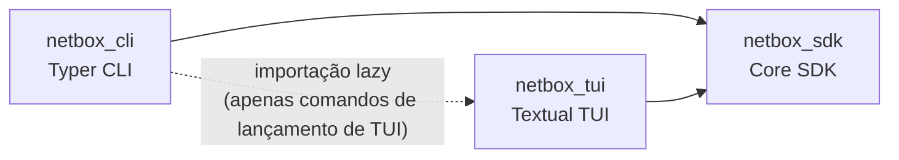
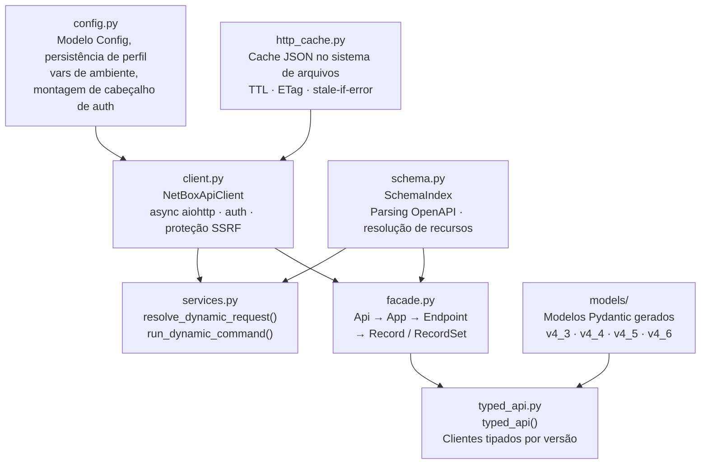

# Arquitetura

O repositório está organizado em três pacotes Python irmãos que compartilham um único runtime:

- `netbox_sdk` — camada API/SDK independente (sem dependências de CLI ou TUI)
- `netbox_cli` — camada CLI Typer (requer o extra `[cli]`)
- `netbox_tui` — camada TUI Textual (requer o extra `[tui]`)

---

## Direção das dependências



`netbox_sdk` é o núcleo estável. Deve permanecer importável sem Typer ou Textual instalados.

---

## Componentes internos do SDK



| Módulo | Função |
|---|---|
| `config.py` | Modelo Pydantic `Config`, persistência de múltiplos perfis, sanitização de tokens, carregamento de variáveis de ambiente |
| `client.py` | `NetBoxApiClient` — cliente HTTP async aiohttp, injeção de auth, integração com cache HTTP, proteção SSRF |
| `http_cache.py` | `HttpCacheStore` — cache JSON em disco com TTL, ETag/If-Modified-Since, stale-if-error |
| `schema.py` | `SchemaIndex` — analisa JSON OpenAPI em grupos, recursos, operações e parâmetros de filtro |
| `services.py` | `resolve_dynamic_request()` / `run_dynamic_command()` — mapeia ações CLI para chamadas HTTP |
| `facade.py` | `api()` — fachada async estilo PyNetBox: `Api → App → Endpoint → Record/RecordSet` |
| `typed_api.py` | `typed_api()` — clientes tipados por versão com modelos Pydantic de request/response |
| `models/` | Modelos Pydantic gerados para NetBox 4.3, 4.4, 4.5 e 4.6 |

---

## Estrutura dos pacotes

??? note "Árvore completa de pacotes"

    ```
    netbox_sdk/
      __init__.py
      client.py
      config.py
      http_cache.py
      schema.py
      services.py
      plugin_discovery.py
      formatting.py
      logging_runtime.py
      output_safety.py
      trace_ascii.py
      demo_auth.py
      facade.py
      typed_api.py
      typed_runtime.py
      versioning.py
      exceptions.py
      models/
        v4_3.py · v4_4.py · v4_5.py · v4_6.py
      typed_versions/
        v4_3.py · v4_4.py · v4_5.py · v4_6.py
      django_models/
      reference/openapi/
        netbox-openapi.json (padrão)
        netbox-openapi-4.3.json
        netbox-openapi-4.4.json
        netbox-openapi-4.5.json
        netbox-openapi-4.6.json

    netbox_cli/
      __init__.py
      runtime.py
      dynamic.py
      support.py
      demo.py
      dev.py
      django_model.py
      markdown_output.py
      docgen_capture.py
      docgen_specs.py
      docgen/

    netbox_tui/
      __init__.py
      app.py
      cli_tui.py
      dev_app.py
      logs_app.py
      graphql_app.py
      django_model_app.py
      chrome.py
      navigation.py
      nav_blueprint.py
      panels.py
      widgets.py
      state.py
      dev_state.py
      django_model_state.py
      graphql_state.py
      filter_overlay.py
      theme_registry.py
      *.tcss
      themes/*.json
    ```

---

## Fluxo de dados

=== "CLI"

    ```mermaid
    flowchart LR
        CMD["nbx dcim devices list"]
        INIT["netbox_cli.__init__\naplicação Typer raiz"]
        DYN["netbox_cli.dynamic\n_register_openapi_subcommands()"]
        SVC["netbox_sdk.services\nresolve_dynamic_request()"]
        CLIENT["netbox_sdk.client\nNetBoxApiClient.request()"]
        OUT["netbox_cli.support\nmarkdown_output"]

        CMD --> INIT --> DYN --> SVC --> CLIENT --> OUT
    ```

    1. `nbx` despacha para a aplicação Typer raiz em `netbox_cli/__init__.py`
    2. `netbox_cli.dynamic` registra todos os comandos `nbx <grupo> <recurso> <ação>` na inicialização a partir do esquema OpenAPI
    3. `netbox_sdk.services.resolve_dynamic_request()` mapeia a ação para `(método, caminho, query, payload)`
    4. `NetBoxApiClient.request()` executa a chamada HTTP com auth, cache e proteção SSRF
    5. `support` / `markdown_output` renderizam a resposta como tabelas Rich ou Markdown

=== "TUI"

    ```mermaid
    flowchart LR
        CMD2["nbx tui"]
        LAZY["netbox_cli\nimporta netbox_tui lazily"]
        APP["netbox_tui.app\nNetBoxTuiApp"]
        SDK2["netbox_sdk\nclient · schema · formatting"]
        TUI2["Textual\nwidgets · TCSS · registro de temas"]

        CMD2 --> LAZY --> APP --> SDK2 --> TUI2
    ```

    1. `nbx tui` em `netbox_cli/__init__.py` importa `netbox_tui` lazily (para que `import netbox_cli` funcione sem Textual)
    2. `NetBoxTuiApp` recebe o `NetBoxApiClient` e `SchemaIndex` ativos do runtime do CLI
    3. Todas as consultas de dados passam por `netbox_sdk.client` e `netbox_sdk.schema`
    4. Formatação (badges, labels, cores) vem de `netbox_sdk.formatting`
    5. Layout da UI é puro Textual: stylesheets TCSS + registro de temas

---

## Responsabilidades

### `netbox_sdk`

Responsável por:

- Comportamento do cliente API (HTTP, auth, cache, atualização de token, upload de arquivos)
- Carregamento de perfil e config do disco e variáveis de ambiente
- Cache de resposta HTTP (no sistema de arquivos, ETag/If-Modified-Since)
- Indexação do esquema OpenAPI e resolução de recursos
- Resolução dinâmica de requisições a partir de tuplas `(grupo, recurso, ação)`
- Helpers de descoberta de plugins
- Utilitários de formatação e segurança de saída compartilhados
- Helpers de auth para demonstração e parsing/cache de modelos Django
- Todas as três camadas públicas de API: `NetBoxApiClient`, `api()`, `typed_api()`

### `netbox_cli`

Responsável por:

- Entrypoint `nbx` e registro de comandos raiz
- Factories de runtime para config/índice/cliente (`netbox_cli/runtime.py`)
- Cabeamento dinâmico de comandos a partir do esquema OpenAPI (`netbox_cli/dynamic.py`)
- Renderização de saída CLI (`support.py`, `markdown_output.py`)
- Árvores de comandos demo/dev/docgen

Comandos CLI que lançam uma TUI devem importar `netbox_tui` lazily e exibir uma dica de instalação para `pip install 'netbox-sdk[tui]'` quando necessário.

### `netbox_tui`

Responsável por:

- Todas as seis aplicações Textual: `NetBoxTuiApp`, `NbxCliTuiApp`, `NetBoxDevTuiApp`, `NetBoxGraphqlTuiApp`, `NetBoxLogsTuiApp`, `DjangoModelTuiApp`
- Widgets Textual compartilhados, chrome, painéis e gerenciamento de estado
- Stylesheets TCSS e registro de temas

Transformações de dados compartilhadas (`semantic_cell`, `humanize_value`, parsing de linhas) vivem em `netbox_sdk.formatting`, não no pacote TUI.

---

## Empacotamento

| Comando de instalação | O que você obtém |
|---|---|
| `pip install netbox-sdk` | Apenas `netbox_sdk` — SDK, sem CLI ou TUI |
| `pip install 'netbox-sdk[cli]'` | `netbox_sdk` + `netbox_cli` |
| `pip install 'netbox-sdk[tui]'` | `netbox_sdk` + `netbox_tui` |
| `pip install 'netbox-sdk[all]'` | Tudo, incluindo ferramentas de demonstração |

---

## Verificação

Para mudanças que afetam a arquitetura, execute:

```bash
uv sync --dev --extra cli --extra tui --extra demo
uv run pre-commit run --all-files
uv run pytest
```
