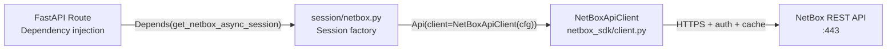
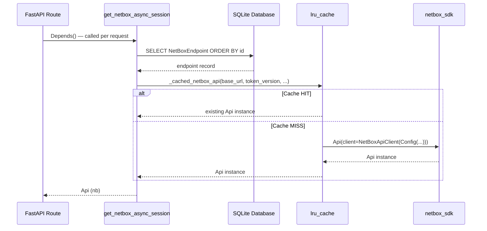
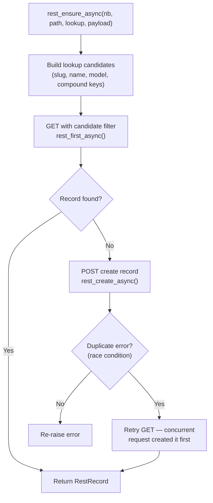

# Integration with proxbox-api

This page shows exactly how **proxbox-api** consumes `netbox-sdk` to connect Proxmox inventory data to NetBox objects. All code examples are drawn from the real proxbox-api source tree.

!!! info "Source repositories"
    - `proxbox_api/session/netbox.py` — session factory and FastAPI dependency providers
    - `proxbox_api/netbox_rest.py` — REST helper layer (primary production path)
    - `proxbox_api/netbox_sdk_helpers.py` — facade-level helpers (`to_dict`, `ensure_record`)
    - `proxbox_api/netbox_compat.py` — legacy sync compatibility wrappers
    - `proxbox_api/e2e/session.py` — E2E test client (cache disabled)

---

## Overview

proxbox-api is a FastAPI service that reads Proxmox inventory (nodes, VMs, clusters) and creates or updates matching objects in NetBox. `netbox-sdk` is the sole library used to communicate with NetBox.



---

## Session Factory Pattern

The session factory lives in `proxbox_api/session/netbox.py`. It builds an `Api` facade from a `NetBoxEndpoint` record stored in the local SQLite database.

### Config from Database Endpoint

```python title="proxbox_api/session/netbox.py"
from netbox_sdk.client import NetBoxApiClient
from netbox_sdk.config import Config
from netbox_sdk.facade import Api
from netbox_sdk.schema import build_schema_index

def netbox_config_from_endpoint(endpoint: NetBoxEndpoint) -> Config:
    """Build netbox-sdk Config from a stored NetBox endpoint (v1 or v2 tokens)."""
    tv = (endpoint.token_version or "v1").strip().lower()
    if tv not in ("v1", "v2"):
        raise ProxboxException(
            message="Invalid token version in stored endpoint",
            detail=f"Token version must be 'v1' or 'v2', got '{tv}'",
        )
    decrypted_key = endpoint.get_decrypted_token_key()
    key = decrypted_key.strip() if decrypted_key else None
    if tv == "v1":
        key = None
    return Config(
        base_url=endpoint.url,
        token_version=tv,
        token_key=key,
        token_secret=endpoint.get_decrypted_token(),
        timeout=_resolve_netbox_timeout(),   # PROXBOX_NETBOX_TIMEOUT env var
        ssl_verify=endpoint.verify_ssl,
    )
```

The `get_decrypted_token()` call decrypts the token from the SQLite database using Fernet encryption. Credentials never travel in plaintext.

### LRU-Cached Api Construction

`Api` instances are cached per unique endpoint configuration, so multiple requests within the same process reuse the same `NetBoxApiClient` (and its pooled `aiohttp.ClientSession`):

```python title="proxbox_api/session/netbox.py"
@lru_cache(maxsize=16)
def _cached_netbox_api(
    base_url: str,
    token_version: str,
    token_key: str | None,
    token_secret: str | None,
    timeout: float,
    ssl_verify: bool,
) -> Api:
    cfg = Config(
        base_url=base_url,
        token_version=token_version,
        token_key=token_key,
        token_secret=token_secret,
        timeout=timeout,
        ssl_verify=ssl_verify,
    )
    return Api(
        client=NetBoxApiClient(cfg),
        schema=build_schema_index(version="4.5"),
    )
```

The cache key uses only primitive types (strings, floats, bools) — `functools.lru_cache` requires hashable arguments.

### FastAPI Dependency Injection

```python title="proxbox_api/session/netbox.py"
async def get_netbox_async_session(
    database_session: AsyncSession = Depends(get_async_session),
    netbox_id: int | None = None,
) -> Api:
    """Get NetBox API session from database endpoint."""
    result = await database_session.exec(
        select(NetBoxEndpoint).order_by(NetBoxEndpoint.id)
    )
    netbox_endpoint = result.first()
    return netbox_api_from_endpoint(netbox_endpoint)


# Type alias used throughout route modules
NetBoxAsyncSessionDep = Annotated[object, Depends(get_netbox_async_session)]
```

Route handlers declare `nb: NetBoxAsyncSessionDep` to receive a ready `Api` instance:

```python title="proxbox_api/routes (pattern)"
@router.get("/status")
async def netbox_status(nb: NetBoxAsyncSessionDep):
    return await check_netbox_connection(nb)
```

**Session lifecycle in proxbox-api:**



---

## Two API Access Patterns

proxbox-api uses `netbox-sdk` in two distinct ways depending on the call site:

=== "Facade Pattern"

    The **facade pattern** uses attribute-chain navigation to reach typed endpoints, then calls CRUD methods. This is the legacy path used in `netbox_compat.py` and `netbox_sdk_helpers.py`.

    ```python title="proxbox_api/netbox_sdk_helpers.py"
    async def ensure_record(endpoint, lookup, payload) -> NetBoxRecord:
        """Get a record by lookup fields or create it when missing."""
        # Navigate to the endpoint and call .get() with keyword filters
        record = await endpoint.get(**lookup)
        if record:
            return record
        # Create if not found
        return await endpoint.create(payload)


    async def ensure_tag(nb, *, name, slug, color, description) -> TagLike:
        """Get or create a NetBox tag."""
        return await ensure_record(
            nb.extras.tags,          # ← attribute navigation: Api → App → Endpoint
            {"slug": slug},
            {"name": name, "slug": slug, "color": color, "description": description},
        )
    ```

    ```python title="proxbox_api/netbox_compat.py"
    # Async iteration over all virtual machines
    async for item in nb.virtualization.virtual_machines.all():
        results.append(to_dict(item))

    # Lookup by keyword args
    vm = await nb.virtualization.virtual_machines.get(name="myvm")
    ```

    **When to use:** When the existing facade navigation covers your resource, or when you need full `Record` dirty tracking and `.save()`.

=== "Direct REST Pattern"

    The **direct REST pattern** bypasses the facade and calls `api.client.request()` directly. This is the **primary production path** in proxbox-api — used in `netbox_rest.py` for all sync operations.

    ```python title="proxbox_api/netbox_rest.py"
    async def rest_list_async(nb, path, *, query=None) -> list[RestRecord]:
        response = await nb.client.request("GET", normalized_path, query=query)
        payload = _extract_payload(response)
        results = payload.get("results", [])
        return [RestRecord(nb, path, item) for item in results]


    async def rest_create_async(nb, path, payload) -> RestRecord:
        response = await nb.client.request("POST", path, payload=payload)
        body = _extract_payload(response)
        return RestRecord(nb, path, body)
    ```

    **When to use:** When you need full control over the request, when the resource isn't covered by the facade schema, or when you're implementing reconciliation logic.

**Trade-off summary:**

| Aspect | Facade Pattern | Direct REST Pattern |
|---|---|---|
| Navigation | Attribute-chain (`nb.dcim.devices`) | Explicit path string (`/api/dcim/devices/`) |
| Schema dependency | Requires resource in `SchemaIndex` | None — any path |
| Pagination | Auto-pagination via `RecordSet` | Manual (proxbox-api adds its own) |
| Dirty tracking | Built into `Record.save()` | `RestRecord._dirty_fields` |
| Validation | PyNetBox-style duck-typing | Pydantic schema validation optional |

---

## REST Helper Layer

`proxbox_api/netbox_rest.py` wraps `api.client.request()` with a complete production-grade HTTP layer: in-memory GET cache, concurrency control, retry with exponential backoff, and response normalization.

### RestRecord

`RestRecord` is a minimal mutable record wrapper for direct REST responses. It mirrors the facade `Record` interface so downstream code can treat both interchangeably:

```python title="proxbox_api/netbox_rest.py"
class RestRecord:
    def __init__(self, api, list_path, values: dict) -> None:
        self._api = api
        self._list_path = list_path
        self._data = dict(values)
        self._dirty_fields: set[str] = set()

    def __setattr__(self, name, value):
        if name in {"_api", "_list_path", "_data", "_dirty_fields"}:
            object.__setattr__(self, name, value)
        else:
            self._data[name] = value
            self._dirty_fields.add(name)    # ← dirty tracking

    async def save(self) -> RestRecord:
        payload = {f: self._data[f] for f in self._dirty_fields if f in self._data}
        response = await self._api.client.request("PATCH", self._detail_path, payload=payload)
        ...

    async def delete(self) -> bool:
        response = await self._api.client.request("DELETE", self._detail_path, expect_json=False)
        ...
```

### Core Helpers

| Function | Method | Description |
|---|---|---|
| `rest_list_async(nb, path, query=...)` | GET | Returns `list[RestRecord]`, with caching |
| `rest_first_async(nb, path, query=...)` | GET | Returns first `RestRecord` or `None` |
| `rest_create_async(nb, path, payload)` | POST | Creates and returns `RestRecord` |
| `rest_patch_async(nb, path, id, payload)` | PATCH | Updates record by ID |
| `rest_ensure_async(nb, path, lookup=..., payload=...)` | GET+POST | Get-or-create with duplicate recovery |
| `rest_reconcile_async(nb, path, lookup=..., payload=..., schema=...)` | GET+POST+PATCH | Full diff and patch reconciliation |
| `rest_bulk_create_async(nb, path, payloads)` | POST | Bulk create |
| `rest_bulk_reconcile_async(...)` | GET+POST+PATCH | Batch reconciliation |

### rest_ensure_async — Get-or-Create

```python title="proxbox_api/netbox_rest.py"
async def rest_ensure_async(nb, path, *, lookup, payload) -> RestRecord:
    # Try multiple candidate lookups (by slug, name, model, etc.)
    for candidate in _candidate_reuse_lookups(lookup, payload):
        existing = await rest_first_async(nb, path, query={**candidate, "limit": 2})
        if existing:
            return existing

    # Create if not found
    try:
        return await rest_create_async(nb, path, payload)
    except ProxboxException as error:
        # Recover from race-condition duplicate errors
        if _is_duplicate_error(error.detail):
            for candidate in _candidate_reuse_lookups(lookup, payload):
                retry = await rest_first_async(nb, path, query={**candidate, "limit": 2})
                if retry:
                    return retry
        raise
```

Decision flow:



### rest_reconcile_async — Diff and Patch

`rest_reconcile_async` is the highest-level helper. It finds an existing record, computes a diff against the desired payload, and only issues a PATCH if fields diverge:

```python title="proxbox_api/netbox_rest.py (simplified)"
async def rest_reconcile_async(nb, path, *, lookup, payload, schema, current_normalizer, ...):
    desired_model = schema.model_validate(payload)
    desired_payload = desired_model.model_dump(exclude_none=True, by_alias=True)

    existing = await _find_existing(nb, path, lookup, desired_payload)
    if existing is None:
        return await rest_create_async(nb, path, desired_payload)

    # Compute diff
    current_payload = schema.model_validate(current_normalizer(existing.serialize())).model_dump(...)
    patch_payload = {k: v for k, v in desired_payload.items() if current_payload.get(k) != v}

    if patch_payload:
        for field, value in patch_payload.items():
            setattr(existing, field, value)
        await existing.save()    # PATCH only changed fields

    return existing
```

---

## Concurrency and Caching

### Semaphore-Based Rate Limiting

All REST helpers share a single `asyncio.Semaphore` to cap concurrent NetBox requests. The default is 1 to avoid exhausting NetBox's PostgreSQL connection pool:

```python title="proxbox_api/netbox_rest.py"
_netbox_request_semaphore: asyncio.Semaphore | None = None

def _get_netbox_semaphore() -> asyncio.Semaphore:
    global _netbox_request_semaphore
    if _netbox_request_semaphore is None:
        _netbox_request_semaphore = asyncio.Semaphore(_resolve_netbox_max_concurrent())
    return _netbox_request_semaphore

# In every REST helper:
async with semaphore:
    return await _do_request()
```

| Variable | Default | Description |
|---|---|---|
| `PROXBOX_NETBOX_MAX_CONCURRENT` | `1` | Semaphore limit — increase only if NetBox has sufficient DB pool capacity |
| `PROXBOX_NETBOX_MAX_RETRIES` | `5` | Max retry attempts per request |
| `PROXBOX_NETBOX_RETRY_DELAY` | `2.0` | Base retry delay in seconds |
| `PROXBOX_NETBOX_GET_CACHE_TTL` | `60.0` | In-memory GET cache TTL (set to `0` to disable) |
| `PROXBOX_NETBOX_GET_CACHE_MAX_ENTRIES` | `4096` | Max cached GET responses |
| `PROXBOX_NETBOX_GET_CACHE_MAX_BYTES` | `50 MB` | Max total cache size |

### In-Memory GET Cache

`netbox_rest.py` maintains its own module-level GET cache that sits *in front of* the SDK's filesystem cache. This avoids repeated disk reads within a single sync run:

```python title="proxbox_api/netbox_rest.py (simplified)"
_netbox_get_cache: dict[tuple[int, str, str], tuple[float, int, list[dict]]] = {}
# Key: (id(api), normalized_path, serialized_query)
# Value: (cached_at: float, size_bytes: int, records: list[dict])
```

Cache keys use `id(api)` to scope cached results to a specific `Api` instance, preventing cross-endpoint contamination. GET cache entries are invalidated after any POST/PATCH/DELETE on the same path.

---

## Retry with Exponential Backoff

Every REST helper wraps its `_do_request()` call in a retry loop with exponential backoff and jitter:

```python title="proxbox_api/netbox_rest.py"
for attempt in range(max_retries + 1):
    async with semaphore:
        try:
            return await _do_request()
        except Exception as e:
            if attempt == max_retries or not _is_transient_netbox_error(e):
                raise
            delay = _compute_retry_delay(base_delay, attempt, e)
            logger.warning(
                "NetBox request failed (attempt %s/%s), retrying in %ss: %s",
                attempt + 1, max_retries + 1, delay, str(e)[:200],
            )
    await asyncio.sleep(delay)


def _compute_retry_delay(base_delay: float, attempt: int, error: Exception) -> float:
    exponential_delay = base_delay * (2 ** attempt)
    if _is_connection_refused_error(error):
        exponential_delay = max(exponential_delay, 10.0)
    if _is_netbox_overwhelmed_error(error):
        exponential_delay = max(exponential_delay, 30.0)  # DB pool saturated
    return exponential_delay + random.uniform(0, exponential_delay * 0.5)  # jitter
```

Retry backoff progression (default: `base_delay=2.0s`):

| Attempt | Min delay | Max delay |
|---|---|---|
| 1 | 2.0 s | 3.0 s |
| 2 | 4.0 s | 6.0 s |
| 3 | 8.0 s | 12.0 s |
| 4 | 16.0 s | 24.0 s |
| 5 | 32.0 s | 48.0 s |

!!! note "NetBox overwhelmed detection"
    When NetBox returns an error consistent with PostgreSQL pool exhaustion (e.g., `too many connections`, `connection pool`), the minimum delay jumps to 30 seconds to give the database time to recover.

---

## Compatibility Wrappers

`proxbox_api/netbox_compat.py` provides sync wrappers over the async facade for legacy code paths that predate proxbox-api's async rewrite. Each wrapper maps an `endpoint_getter` string to a facade attribute path and bridges sync-to-async via a thread:

```python title="proxbox_api/netbox_compat.py"
class _BaseCompat:
    endpoint_getter: str = ""   # e.g. "virtualization.virtual_machines"

    @classmethod
    def _endpoint(cls, nb):
        endpoint = nb
        for piece in cls.endpoint_getter.split("."):
            endpoint = getattr(endpoint, piece)
        return endpoint

    def all(self) -> list[dict]:
        async def _op():
            endpoint = self._endpoint(self._nb())
            results = []
            async for item in endpoint.all():
                results.append(to_dict(item))
            return results
        return _run(_op())      # runs coroutine in a thread if inside event loop


class Tags(_BaseCompat):
    endpoint_getter = "extras.tags"

class VirtualMachine(_BaseCompat):
    endpoint_getter = "virtualization.virtual_machines"

    @staticmethod
    def map_status(proxmox_status: str) -> str:
        return ProxmoxToNetBoxVMStatus.from_proxmox(proxmox_status)
```

Available wrappers:

| Class | `endpoint_getter` | Resource |
|---|---|---|
| `Tags` | `extras.tags` | NetBox tags |
| `CustomField` | `extras.custom_fields` | Custom fields |
| `ClusterType` | `virtualization.cluster_types` | Cluster types |
| `Cluster` | `virtualization.clusters` | Clusters |
| `Site` | `dcim.sites` | Sites |
| `DeviceRole` | `dcim.device_roles` | Device roles |
| `Manufacturer` | `dcim.manufacturers` | Manufacturers |
| `DeviceType` | `dcim.device_types` | Device types |
| `Device` | `dcim.devices` | Devices |
| `Interface` | `dcim.interfaces` | Physical interfaces |
| `VMInterface` | `virtualization.interfaces` | VM interfaces |
| `IPAddress` | `ipam.ip_addresses` | IP addresses |
| `VirtualMachine` | `virtualization.virtual_machines` | Virtual machines |

!!! tip "Migration path"
    New proxbox-api code uses `rest_ensure_async` / `rest_reconcile_async` from `netbox_rest.py` instead of these wrappers. The wrappers exist for backward compatibility with older routes that predate the REST helper layer.

---

## Error Handling

### Response Validation

`_extract_payload()` validates every response and normalizes error details:

```python title="proxbox_api/netbox_rest.py"
def _extract_payload(response: ApiResponse) -> object:
    if response.status < 200 or response.status >= 300:
        detail = response.text
        try:
            payload = response.json()
        except json.JSONDecodeError:
            payload = None

        if isinstance(payload, dict):
            detail = str(payload.get("detail") or payload.get("message") or detail)
        elif isinstance(payload, list):
            parts = [str(item) for item in payload if item]
            if parts:
                detail = "; ".join(parts)

        raise ProxboxException(
            message="NetBox REST request failed",
            detail=detail,
        )
    return response.json() if response.text else None
```

### Error Classification

`_handle_netbox_error()` distinguishes transient failures (connection refused, timeout, DNS) from permanent ones and logs at different levels:

```python title="proxbox_api/netbox_rest.py"
def _handle_netbox_error(error, operation):
    if _is_transient_netbox_error(error):
        logger.warning("Transient NetBox error during %s: %s", operation, error)
    else:
        logger.error("NetBox error during %s: %s", operation, error)

    if _is_netbox_overwhelmed_error(error):
        raise ProxboxException(
            message="NetBox is overwhelmed. Please retry in a few moments.",
            detail=f"{operation} failed: {error}",
        )
    raise ProxboxException(message=f"NetBox {operation} failed", detail=str(error))
```

---

## E2E Testing Pattern

proxbox-api's end-to-end tests use a `E2ENetBoxApiClient` subclass that disables the SDK's filesystem cache by returning `None` from `_cache_policy()`. This ensures tests always see live responses rather than cached state:

```python title="proxbox_api/e2e/session.py"
from netbox_sdk.client import NetBoxApiClient
from netbox_sdk.facade import Api

class E2ENetBoxApiClient(NetBoxApiClient):
    """NetBox client with HTTP caching disabled for E2E test stability."""

    def _cache_policy(self, *, method, path, query=None, payload=None):
        return None   # Always bypass SDK filesystem cache


async def create_netbox_e2e_session(base_url: str, token: str) -> Api:
    config = Config(
        base_url=base_url,
        token_secret=token,
        token_version="v1",
    )
    client = E2ENetBoxApiClient(config)
    return Api(client=client)
```

!!! tip "Cache isolation in tests"
    The `E2ENetBoxApiClient` subclass is the recommended pattern for any integration test that needs to avoid cross-test cache contamination. The SDK's `_cache_policy()` method is intentionally designed to be overridable.
