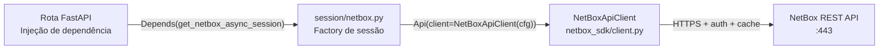
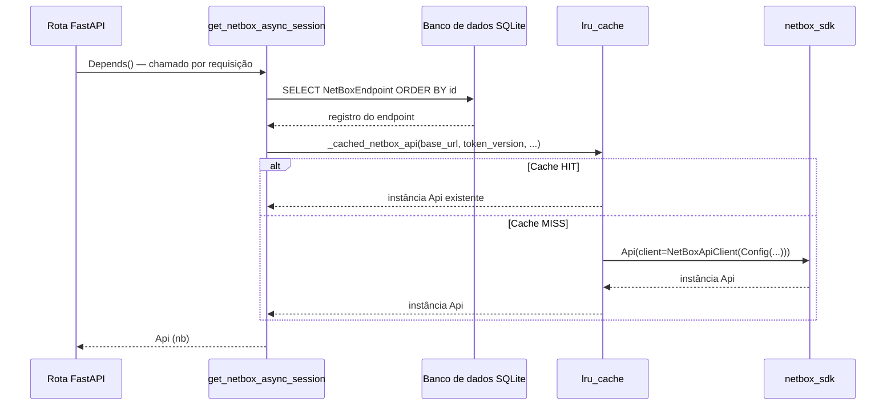
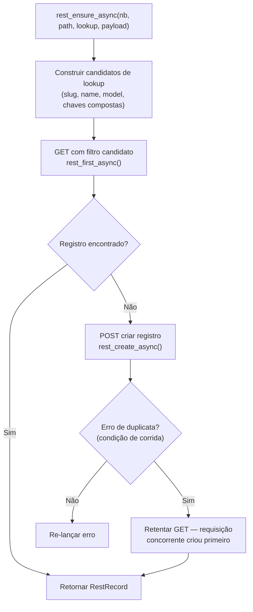

# Integração com proxbox-api

Esta página mostra exatamente como o **proxbox-api** consome o `netbox-sdk` para conectar dados de inventário do Proxmox a objetos do NetBox. Todos os exemplos de código foram extraídos do código-fonte real do proxbox-api.

!!! info "Repositórios fonte"
    - `proxbox_api/session/netbox.py` — factory de sessão e provedores de dependência FastAPI
    - `proxbox_api/netbox_rest.py` — camada de helpers REST (caminho de produção principal)
    - `proxbox_api/netbox_sdk_helpers.py` — helpers de fachada (`to_dict`, `ensure_record`)
    - `proxbox_api/netbox_compat.py` — wrappers de compatibilidade sync legados
    - `proxbox_api/e2e/session.py` — cliente de teste E2E (cache desabilitado)

---

## Visão geral

proxbox-api é um serviço FastAPI que lê o inventário do Proxmox (nós, VMs, clusters) e cria ou atualiza objetos correspondentes no NetBox. `netbox-sdk` é a única biblioteca usada para comunicar com o NetBox.



---

## Padrão de factory de sessão

A factory de sessão fica em `proxbox_api/session/netbox.py`. Ela constrói uma fachada `Api` a partir de um registro `NetBoxEndpoint` armazenado no banco de dados SQLite local.

### Config a partir do endpoint no banco de dados

```python title="proxbox_api/session/netbox.py"
from netbox_sdk.client import NetBoxApiClient
from netbox_sdk.config import Config
from netbox_sdk.facade import Api
from netbox_sdk.schema import build_schema_index

def netbox_config_from_endpoint(endpoint: NetBoxEndpoint) -> Config:
    """Constrói o Config do netbox-sdk a partir de um endpoint NetBox armazenado (tokens v1 ou v2)."""
    tv = (endpoint.token_version or "v1").strip().lower()
    if tv not in ("v1", "v2"):
        raise ProxboxException(
            message="Versão de token inválida no endpoint armazenado",
            detail=f"A versão do token deve ser 'v1' ou 'v2', recebido '{tv}'",
        )
    decrypted_key = endpoint.get_decrypted_token_key()
    key = decrypted_key.strip() if decrypted_key else None
    if tv == "v1":
        key = None
    return Config(
        base_url=endpoint.url,
        token_version=tv,
        token_key=key,
        token_secret=endpoint.get_decrypted_token(),
        timeout=_resolve_netbox_timeout(),   # variável de ambiente PROXBOX_NETBOX_TIMEOUT
        ssl_verify=endpoint.verify_ssl,
    )
```

### Construção de Api com cache LRU

Instâncias `Api` são cacheadas por configuração de endpoint única, então múltiplas requisições dentro do mesmo processo reutilizam o mesmo `NetBoxApiClient` (e sua `aiohttp.ClientSession` com pool de conexões):

```python title="proxbox_api/session/netbox.py"
@lru_cache(maxsize=16)
def _cached_netbox_api(
    base_url: str,
    token_version: str,
    token_key: str | None,
    token_secret: str | None,
    timeout: float,
    ssl_verify: bool,
) -> Api:
    cfg = Config(
        base_url=base_url,
        token_version=token_version,
        token_key=token_key,
        token_secret=token_secret,
        timeout=timeout,
        ssl_verify=ssl_verify,
    )
    return Api(
        client=NetBoxApiClient(cfg),
        schema=build_schema_index(version="4.5"),
    )
```

### Injeção de dependência FastAPI

```python title="proxbox_api/session/netbox.py"
async def get_netbox_async_session(
    database_session: AsyncSession = Depends(get_async_session),
    netbox_id: int | None = None,
) -> Api:
    """Obtém sessão da API NetBox a partir do endpoint no banco de dados."""
    result = await database_session.exec(
        select(NetBoxEndpoint).order_by(NetBoxEndpoint.id)
    )
    netbox_endpoint = result.first()
    return netbox_api_from_endpoint(netbox_endpoint)


# Alias de tipo usado em todos os módulos de rota
NetBoxAsyncSessionDep = Annotated[object, Depends(get_netbox_async_session)]
```

**Ciclo de vida da sessão no proxbox-api:**



---

## Dois padrões de acesso à API

O proxbox-api usa o `netbox-sdk` de duas formas distintas dependendo do local de chamada:

=== "Padrão Fachada"

    O **padrão fachada** usa navegação por cadeia de atributos para alcançar endpoints tipados, depois chama métodos CRUD. Este é o caminho legado usado em `netbox_compat.py` e `netbox_sdk_helpers.py`.

    ```python title="proxbox_api/netbox_sdk_helpers.py"
    async def ensure_record(endpoint, lookup, payload) -> NetBoxRecord:
        """Obtém um registro por campos de lookup ou cria quando não encontrado."""
        # Navegar até o endpoint e chamar .get() com filtros de keyword
        record = await endpoint.get(**lookup)
        if record:
            return record
        # Criar se não encontrado
        return await endpoint.create(payload)


    async def ensure_tag(nb, *, name, slug, color, description) -> TagLike:
        """Obtém ou cria uma tag NetBox."""
        return await ensure_record(
            nb.extras.tags,          # ← navegação por atributo: Api → App → Endpoint
            {"slug": slug},
            {"name": name, "slug": slug, "color": color, "description": description},
        )
    ```

    **Quando usar:** Quando a navegação pela fachada existente cobre seu recurso, ou quando você precisa de rastreamento dirty completo do `Record` e `.save()`.

=== "Padrão REST Direto"

    O **padrão REST direto** contorna a fachada e chama `api.client.request()` diretamente. Este é o **caminho de produção principal** no proxbox-api — usado em `netbox_rest.py` para todas as operações de sincronização.

    ```python title="proxbox_api/netbox_rest.py"
    async def rest_list_async(nb, path, *, query=None) -> list[RestRecord]:
        response = await nb.client.request("GET", normalized_path, query=query)
        payload = _extract_payload(response)
        results = payload.get("results", [])
        return [RestRecord(nb, path, item) for item in results]


    async def rest_create_async(nb, path, payload) -> RestRecord:
        response = await nb.client.request("POST", path, payload=payload)
        body = _extract_payload(response)
        return RestRecord(nb, path, body)
    ```

    **Quando usar:** Quando você precisa de controle total da requisição, quando o recurso não está coberto pelo esquema da fachada, ou quando está implementando lógica de reconciliação.

**Resumo das trocas:**

| Aspecto | Padrão Fachada | Padrão REST Direto |
|---|---|---|
| Navegação | Cadeia de atributos (`nb.dcim.devices`) | String de caminho explícita (`/api/dcim/devices/`) |
| Dependência de esquema | Requer recurso no `SchemaIndex` | Nenhuma — qualquer caminho |
| Paginação | Auto-paginação via `RecordSet` | Manual (proxbox-api adiciona a própria) |
| Rastreamento dirty | Embutido em `Record.save()` | `RestRecord._dirty_fields` |
| Validação | Duck-typing estilo PyNetBox | Validação de esquema Pydantic opcional |

---

## Camada de helpers REST

`proxbox_api/netbox_rest.py` envolve `api.client.request()` com uma camada HTTP completa para produção: cache GET em memória, controle de concorrência, retentativa com backoff exponencial e normalização de resposta.

### RestRecord

`RestRecord` é um wrapper mínimo e mutável para respostas REST diretas. Espelha a interface do `Record` da fachada para que o código downstream possa tratar ambos indistintamente:

```python title="proxbox_api/netbox_rest.py"
class RestRecord:
    def __init__(self, api, list_path, values: dict) -> None:
        self._api = api
        self._list_path = list_path
        self._data = dict(values)
        self._dirty_fields: set[str] = set()

    def __setattr__(self, name, value):
        if name in {"_api", "_list_path", "_data", "_dirty_fields"}:
            object.__setattr__(self, name, value)
        else:
            self._data[name] = value
            self._dirty_fields.add(name)    # ← rastreamento dirty

    async def save(self) -> RestRecord:
        payload = {f: self._data[f] for f in self._dirty_fields if f in self._data}
        response = await self._api.client.request("PATCH", self._detail_path, payload=payload)
        ...

    async def delete(self) -> bool:
        response = await self._api.client.request("DELETE", self._detail_path, expect_json=False)
        ...
```

### Helpers principais

| Função | Método | Descrição |
|---|---|---|
| `rest_list_async(nb, path, query=...)` | GET | Retorna `list[RestRecord]`, com cache |
| `rest_first_async(nb, path, query=...)` | GET | Retorna primeiro `RestRecord` ou `None` |
| `rest_create_async(nb, path, payload)` | POST | Cria e retorna `RestRecord` |
| `rest_patch_async(nb, path, id, payload)` | PATCH | Atualiza registro por ID |
| `rest_ensure_async(nb, path, lookup=..., payload=...)` | GET+POST | Obtém ou cria com recuperação de duplicata |
| `rest_reconcile_async(nb, path, lookup=..., payload=..., schema=...)` | GET+POST+PATCH | Reconciliação completa com diff e patch |

### rest_ensure_async — Obtém ou cria



---

## Concorrência e cache

### Limitação de taxa baseada em semáforo

Todos os helpers REST compartilham um único `asyncio.Semaphore` para limitar requisições NetBox concorrentes. O padrão é 1 para evitar esgotar o pool de conexões PostgreSQL do NetBox:

| Variável | Padrão | Descrição |
|---|---|---|
| `PROXBOX_NETBOX_MAX_CONCURRENT` | `1` | Limite de semáforo — aumente apenas se o NetBox tiver capacidade suficiente no pool de DB |
| `PROXBOX_NETBOX_MAX_RETRIES` | `5` | Máximo de tentativas por requisição |
| `PROXBOX_NETBOX_RETRY_DELAY` | `2.0` | Delay base de retentativa em segundos |
| `PROXBOX_NETBOX_GET_CACHE_TTL` | `60.0` | TTL do cache GET em memória (defina `0` para desabilitar) |
| `PROXBOX_NETBOX_GET_CACHE_MAX_ENTRIES` | `4096` | Máximo de respostas GET cacheadas |
| `PROXBOX_NETBOX_GET_CACHE_MAX_BYTES` | `50 MB` | Tamanho total máximo do cache |

---

## Retentativa com backoff exponencial

Cada helper REST envolve sua chamada `_do_request()` em um loop de retentativa com backoff exponencial e jitter:

```python title="proxbox_api/netbox_rest.py"
for attempt in range(max_retries + 1):
    async with semaphore:
        try:
            return await _do_request()
        except Exception as e:
            if attempt == max_retries or not _is_transient_netbox_error(e):
                raise
            delay = _compute_retry_delay(base_delay, attempt, e)
    await asyncio.sleep(delay)


def _compute_retry_delay(base_delay, attempt, error) -> float:
    exponential_delay = base_delay * (2 ** attempt)
    if _is_connection_refused_error(error):
        exponential_delay = max(exponential_delay, 10.0)
    if _is_netbox_overwhelmed_error(error):
        exponential_delay = max(exponential_delay, 30.0)  # pool de DB saturado
    return exponential_delay + random.uniform(0, exponential_delay * 0.5)  # jitter
```

!!! note "Detecção de NetBox sobrecarregado"
    Quando o NetBox retorna um erro consistente com esgotamento do pool PostgreSQL, o delay mínimo sobe para 30 segundos para dar tempo ao banco de dados se recuperar.

---

## Wrappers de compatibilidade

`proxbox_api/netbox_compat.py` fornece wrappers sync sobre a fachada async para caminhos de código legados. Cada wrapper mapeia uma string `endpoint_getter` para um caminho de atributo de fachada:

| Classe | `endpoint_getter` | Recurso |
|---|---|---|
| `Tags` | `extras.tags` | Tags NetBox |
| `CustomField` | `extras.custom_fields` | Campos personalizados |
| `ClusterType` | `virtualization.cluster_types` | Tipos de cluster |
| `Cluster` | `virtualization.clusters` | Clusters |
| `Site` | `dcim.sites` | Sites |
| `DeviceRole` | `dcim.device_roles` | Papéis de dispositivo |
| `Manufacturer` | `dcim.manufacturers` | Fabricantes |
| `DeviceType` | `dcim.device_types` | Tipos de dispositivo |
| `Device` | `dcim.devices` | Dispositivos |
| `Interface` | `dcim.interfaces` | Interfaces físicas |
| `VMInterface` | `virtualization.interfaces` | Interfaces de VM |
| `IPAddress` | `ipam.ip_addresses` | Endereços IP |
| `VirtualMachine` | `virtualization.virtual_machines` | Máquinas virtuais |

!!! tip "Caminho de migração"
    Novo código no proxbox-api usa `rest_ensure_async` / `rest_reconcile_async` de `netbox_rest.py` em vez desses wrappers. Os wrappers existem por compatibilidade retroativa com rotas mais antigas.

---

## Tratamento de erros

`_extract_payload()` valida cada resposta e normaliza os detalhes de erro, enquanto `_handle_netbox_error()` distingue falhas transitórias (conexão recusada, timeout, DNS) de permanentes e registra em níveis diferentes.

---

## Padrão de testes E2E

Os testes de ponta a ponta do proxbox-api usam uma subclasse `E2ENetBoxApiClient` que desabilita o cache em disco do SDK retornando `None` de `_cache_policy()`:

```python title="proxbox_api/e2e/session.py"
from netbox_sdk.client import NetBoxApiClient
from netbox_sdk.facade import Api

class E2ENetBoxApiClient(NetBoxApiClient):
    """Cliente NetBox com cache HTTP desabilitado para estabilidade em testes E2E."""

    def _cache_policy(self, *, method, path, query=None, payload=None):
        return None   # Sempre contornar o cache em disco do SDK


async def create_netbox_e2e_session(base_url: str, token: str) -> Api:
    config = Config(base_url=base_url, token_secret=token, token_version="v1")
    client = E2ENetBoxApiClient(config)
    return Api(client=client)
```

!!! tip "Isolamento de cache em testes"
    A subclasse `E2ENetBoxApiClient` é o padrão recomendado para qualquer teste de integração que precise evitar contaminação de cache entre testes. O método `_cache_policy()` do SDK foi projetado intencionalmente para ser substituível.
