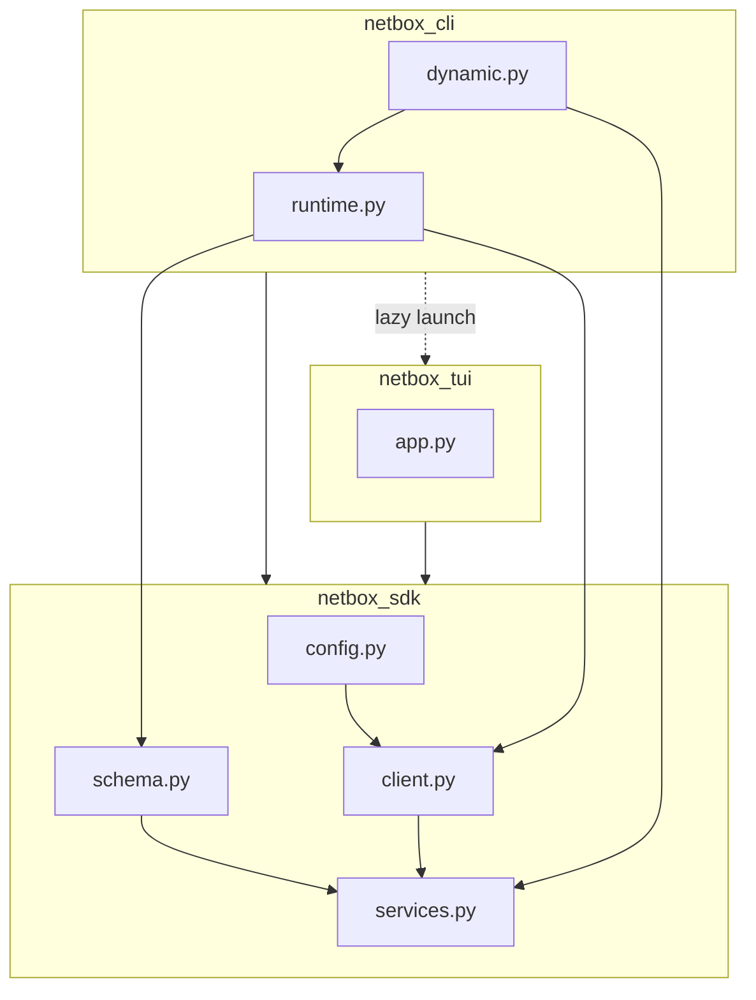

# Package integration

This document describes how the installable artifact, import paths, and subsystems fit together.

## PyPI project and optional extras

The primary PyPI project is `netbox-sdk` (see `pyproject.toml`). The same distribution ships three top-level packages:

| Import package | Role | Typical install |
|----------------|------|-----------------|
| `netbox_sdk` | REST client, config, schema, services, typed API | `pip install netbox-sdk` |
| `netbox_cli` | Typer `nbx` CLI | `pip install 'netbox-sdk[cli]'` |
| `netbox_tui` | Textual TUIs | `pip install 'netbox-sdk[tui]'` |

Use `pip install 'netbox-sdk[all]'` for CLI + TUI + demo tooling.

To match the version described by the published documentation site, pin with `==` and the same version as `docs/snippets/package-version.txt` (see [Installation](../getting-started/installation.md)).

## Public SDK surface

Stable symbols for library use are exported from `netbox_sdk` (see `netbox_sdk/__init__.py`), including:

- `NetBoxApiClient`, `ApiResponse`, `ConnectionProbe`, `RequestError`
- `Config`, `load_profile_config`, `save_config`, and related profile helpers
- `SchemaIndex`, `load_openapi_schema`, `build_schema_index`
- `ResolvedRequest`, `resolve_dynamic_request`, `run_dynamic_command`
- Typed facade (`api`, `typed_api`, …) and version support types

Everything outside that `__all__` is considered internal unless documented otherwise.

## Layer diagram

## Allowed import edges

| From | May import | Notes |
|------|------------|-------|
| `netbox_sdk` | stdlib + declared deps only | Must **not** import `netbox_cli` or `netbox_tui`. |
| `netbox_cli` | `netbox_sdk`, then `netbox_tui` only via lazy helpers (`support.load_tui_callables`) | Entry: `netbox_cli:main` → `nbx`. |
| `netbox_tui` | `netbox_sdk` | Receives `NetBoxApiClient` and `SchemaIndex` from the caller or CLI. |

## In-process runtime state (`netbox_cli.runtime`)

`netbox_cli.runtime` holds `_RUNTIME_CONFIGS`, `_cache_profile`, `_get_client`, `_get_index`, and related helpers. Demo token refresh updates the cached profile via `_cache_profile` so the CLI process stays consistent without the SDK client importing Typer.

## CLI command registration

Commands are registered on the root `Typer` app in `netbox_cli/__init__.py`. Dynamic OpenAPI commands are built in `netbox_cli/dynamic.py`; `_runtime_get_client` / `_runtime_get_index` resolve through `netbox_cli.runtime` at call time so tests can patch those factories.

## Entry point

Console script `nbx` maps to `netbox_cli:main`.

See also: [Architecture](architecture.md), [Design principles](design-principles.md).
