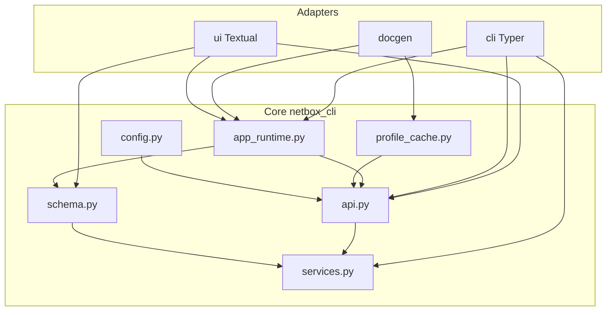

# Package integration

This document describes how the installable artifact, import path, and subsystems fit together.

## One package, two PyPI names

The Python package is always `netbox_cli`. It is published under two project names from the same source tree:

| PyPI project       | Use case                                      |
|--------------------|-----------------------------------------------|
| `netbox-console`   | Primary name in `pyproject.toml`              |
| `netbox-sdk`       | Same code; CI builds a second wheel/sdist     |

After installation, imports are identical: `import netbox_cli`, `from netbox_cli.api import NetBoxApiClient`, etc.

## Public SDK surface

Stable symbols for library use are re-exported from `netbox_cli`:

- `NetBoxApiClient`, `ApiResponse`, `ConnectionProbe`, `RequestError`
- `Config`, `load_profile_config`, `save_config`
- `SchemaIndex`, `load_openapi_schema`
- `ResolvedRequest`, `resolve_dynamic_request`, `run_dynamic_command`
- `__version__`

Everything else is considered internal; it may change between minor releases.

Typer-free factories for apps embedding the client live in `netbox_cli.app_runtime`:

- `get_schema_index()` — fresh `SchemaIndex` from the cached OpenAPI document
- `client_for_config(cfg)` — `NetBoxApiClient` for an explicit `Config`
- `get_default_client()` — default profile (may prompt); delegates to `netbox_cli.cli` for interactive setup

## Layer diagram

## Allowed import edges

| From              | May import into core? | Notes |
|-------------------|----------------------|-------|
| `netbox_cli.api`  | `config`, `http_cache`, `profile_cache`, `logging_runtime`, `schema` (types only where needed) | Must **not** import `cli` or `ui`. |
| `netbox_cli.cli`  | Core + `cli/*`       | Typer/Rich wiring; `cli/commands/*` registers commands on the root app. |
| `netbox_cli.ui`   | Core + `app_runtime` for default client/index when switching TUIs | Prefer injecting `client`/`index` into apps. |
| `netbox_cli.docgen` | Core, `app_runtime`, `profile_cache` | Workers preload schema via `get_schema_index()`; config via `_RUNTIME_CONFIGS`. |

## In-process profile cache

`netbox_cli.profile_cache` holds `_RUNTIME_CONFIGS` and `_cache_profile`. The HTTP client updates this cache when refreshing demo tokens so the CLI process stays consistent without importing Typer from `api.py`.

## CLI command registration

Static commands are registered by `netbox_cli.cli.commands.register_static_commands(app)`. Modules under `cli/commands/` group commands by concern (`profile`, `http_api`, `tui_launch`, etc.). `cli/commands/_wiring.py` resolves `netbox_cli.cli._get_client` at **call time** so tests can monkeypatch the CLI package.

Dynamic OpenAPI commands are still built in `cli/dynamic.py`; `_runtime_get_client` / `_runtime_get_index` resolve through `netbox_cli.cli` for the same patching reason.

## Entry point

Console script `nbx` maps to `netbox_cli.cli:main`. `cli/__init__.py` constructs the root `Typer` app, registers commands, and re-exports several names (`run_dynamic_command`, `load_profile_config`, …) for backward compatibility and tests.

See also: [Architecture](architecture.md), [Design principles](design-principles.md).
