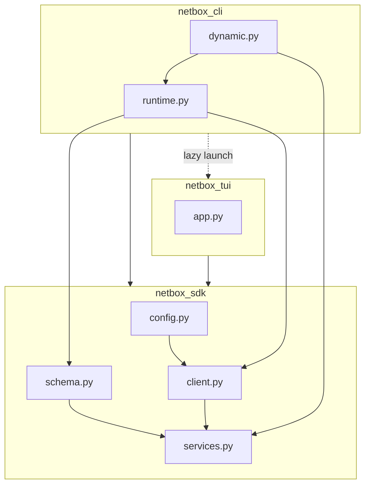

# Package integration

This document describes how the installable artifact, import paths, and subsystems fit together.

## PyPI project and optional extras

The primary PyPI project is `netbox-sdk` (see `pyproject.toml`). The same distribution ships three top-level packages:

| Import package | Role | Typical install |
|----------------|------|-----------------|
| `netbox_sdk` | REST client, config, schema, services, typed API | `pip install netbox-sdk` |
| `netbox_cli` | Typer `nbx` CLI | `pip install 'netbox-sdk[cli]'` |
| `netbox_tui` | Textual TUIs | `pip install 'netbox-sdk[tui]'` |

Use `pip install 'netbox-sdk[all]'` for CLI + TUI + demo tooling.

For a reproducible install from the default PyPI index, pin with `==` and the
PEP 440 final or post-release version in
`docs/snippets/published-package-version.txt` (see
[Installation](../getting-started/installation.md)). The separate
`docs/snippets/package-version.txt` value identifies the in-tree source
candidate and TestPyPI artifacts; prerelease, development, and local versions
do not publish to the default index.

Release-candidate tags are pushed directly with the exact `v*rc*` version and
publish only to TestPyPI. Final and post releases reach PyPI only from a
published GitHub Release. The publishing workflow accepts a closed local set of
exactly one package/version-matched wheel and one sdist, captures it before
network-installed smoke dependencies run, and gives each registry only a fresh
validator-approved upload directory. Before production upload it verifies both
the complete TestPyPI set and PyPI's current exact filename/hash set, staging
only missing PyPI files so partial uploads resume safely without
`--skip-existing`. The Twine step revalidates the approved filename/digest
manifest, and a bounded final check requires PyPI to expose exactly the local
wheel/sdist filenames and hashes. Registry jobs install only the audited,
locked `publish` dependency group.

## Django model-build catalog refreshes

The repository archive under `django_models_builds/` is the source for the
supported catalog packaged under `netbox_sdk/django_models/model_builds/`.
The weekly `.github/workflows/django-model-builds.yml` workflow builds the
latest three NetBox releases with the exact read-only repository source and
retains the JSON files as a 14-day artifact. GitHub `main` remains read-only:
the workflow never commits or pushes an archive refresh.

A maintainer selects and downloads an artifact locally, prepares the archive
and bundled catalog, and submits the result through a reviewed Gitea pull
request:

```bash
gh run download <run-id> --dir .tmp/django-model-builds/<run-id>
uv run --locked python scripts/refresh_django_model_builds.py \
  --artifact-dir .tmp/django-model-builds/<run-id>
```

`scripts/refresh_django_model_builds.py` performs no downloads. It accepts the
local artifact directory, normalizes each build into `django_models_builds/`,
regenerates the supported package catalog with
`scripts/build_model_catalog.py`, and prints the exact `git status` for
review. The same command can build from an existing local NetBox checkout:

```bash
uv run --locked python scripts/refresh_django_model_builds.py \
  --netbox-checkout /path/to/netbox --tag v4.7.0
```

Local-tag generation requires `HEAD` to resolve to the requested tag commit and
requires `git status --porcelain --untracked-files=all` to be empty. Modified
tracked files and untracked files are rejected so they cannot be published under
an official NetBox release name.

Every previously packaged exact patch build remains available. Calling
`catalog.load_build("v4.6.3")` loads that exact artifact; matching the `4.6`
release line selects the newest numeric patch available in the line. The
manifest's `builds` map records these release-line defaults, while
`exact_builds` records the complete packaged inventory.
`scripts/build_model_catalog.py` preserves existing packaged builds by default.
The `--prune` flag removes builds that are not current line defaults and must be
used only for an explicit compatibility decision.

Both the graph builder and catalog normalizer record paths relative to the
NetBox checkout root. The normalizer infers checkout roots from older
`meta.source_path` values and rejects any remaining absolute path with an
actionable error. The offline test suite also requires
`django_models_builds/` to contain the newest release line marked stable in
`netbox_sdk/versioning.py`; adding a stable line without its reviewed graph
therefore fails before merge.

## Repository metadata provenance

`metadata.json` identifies the candidate by content. Its authoritative
`source.content_id` field is the SHA-256 digest of the UTF-8 bytes of the sorted
`git ls-tree -r --full-tree` lines for the candidate tree. The digest excludes
the `metadata.json` entry because including that entry would make the digest
contain itself. Recursive `git ls-tree` output omits empty subtrees, so empty
directories do not affect the identity.

`scripts/build_metadata.py` stages the current checkout in a temporary Git
index and temporary object database, then computes the digest from that
candidate tree without changing the real index or repository objects.
The exact schema rejects missing and unknown fields. It derives `python` and
`netbox` from the same project sources used during generation, pins
`source.repo` to the canonical repository identity declared by the trusted
project configuration, and requires `generated_at` to be a valid RFC 3339 UTC
timestamp. `source.version` must equal `project.version`. `source.commit`
remains a full informational SHA: when the object is available, generation and
verification require it to be a commit with the candidate's project version and
content identity, but its absence does not invalidate the content identity.
Content equality authenticates the tree, not the repository origin; an external
trusted fetch or equivalent canonical-source binding must authenticate the
origin. `python scripts/build_metadata.py --verify` checks committed metadata
against `HEAD`.

The credential-free metadata workflow validates this content identity. The
Gitea-to-GitHub mirror pushes the exact canonical commit and runs only the
bounded `scripts/mirror_github.py` helper from that detached commit during the
push step. It does not regenerate `metadata.json` or create a GitHub-only
metadata commit. The one-time rewrite is permitted only when the observed
GitHub tip equals the exact reviewed historical mirror-only commit
`d0b46101d3d91d6755b6a419e9095577b66a443d`, and the force-with-lease remains
fixed to that SHA. Every other update requires the observed GitHub tip to be an
ancestor of the canonical commit and uses an exact force-with-lease fixed to the
tip inspected by that ancestry check. Any push rejection aborts without
refreshing the tip or retrying, so neither a concurrent rewind nor another
concurrent write is overwritten.

## Public SDK surface

Stable symbols for library use are exported from `netbox_sdk` (see `netbox_sdk/__init__.py`), including:

- `NetBoxApiClient`, `ApiResponse`, `ConnectionProbe`, `RequestError`
- `Config`, `load_profile_config`, `save_config`, and related profile helpers
- `SchemaIndex`, `load_openapi_schema`, `build_schema_index`
- `ResolvedRequest`, `resolve_dynamic_request`, `run_dynamic_command`
- Typed facade (`api`, `typed_api`, …) and version support types

Everything outside that `__all__` is considered internal unless documented otherwise.

## Layer diagram


```mermaid
flowchart TB
  subgraph sdk [netbox_sdk]
    config[config.py]
    schema[schema.py]
    services[services.py]
    client[client.py]
    config --> client
    schema --> services
    client --> services
  end
  subgraph cli [netbox_cli]
    runtime[runtime.py]
    dynamic[dynamic.py]
    runtime --> client
    runtime --> schema
    dynamic --> runtime
    dynamic --> services
  end
  subgraph tui [netbox_tui]
    app[app.py]
  end
  cli --> sdk
  tui --> sdk
  cli -. lazy launch .-> tui
```

## Allowed import edges

| From | May import | Notes |
|------|------------|-------|
| `netbox_sdk` | stdlib + declared deps only | Must **not** import `netbox_cli` or `netbox_tui`. |
| `netbox_cli` | `netbox_sdk`, then `netbox_tui` only via lazy helpers (`support.load_tui_callables`) | Entry: `netbox_cli:main` → `nbx`. |
| `netbox_tui` | `netbox_sdk` | Receives `NetBoxApiClient` and `SchemaIndex` from the caller or CLI. |

## In-process runtime state (`netbox_cli.runtime`)

`netbox_cli.runtime` holds `_RUNTIME_CONFIGS`, `_cache_profile`, `_get_client`, `_get_registration_index`, `_get_runtime_index`, and related helpers. `_get_registration_index()` builds the network-free command tree from the selected bundled schema, while `_get_runtime_index()` honors explicit version overrides or detects the configured instance release line for execution. Demo token refresh updates the cached profile via `_cache_profile` so the CLI process stays consistent without the SDK client importing Typer.

## CLI command registration

Commands are registered on the root `Typer` app in `netbox_cli/__init__.py`. Dynamic OpenAPI commands are built in `netbox_cli/dynamic.py`; `_runtime_get_client` / `_runtime_get_index` resolve through `netbox_cli.runtime` at call time so tests can patch those factories.

## Entry point

Console script `nbx` maps to `netbox_cli:main`.

See also: [Architecture](architecture.md), [Design principles](design-principles.md).
