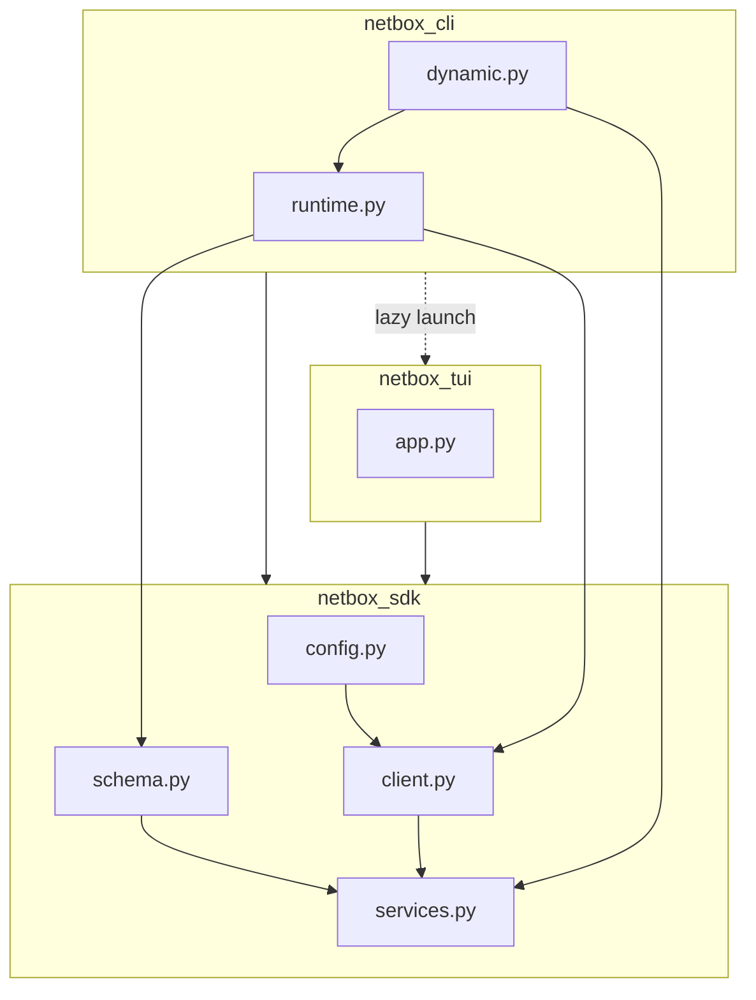

# Integração de pacotes

Este documento descreve como o artefato instalável, caminhos de import e subsistemas se encaixam.

## Projeto PyPI e extras opcionais

O projeto PyPI principal é `netbox-sdk` (veja `pyproject.toml`). A mesma distribuição inclui três pacotes de nível superior:

| Pacote de import | Papel | Instalação típica |
|----------------|------|-----------------|
| `netbox_sdk` | Cliente REST, config, esquema, services, API tipada | `pip install netbox-sdk` |
| `netbox_cli` | CLI Typer `nbx` | `pip install 'netbox-sdk[cli]'` |
| `netbox_tui` | TUIs Textual | `pip install 'netbox-sdk[tui]'` |

Use `pip install 'netbox-sdk[all]'` para CLI + TUI + ferramentas demo.

## Superfície pública do SDK

Símbolos estáveis para uso em biblioteca são exportados de `netbox_sdk` (veja `netbox_sdk/__init__.py`), incluindo:

- `NetBoxApiClient`, `ApiResponse`, `ConnectionProbe`, `RequestError`
- `Config`, `load_profile_config`, `save_config` e auxiliares de perfil relacionados
- `SchemaIndex`, `load_openapi_schema`, `build_schema_index`
- `ResolvedRequest`, `resolve_dynamic_request`, `run_dynamic_command`
- Fachada tipada (`api`, `typed_api`, …) e tipos de suporte de versão

Tudo fora desse `__all__` é considerado interno salvo documentação em contrário.

## Diagrama de camadas

## Arestas de import permitidas

| De | Pode importar | Notas |
|------|------------|-------|
| `netbox_sdk` | stdlib + deps declaradas apenas | **Não** importar `netbox_cli` ou `netbox_tui`. |
| `netbox_cli` | `netbox_sdk`, depois `netbox_tui` só via auxiliares preguiçosos (`support.load_tui_callables`) | Entry: `netbox_cli:main` → `nbx`. |
| `netbox_tui` | `netbox_sdk` | Recebe `NetBoxApiClient` e `SchemaIndex` do chamador ou CLI. |

## Estado de runtime em processo (`netbox_cli.runtime`)

`netbox_cli.runtime` mantém `_RUNTIME_CONFIGS`, `_cache_profile`, `_get_client`, `_get_index` e auxiliares relacionados. A atualização de token demo atualiza o perfil em cache via `_cache_profile` para o processo CLI permanecer consistente sem o cliente SDK importar Typer.

## Registro de comandos CLI

Comandos são registrados no app `Typer` raiz em `netbox_cli/__init__.py`. Comandos dinâmicos OpenAPI são construídos em `netbox_cli/dynamic.py`; `_runtime_get_client` / `_runtime_get_index` resolvem via `netbox_cli.runtime` em tempo de chamada para testes poderem patchar essas fábricas.

## Entry point

O script de console `nbx` mapeia para `netbox_cli:main`.

Veja também: [Arquitetura](architecture.md), [Princípios de design](design-principles.md).
