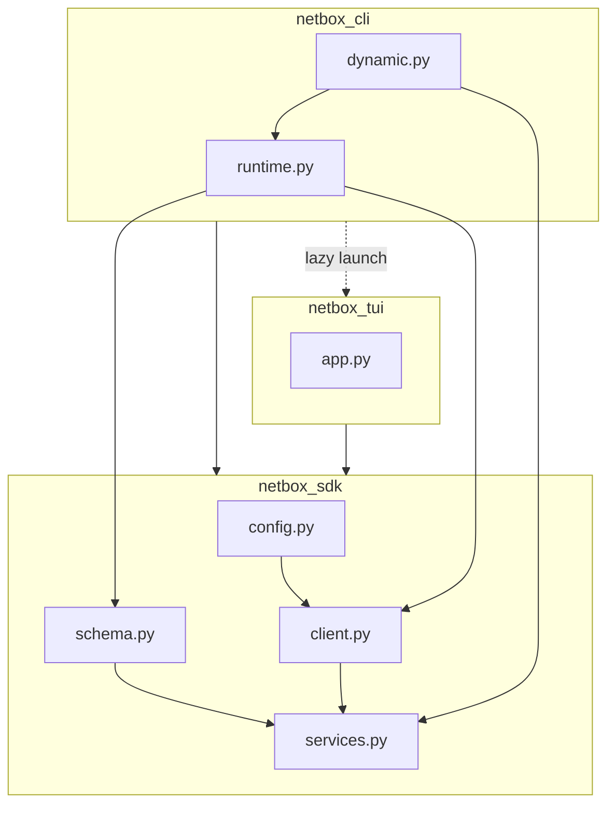

# Integração de pacotes

Este documento descreve como o artefato instalável, caminhos de import e subsistemas se encaixam.

## Projeto PyPI e extras opcionais

O projeto PyPI principal é `netbox-sdk` (veja `pyproject.toml`). A mesma distribuição inclui três pacotes de nível superior:

| Pacote de import | Papel | Instalação típica |
|----------------|------|-----------------|
| `netbox_sdk` | Cliente REST, config, esquema, services, API tipada | `pip install netbox-sdk` |
| `netbox_cli` | CLI Typer `nbx` | `pip install 'netbox-sdk[cli]'` |
| `netbox_tui` | TUIs Textual | `pip install 'netbox-sdk[tui]'` |

Use `pip install 'netbox-sdk[all]'` para CLI + TUI + ferramentas demo.

Para uma instalação reproduzível pelo índice PyPI padrão, fixe com `==` e a
versão final ou pós-lançamento compatível com PEP 440 em
`docs/snippets/published-package-version.txt` (veja
[Instalação](../getting-started/installation.pt.md)). O valor separado em
`docs/snippets/package-version.txt` identifica o candidato no código-fonte e os
artefatos do TestPyPI; versões de pré-lançamento, desenvolvimento e locais não
são publicadas no índice padrão.

Tags de candidatos são enviados diretamente com a versão exata `v*rc*` e
publicam somente no TestPyPI. Versões finais e pós-lançamentos chegam ao PyPI
somente por um GitHub Release publicado. O workflow aceita um conjunto local
fechado com exatamente um wheel e um sdist correspondentes ao pacote/versão,
captura esse conjunto antes de instalar dependências de rede para o smoke test
e fornece a cada registro apenas um diretório novo aprovado pelo validador.
Antes do upload de produção, ele valida o conjunto completo no TestPyPI e o
conjunto exato atual de nomes/hashes no PyPI, preparando apenas arquivos
ausentes para que uploads parciais possam continuar sem `--skip-existing`. A
etapa do Twine revalida o manifesto aprovado de nomes/digests, e uma verificação
final limitada exige que o PyPI exponha exatamente os nomes e hashes locais do
wheel e do sdist. Os jobs de registro instalam somente o grupo de dependências
`publish` auditado e bloqueado pelo lockfile.

## Superfície pública do SDK

Símbolos estáveis para uso em biblioteca são exportados de `netbox_sdk` (veja `netbox_sdk/__init__.py`), incluindo:

- `NetBoxApiClient`, `ApiResponse`, `ConnectionProbe`, `RequestError`
- `Config`, `load_profile_config`, `save_config` e auxiliares de perfil relacionados
- `SchemaIndex`, `load_openapi_schema`, `build_schema_index`
- `ResolvedRequest`, `resolve_dynamic_request`, `run_dynamic_command`
- Fachada tipada (`api`, `typed_api`, …) e tipos de suporte de versão

Tudo fora desse `__all__` é considerado interno salvo documentação em contrário.

## Diagrama de camadas

```mermaid
flowchart TB
  subgraph sdk [netbox_sdk]
    config[config.py]
    schema[schema.py]
    services[services.py]
    client[client.py]
    config --> client
    schema --> services
    client --> services
  end
  subgraph cli [netbox_cli]
    runtime[runtime.py]
    dynamic[dynamic.py]
    runtime --> client
    runtime --> schema
    dynamic --> runtime
    dynamic --> services
  end
  subgraph tui [netbox_tui]
    app[app.py]
  end
  cli --> sdk
  tui --> sdk
  cli -. lazy launch .-> tui
```

## Arestas de import permitidas

| De | Pode importar | Notas |
|------|------------|-------|
| `netbox_sdk` | stdlib + deps declaradas apenas | **Não** importar `netbox_cli` ou `netbox_tui`. |
| `netbox_cli` | `netbox_sdk`, depois `netbox_tui` só via auxiliares preguiçosos (`support.load_tui_callables`) | Entry: `netbox_cli:main` → `nbx`. |
| `netbox_tui` | `netbox_sdk` | Recebe `NetBoxApiClient` e `SchemaIndex` do chamador ou CLI. |

## Estado de runtime em processo (`netbox_cli.runtime`)

`netbox_cli.runtime` mantém `_RUNTIME_CONFIGS`, `_cache_profile`, `_get_client`, `_get_registration_index`, `_get_runtime_index` e auxiliares relacionados. `_get_registration_index()` constrói a árvore de comandos sem rede a partir do esquema integrado selecionado, enquanto `_get_runtime_index()` respeita overrides explícitos de versão ou detecta a linha de release da instância configurada para execução. A atualização de token demo atualiza o perfil em cache via `_cache_profile` para o processo CLI permanecer consistente sem o cliente SDK importar Typer.

## Registro de comandos CLI

Comandos são registrados no app `Typer` raiz em `netbox_cli/__init__.py`. Comandos dinâmicos OpenAPI são construídos em `netbox_cli/dynamic.py`; `_runtime_get_client` / `_runtime_get_index` resolvem via `netbox_cli.runtime` em tempo de chamada para testes poderem patchar essas fábricas.

## Entry point

O script de console `nbx` mapeia para `netbox_cli:main`.

Veja também: [Arquitetura](architecture.md), [Princípios de design](design-principles.md).
