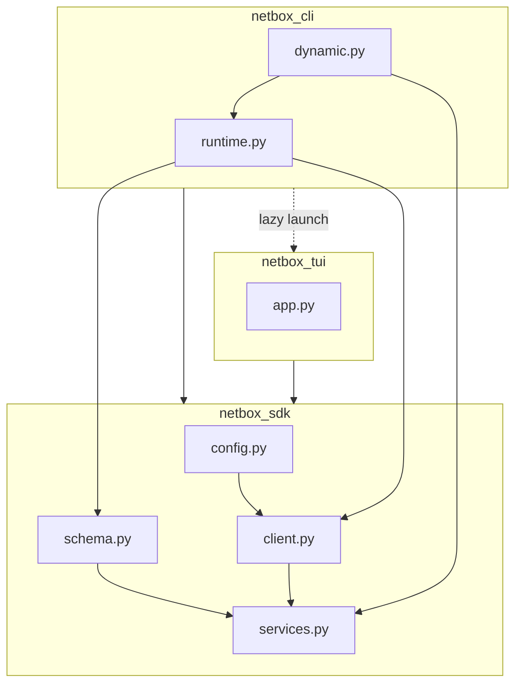

# Integração de pacotes

Este documento descreve como o artefato instalável, caminhos de import e subsistemas se encaixam.

## Projeto PyPI e extras opcionais

O projeto PyPI principal é `netbox-sdk` (veja `pyproject.toml`). A mesma distribuição inclui três pacotes de nível superior:

| Pacote de import | Papel | Instalação típica |
|----------------|------|-----------------|
| `netbox_sdk` | Cliente REST, config, esquema, services, API tipada | `pip install netbox-sdk` |
| `netbox_cli` | CLI Typer `nbx` | `pip install 'netbox-sdk[cli]'` |
| `netbox_tui` | TUIs Textual | `pip install 'netbox-sdk[tui]'` |

Use `pip install 'netbox-sdk[all]'` para CLI + TUI + ferramentas demo.

Para uma instalação reproduzível pelo índice PyPI padrão, fixe com `==` e a
versão final ou pós-lançamento compatível com PEP 440 em
`docs/snippets/published-package-version.txt` (veja
[Instalação](../getting-started/installation.pt.md)). O valor separado em
`docs/snippets/package-version.txt` identifica o candidato no código-fonte e os
artefatos do TestPyPI; versões de pré-lançamento, desenvolvimento e locais não
são publicadas no índice padrão.

Tags de candidatos são enviados diretamente com a versão exata `v*rc*` e
publicam somente no TestPyPI. Versões finais e pós-lançamentos chegam ao PyPI
somente por um GitHub Release publicado. O workflow aceita um conjunto local
fechado com exatamente um wheel e um sdist correspondentes ao pacote/versão,
captura esse conjunto antes de instalar dependências de rede para o smoke test
e fornece a cada registro apenas um diretório novo aprovado pelo validador.
Antes do upload de produção, ele valida o conjunto completo no TestPyPI e o
conjunto exato atual de nomes/hashes no PyPI, preparando apenas arquivos
ausentes para que uploads parciais possam continuar sem `--skip-existing`. A
etapa do Twine revalida o manifesto aprovado de nomes/digests, e uma verificação
final limitada exige que o PyPI exponha exatamente os nomes e hashes locais do
wheel e do sdist. Os jobs de registro instalam somente o grupo de dependências
`publish` auditado e bloqueado pelo lockfile.

## Atualizações do catálogo de builds dos modelos Django

O arquivo do repositório em `django_models_builds/` é a fonte do catálogo de
versões compatíveis empacotado em `netbox_sdk/django_models/model_builds/`.
O workflow semanal `.github/workflows/django-model-builds.yml` constrói as três
versões mais recentes do NetBox com o código-fonte exato e somente leitura do
repositório e retém os arquivos JSON como artefato por 14 dias. A branch `main`
do GitHub permanece somente leitura: o workflow nunca faz commit nem push de
uma atualização do arquivo.

Um mantenedor seleciona e baixa um artefato localmente, prepara o arquivo e o
catálogo empacotado e envia o resultado por meio de um pull request revisado no
Gitea:

```bash
gh run download <run-id> --dir .tmp/django-model-builds/<run-id>
uv run --locked python scripts/refresh_django_model_builds.py \
  --artifact-dir .tmp/django-model-builds/<run-id>
```

O `scripts/refresh_django_model_builds.py` não realiza downloads. Ele recebe o
diretório local do artefato, normaliza cada build em `django_models_builds/`,
regenera o catálogo empacotado de versões compatíveis com
`scripts/build_model_catalog.py` e imprime a saída exata de
`git status` para revisão. O mesmo comando pode construir os dados a
partir de um checkout local existente do NetBox:

```bash
uv run --locked python scripts/refresh_django_model_builds.py \
  --netbox-checkout /path/to/netbox --tag v4.7.0
```

A geração por tag local exige que `HEAD` resolva para o commit da tag solicitada
e que `git status --porcelain --untracked-files=all` esteja vazio. Arquivos
rastreados modificados e arquivos não rastreados são rejeitados para que não
sejam publicados sob o nome de uma versão oficial do NetBox.

Cada build de patch exata já empacotada permanece disponível. A chamada
`catalog.load_build("v4.6.3")` carrega esse artefato exato; a correspondência da
linha de versão `4.6` seleciona o patch numérico mais recente disponível nessa
linha. O mapa `builds` do manifesto registra esses padrões por linha de versão,
enquanto `exact_builds` registra o inventário empacotado completo. O
`scripts/build_model_catalog.py` preserva as builds empacotadas existentes por
padrão. A opção `--prune` remove builds que não são padrões atuais de uma linha
e deve ser usada somente por uma decisão explícita de compatibilidade.

Tanto o construtor do grafo quanto o normalizador do catálogo registram os
caminhos relativos à raiz do checkout do NetBox. O normalizador infere as
raízes de checkout dos valores antigos de `meta.source_path` e rejeita qualquer
caminho absoluto remanescente com uma mensagem acionável. A suíte offline
também exige que `django_models_builds/` contenha a linha de versão mais recente
marcada como estável em `netbox_sdk/versioning.py`; portanto, adicionar uma
linha estável sem seu grafo revisado causa uma falha antes do merge.

## Proveniência dos metadados do repositório

O `metadata.json` identifica o candidato pelo conteúdo. O campo autoritativo
`source.content_id` é o digest SHA-256 dos bytes UTF-8 das linhas ordenadas de
`git ls-tree -r --full-tree` para a árvore candidata. O digest exclui a entrada
de `metadata.json` porque incluí-la faria o digest conter a si próprio.
Subárvores vazias não aparecem na saída recursiva de `git ls-tree`; portanto,
diretórios vazios não afetam a identidade.

O `scripts/build_metadata.py` prepara o checkout atual em um índice Git e um
banco de objetos temporários e calcula o digest dessa árvore candidata sem
alterar o índice real nem os objetos do repositório. O schema exato rejeita
campos ausentes e desconhecidos. Ele deriva `python` e `netbox` das mesmas fontes
do projeto usadas durante a geração, fixa `source.repo` à identidade do
repositório canônico declarada pela configuração confiável do projeto e exige
que `generated_at` seja um timestamp RFC 3339 UTC válido. `source.version` deve
ser igual a `project.version`. `source.commit` continua sendo um SHA completo e
informativo: quando o objeto está disponível, a geração e a verificação exigem
que ele seja um commit com a versão do projeto e a identidade de conteúdo da
árvore candidata, mas a ausência do objeto não invalida a identidade do
conteúdo. A igualdade de conteúdo autentica a árvore, não a origem do
repositório; um fetch externo confiável ou vínculo equivalente à fonte canônica
deve autenticar a origem. O comando
`python scripts/build_metadata.py --verify` verifica os metadados commitados em
relação ao `HEAD`.

O workflow de metadados sem credenciais valida essa identidade de conteúdo. O
espelho do Gitea para o GitHub envia o commit canônico exato e executa somente o
auxiliar limitado `scripts/mirror_github.py` desse commit destacado durante a
etapa de push. Ele não regenera o `metadata.json` nem cria um commit de metadados
exclusivo do GitHub. A reescrita única é permitida somente quando a ponta
observada no GitHub for exatamente o commit histórico e revisado exclusivo do
espelho `d0b46101d3d91d6755b6a419e9095577b66a443d`, e o force-with-lease
permanece fixo nesse SHA. Todas as outras atualizações exigem que a ponta
observada no GitHub seja ancestral do commit canônico e usam um force-with-lease
exato, fixo na ponta inspecionada por essa verificação de ancestralidade.
Qualquer rejeição do push encerra o job sem atualizar a ponta observada ou
tentar novamente; assim, nem um retrocesso concorrente nem outra gravação
concorrente são sobrescritos.

## Superfície pública do SDK

Símbolos estáveis para uso em biblioteca são exportados de `netbox_sdk` (veja `netbox_sdk/__init__.py`), incluindo:

- `NetBoxApiClient`, `ApiResponse`, `ConnectionProbe`, `RequestError`
- `Config`, `load_profile_config`, `save_config` e auxiliares de perfil relacionados
- `SchemaIndex`, `load_openapi_schema`, `build_schema_index`
- `ResolvedRequest`, `resolve_dynamic_request`, `run_dynamic_command`
- Fachada tipada (`api`, `typed_api`, …) e tipos de suporte de versão

Tudo fora desse `__all__` é considerado interno salvo documentação em contrário.

## Diagrama de camadas


```mermaid
flowchart TB
  subgraph sdk [netbox_sdk]
    config[config.py]
    schema[schema.py]
    services[services.py]
    client[client.py]
    config --> client
    schema --> services
    client --> services
  end
  subgraph cli [netbox_cli]
    runtime[runtime.py]
    dynamic[dynamic.py]
    runtime --> client
    runtime --> schema
    dynamic --> runtime
    dynamic --> services
  end
  subgraph tui [netbox_tui]
    app[app.py]
  end
  cli --> sdk
  tui --> sdk
  cli -. lazy launch .-> tui
```

## Arestas de import permitidas

| De | Pode importar | Notas |
|------|------------|-------|
| `netbox_sdk` | stdlib + deps declaradas apenas | **Não** importar `netbox_cli` ou `netbox_tui`. |
| `netbox_cli` | `netbox_sdk`, depois `netbox_tui` só via auxiliares preguiçosos (`support.load_tui_callables`) | Entry: `netbox_cli:main` → `nbx`. |
| `netbox_tui` | `netbox_sdk` | Recebe `NetBoxApiClient` e `SchemaIndex` do chamador ou CLI. |

## Estado de runtime em processo (`netbox_cli.runtime`)

`netbox_cli.runtime` mantém `_RUNTIME_CONFIGS`, `_cache_profile`, `_get_client`, `_get_registration_index`, `_get_runtime_index` e auxiliares relacionados. `_get_registration_index()` constrói a árvore de comandos sem rede a partir do esquema integrado selecionado, enquanto `_get_runtime_index()` respeita overrides explícitos de versão ou detecta a linha de release da instância configurada para execução. A atualização de token demo atualiza o perfil em cache via `_cache_profile` para o processo CLI permanecer consistente sem o cliente SDK importar Typer.

## Registro de comandos CLI

Comandos são registrados no app `Typer` raiz em `netbox_cli/__init__.py`. Comandos dinâmicos OpenAPI são construídos em `netbox_cli/dynamic.py`; `_runtime_get_client` / `_runtime_get_index` resolvem via `netbox_cli.runtime` em tempo de chamada para testes poderem patchar essas fábricas.

## Entry point

O script de console `nbx` mapeia para `netbox_cli:main`.

Veja também: [Arquitetura](architecture.md), [Princípios de design](design-principles.md).
