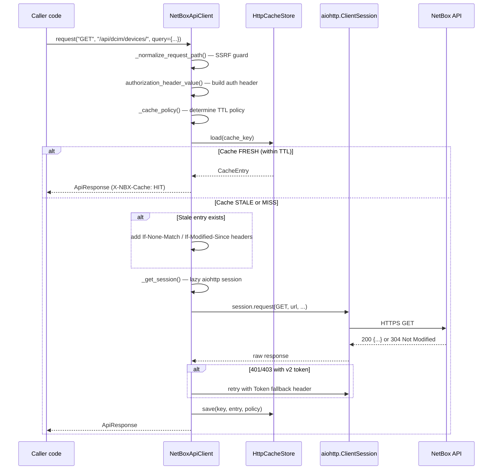
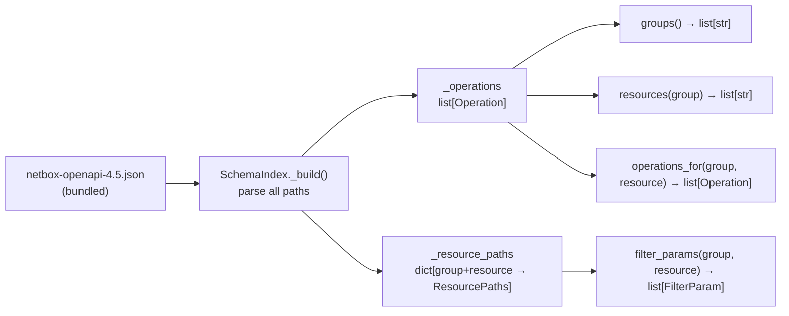
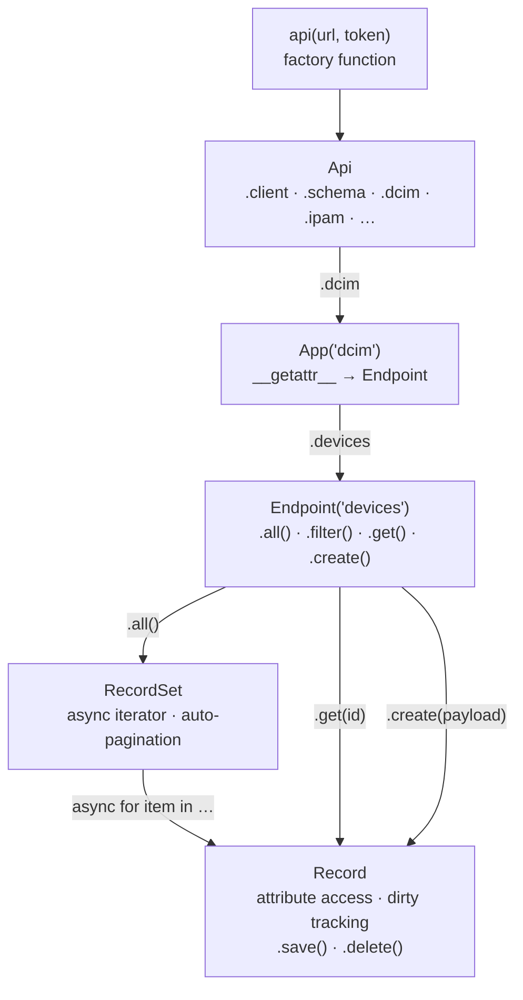
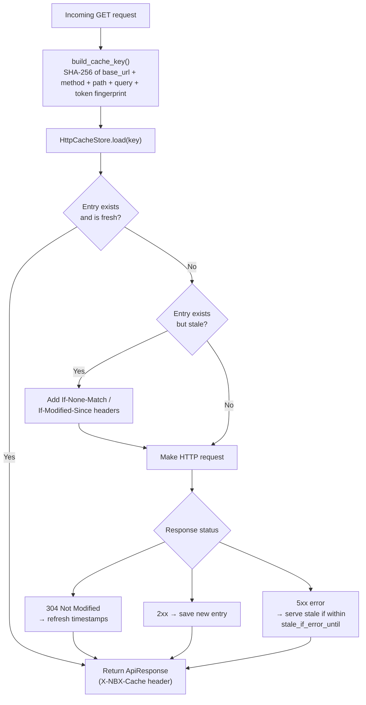

# SDK Internals

This page explains how `netbox_sdk` works under the hood — the HTTP client lifecycle, config and profile system, OpenAPI schema indexing, the facade object hierarchy, versioned typed clients, filesystem HTTP cache, and the services layer.

---

## NetBoxApiClient Request Lifecycle

`NetBoxApiClient` in `netbox_sdk/client.py` is the central async HTTP client. Every request passes through the same pipeline regardless of which API layer (raw, facade, or typed) initiated it.



### Lazy Session Creation

The `aiohttp.ClientSession` is created on the first request and reused for all subsequent calls. A double-check lock pattern handles event-loop affinity:

```python title="netbox_sdk/client.py"
async def _get_session(self) -> aiohttp.ClientSession:
    current_loop_id = id(asyncio.get_running_loop())

    # Fast path: session already valid for this loop — no lock needed
    if (
        self._session is not None
        and not self._session_closed()
        and self._session_loop_id == current_loop_id
    ):
        return self._session

    async with self._get_lock():
        # Re-check under lock in case another coroutine just created the session
        if self._session is None or session_closed or self._session_loop_id != current_loop_id:
            ...
            self._session = aiohttp.ClientSession(timeout=..., connector=...)
            self._session_loop_id = current_loop_id
        return self._session
```

### SSRF Protection

All request paths pass through `_normalize_request_path()`, which rejects absolute URLs, query strings, and fragments embedded in the path argument:

```python title="netbox_sdk/client.py"
def _normalize_request_path(self, path: str) -> str:
    parsed = urlsplit(path.strip())
    if parsed.scheme or parsed.netloc:
        raise ValueError("Request path must be relative to the configured NetBox base URL")
    if parsed.query or parsed.fragment:
        raise ValueError("Request path must not include query parameters or fragments")
    return parsed.path if parsed.path.startswith("/") else f"/{parsed.path}"
```

### v2-to-v1 Token Fallback

When a v2 `nbt_` token receives a 401/403 with "invalid v2 token" in the body, the client retries transparently with a `Token <secret>` v1 header:

```python title="netbox_sdk/client.py"
def _should_retry_with_v1(self, response: ApiResponse) -> bool:
    if self.config.token_version != "v2" or not self.config.token_secret:
        return False
    if response.status not in {401, 403}:
        return False
    return "invalid v2 token" in response.text.lower()
```

---

## Config and Profile System

`Config` in `netbox_sdk/config.py` is a Pydantic model that normalizes and validates connection parameters before passing them to `NetBoxApiClient`.

### Fields and Validators

| Field | Type | Description |
|---|---|---|
| `base_url` | `str \| None` | NetBox base URL — normalized to `http://` or `https://` only |
| `token_version` | `str` | `"v1"` (legacy `Token`) or `"v2"` (`nbt_` bearer) |
| `token_key` | `str \| None` | v2 token key prefix (before `.`) |
| `token_secret` | `str \| None` | Token value — CR/LF/null stripped to prevent header injection |
| `timeout` | `float` | HTTP timeout in seconds (default: 30.0) |
| `ssl_verify` | `bool` | TLS certificate verification (default: `True`) |
| `demo_username` | `str \| None` | Username for demo profile auto-login |
| `demo_password` | `str \| None` | Password for demo profile auto-login |

Validators strip control characters from token values and reject URLs with embedded credentials.

### Multi-Profile Persistence

Profiles are stored as `{"profiles": {"default": {...}, "demo": {...}}}` in `~/.config/netbox-sdk/config.json` with `0o600` permissions (owner read/write only):

```python title="netbox_sdk/config.py (pattern)"
# Load the active profile
config = load_profile_config(profile="default")

# Save updated credentials
save_config(config, profile="default")
```

### Environment Variable Override

| Variable | Config field |
|---|---|
| `NETBOX_URL` | `base_url` |
| `NETBOX_TOKEN_KEY` | `token_key` |
| `NETBOX_TOKEN_SECRET` | `token_secret` |
| `NETBOX_SSL_VERIFY` | `ssl_verify` |
| `DEMO_USERNAME` | `demo_username` |
| `DEMO_PASSWORD` | `demo_password` |

Environment variables take precedence over the profile config file.

---

## SchemaIndex (OpenAPI Parsing)

`SchemaIndex` in `netbox_sdk/schema.py` parses the bundled OpenAPI JSON into an in-memory index optimized for fast group/resource/operation lookups.



### Path Parsing

`parse_group_resource()` splits any NetBox API path into a `(group, resource)` tuple:

- `/api/dcim/devices/` → `("dcim", "devices")`
- `/api/plugins/my-plugin/widgets/` → `("plugins", "my-plugin/widgets")`
- `/api/ipam/ip-addresses/{id}/` → `("ipam", "ip-addresses")`

### Plugin Discovery

`discover_plugin_resource_paths()` in `netbox_sdk/plugin_discovery.py` walks the live `/api/plugins/` endpoint to find non-schema plugin routes and augments the active `SchemaIndex` at runtime:

```python
from netbox_sdk.plugin_discovery import discover_plugin_resource_paths

paths = await discover_plugin_resource_paths(client)
for group_resource, paths_obj in paths.items():
    schema_index.add_discovered_resource(group_resource, paths_obj)
```

### Versioned Bundled Schemas

Four OpenAPI schemas ship with the package under `netbox_sdk/reference/openapi/`:

| File | NetBox Version |
|---|---|
| `netbox-openapi.json` | Default (latest) |
| `netbox-openapi-4.5.json` | NetBox 4.5 |
| `netbox-openapi-4.4.json` | NetBox 4.4 |
| `netbox-openapi-4.3.json` | NetBox 4.3 |

---

## Facade Object Hierarchy

`netbox_sdk/facade.py` provides a PyNetBox-compatible async API. The `api()` factory builds the root `Api` object; subsequent attribute accesses create `App` → `Endpoint` → `Record` / `RecordSet` objects.



### CRUD Operations

```python title="netbox_sdk/facade.py (usage)"
nb = api("https://netbox.example.com", token="...")

# List all — async iteration with auto-pagination
async for device in nb.dcim.devices.all():
    print(device.name, device.status)

# Filter with query params
records = nb.dcim.devices.filter(site="nyc-dc1", status="active")
async for device in records:
    print(device)

# Get single by ID
device = await nb.dcim.devices.get(42)

# Create
tag = await nb.extras.tags.create({
    "name": "proxmox",
    "slug": "proxmox",
    "color": "ff5722",
})

# Get or create via facade (using lookup keywords)
result = await nb.extras.tags.get(slug="proxmox")
```

### Record Dirty Tracking

`Record` captures a snapshot of field values at creation time. Mutating a field adds it to a `_updates` dict; calling `.save()` sends only the changed fields as a PATCH:

```python title="netbox_sdk/facade.py (usage)"
device = await nb.dcim.devices.get(42)
device.status = "offline"          # marks "status" dirty
device.comments = "decommissioned" # marks "comments" dirty
await device.save()                 # PATCH {status, comments} only
```

### Specialized Record Types

| Type | Resource | Extras |
|---|---|---|
| `TraceableRecord` | DCIM interfaces, power ports, etc. | `.trace()` → cable trace result |
| `PathableRecord` | Circuit terminations | `.paths()` → path list |
| `DeviceRecord` | `dcim.devices` | `.render_config()`, `.napalm()` |

---

## Typed API (Versioned Clients)

`typed_api()` in `netbox_sdk/typed_api.py` returns a version-specific typed client backed by generated Pydantic models for full IDE completion and runtime validation.

```python title="Usage"
from netbox_sdk import typed_api

nb = typed_api("https://netbox.example.com", token="...", netbox_version="4.5")

# Full Pydantic validation on request and response
device = await nb.dcim.devices.retrieve(42)
device.name    # str — IDE knows the type
device.status  # DeviceStatus enum
```

### Version Selection

The `netbox_version` argument maps to a dynamically imported module:

```python title="netbox_sdk/typed_api.py (simplified)"
def typed_api(url, token, *, netbox_version):
    normalized = normalize_netbox_version(netbox_version)  # "4.5" / "4.4" / "4.3"
    suffix = version_module_suffix(normalized)             # "v4_5" / "v4_4" / "v4_3"
    module = import_module(f"netbox_sdk.typed_versions.{suffix}")
    return module.build_typed_api(url=url, token=token)
```

Overloaded return types provide IDE completion per version:

```python title="netbox_sdk/typed_api.py"
@overload
def typed_api(url: str, token: str | None = None, *, netbox_version: Literal["4.5"]) -> TypedApiV4_5: ...
@overload
def typed_api(url: str, token: str | None = None, *, netbox_version: Literal["4.4"]) -> TypedApiV4_4: ...
@overload
def typed_api(url: str, token: str | None = None, *, netbox_version: Literal["4.3"]) -> TypedApiV4_3: ...
```

---

## HTTP Cache

`HttpCacheStore` in `netbox_sdk/http_cache.py` provides a filesystem-backed JSON cache stored under `~/.config/netbox-sdk/http-cache/`.



### Cache Key

Cache keys are SHA-256 fingerprints of the request identity — never raw credentials:

```python title="netbox_sdk/http_cache.py"
def build_cache_key(*, base_url, method, path, query, authorization) -> str:
    token_fingerprint = hashlib.sha256((authorization or "").encode()).hexdigest()
    identity = "\n".join([
        base_url.rstrip("/"),
        method.upper(),
        path,
        urlencode(sorted((query or {}).items()), doseq=True),
        token_fingerprint,
    ])
    return hashlib.sha256(identity.encode()).hexdigest()
```

### Cache Policies

| Request type | Fresh TTL | Stale-if-error TTL |
|---|---|---|
| GET list (e.g., `/api/dcim/devices/`) | 60 s | 300 s |
| GET detail with query | 30 s | 60 s |
| GET detail without query | 15 s | 60 s |
| Non-GET (POST/PUT/PATCH/DELETE) | Not cached | — |

Cache files use `0o600` permissions (owner read/write only) to protect token fingerprints.

---

## Services Layer

`netbox_sdk/services.py` maps user-facing action names to HTTP calls, bridging the CLI and the HTTP client.

### ACTION_METHOD_MAP

| Action | HTTP Method | Path |
|---|---|---|
| `list` | GET | `list_path` |
| `get` | GET | `detail_path` (requires `--id`) |
| `create` | POST | `list_path` |
| `update` | PUT | `detail_path` (requires `--id`) |
| `patch` | PATCH | `detail_path` (requires `--id`) |
| `delete` | DELETE | `detail_path` (requires `--id`) |

### resolve_dynamic_request()

Takes a `(group, resource, action, id, query_params, payload)` tuple and returns a `ResolvedRequest(method, path, query, payload)`:

```python title="netbox_sdk/services.py"
class ResolvedRequest(BaseModel):
    method: str
    path: str
    query: dict[str, str]
    payload: dict[str, Any] | list[Any] | None
```

### run_dynamic_command()

Combines `resolve_dynamic_request()` with a `NetBoxApiClient` to execute the full request end-to-end. Used by `netbox_cli/dynamic.py` to power all `nbx <group> <resource> <action>` commands generated at startup from the OpenAPI schema.
