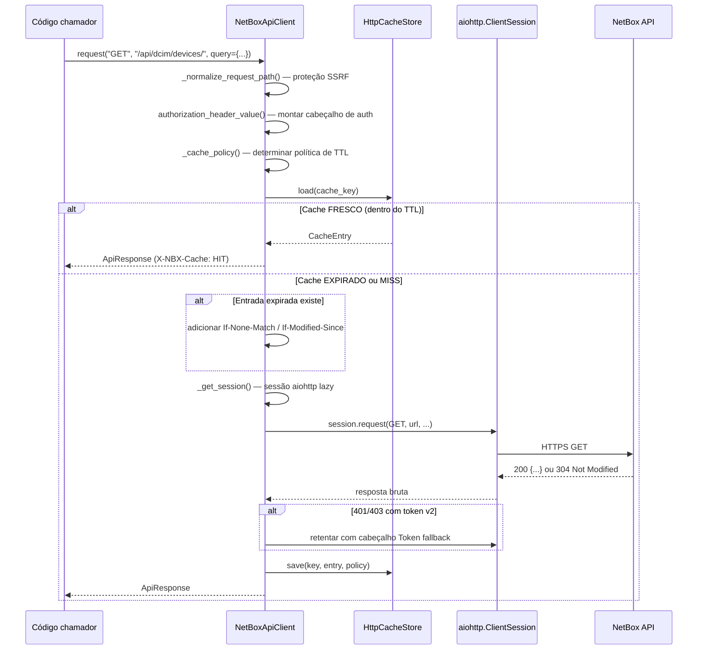
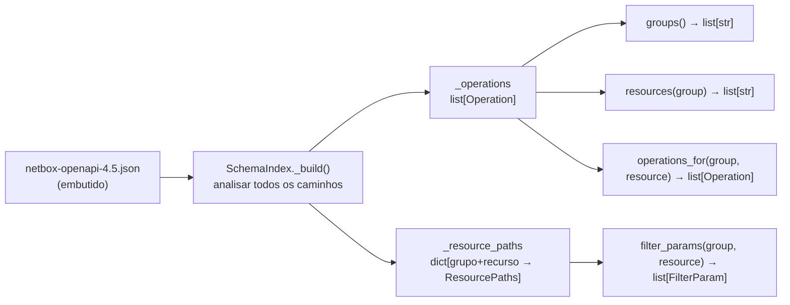
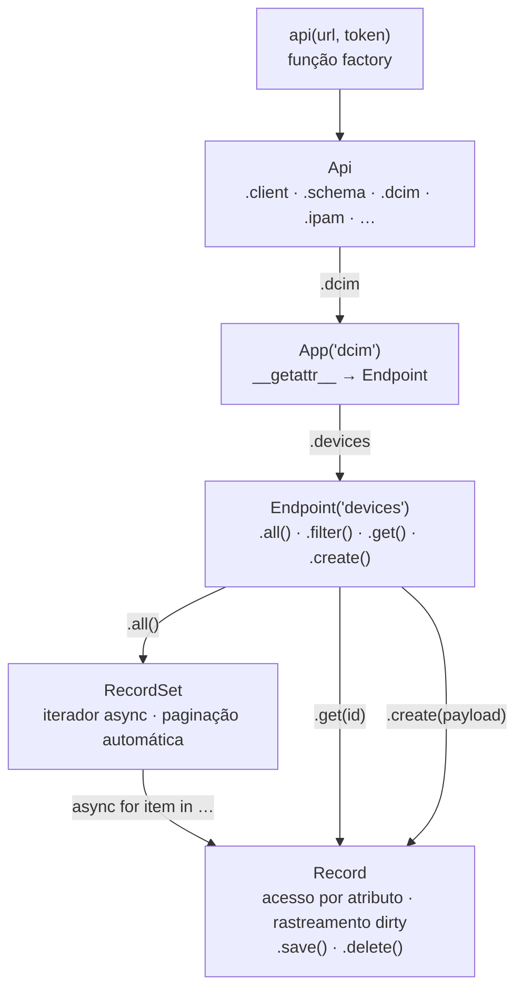
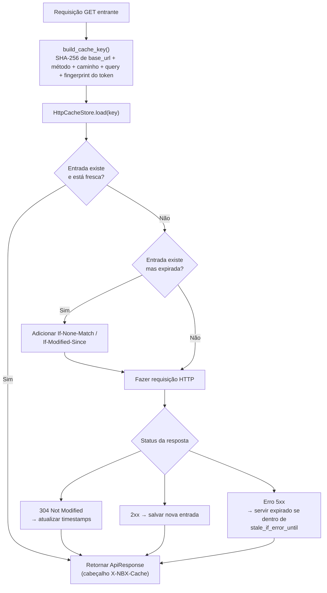

# Internos do SDK

Esta página explica como o `netbox_sdk` funciona internamente — o ciclo de vida do cliente HTTP, o sistema de configuração e perfis, a indexação do esquema OpenAPI, a hierarquia de objetos da fachada, clientes tipados por versão, o cache HTTP em disco e a camada de serviços.

---

## Ciclo de vida das requisições do NetBoxApiClient

`NetBoxApiClient` em `netbox_sdk/client.py` é o cliente HTTP async central. Toda requisição passa pelo mesmo pipeline, independentemente de qual camada de API (raw, facade ou typed) a iniciou.



### Criação lazy de sessão

A `aiohttp.ClientSession` é criada na primeira requisição e reutilizada em todas as chamadas subsequentes. Um padrão de lock com dupla verificação lida com a afinidade de loop de eventos:

```python title="netbox_sdk/client.py"
async def _get_session(self) -> aiohttp.ClientSession:
    current_loop_id = id(asyncio.get_running_loop())

    # Caminho rápido: sessão já válida para este loop — sem lock necessário
    if (
        self._session is not None
        and not self._session_closed()
        and self._session_loop_id == current_loop_id
    ):
        return self._session

    async with self._get_lock():
        # Reverificar sob lock caso outra coroutine acabou de criar a sessão
        if self._session is None or session_closed or self._session_loop_id != current_loop_id:
            ...
            self._session = aiohttp.ClientSession(timeout=..., connector=...)
            self._session_loop_id = current_loop_id
        return self._session
```

### Proteção SSRF

Todos os caminhos de requisição passam por `_normalize_request_path()`, que rejeita URLs absolutas, query strings e fragmentos embutidos no argumento de caminho:

```python title="netbox_sdk/client.py"
def _normalize_request_path(self, path: str) -> str:
    parsed = urlsplit(path.strip())
    if parsed.scheme or parsed.netloc:
        raise ValueError("O caminho da requisição deve ser relativo à URL base configurada")
    if parsed.query or parsed.fragment:
        raise ValueError("O caminho da requisição não deve incluir parâmetros de query ou fragmentos")
    return parsed.path if parsed.path.startswith("/") else f"/{parsed.path}"
```

### Fallback de token v2 para v1

Quando um token v2 `nbt_` recebe 401/403 com "invalid v2 token" no corpo, o cliente retenta transparentemente com um cabeçalho v1 `Token <secret>`:

```python title="netbox_sdk/client.py"
def _should_retry_with_v1(self, response: ApiResponse) -> bool:
    if self.config.token_version != "v2" or not self.config.token_secret:
        return False
    if response.status not in {401, 403}:
        return False
    return "invalid v2 token" in response.text.lower()
```

---

## Sistema de configuração e perfis

`Config` em `netbox_sdk/config.py` é um modelo Pydantic que normaliza e valida parâmetros de conexão antes de passá-los ao `NetBoxApiClient`.

### Campos e validadores

| Campo | Tipo | Descrição |
|---|---|---|
| `base_url` | `str \| None` | URL base do NetBox — normalizada para `http://` ou `https://` apenas |
| `token_version` | `str` | `"v1"` (legacy `Token`) ou `"v2"` (bearer `nbt_`) |
| `token_key` | `str \| None` | Prefixo de chave de token v2 (antes de `.`) |
| `token_secret` | `str \| None` | Valor do token — CR/LF/null removidos para evitar injeção de cabeçalho |
| `timeout` | `float` | Timeout HTTP em segundos (padrão: 30.0) |
| `ssl_verify` | `bool` | Verificação de certificado TLS (padrão: `True`) |
| `demo_username` | `str \| None` | Usuário para login automático no perfil de demonstração |
| `demo_password` | `str \| None` | Senha para login automático no perfil de demonstração |

### Persistência de múltiplos perfis

Perfis são armazenados como `{"profiles": {"default": {...}, "demo": {...}}}` em `~/.config/netbox-sdk/config.json` com permissões `0o600`:

```python title="netbox_sdk/config.py (padrão)"
# Carregar o perfil ativo
config = load_profile_config(profile="default")

# Salvar credenciais atualizadas
save_config(config, profile="default")
```

### Substituição por variáveis de ambiente

| Variável | Campo Config |
|---|---|
| `NETBOX_URL` | `base_url` |
| `NETBOX_TOKEN_KEY` | `token_key` |
| `NETBOX_TOKEN_SECRET` | `token_secret` |
| `NETBOX_SSL_VERIFY` | `ssl_verify` |
| `DEMO_USERNAME` | `demo_username` |
| `DEMO_PASSWORD` | `demo_password` |

---

## SchemaIndex (Parsing de OpenAPI)

`SchemaIndex` em `netbox_sdk/schema.py` analisa o JSON OpenAPI fornecido em um índice em memória otimizado para consultas rápidas de grupo/recurso/operação.



### Esquemas embutidos por versão

Quatro esquemas OpenAPI são fornecidos com o pacote em `netbox_sdk/reference/openapi/`:

| Arquivo | Versão do NetBox |
|---|---|
| `netbox-openapi.json` | Padrão (mais recente) |
| `netbox-openapi-4.5.json` | NetBox 4.5 |
| `netbox-openapi-4.4.json` | NetBox 4.4 |
| `netbox-openapi-4.3.json` | NetBox 4.3 |

---

## Hierarquia de objetos da fachada

`netbox_sdk/facade.py` fornece uma API async compatível com PyNetBox. A função `api()` constrói o objeto `Api` raiz; acessos de atributo subsequentes criam `App` → `Endpoint` → `Record` / `RecordSet`.



### Operações CRUD

```python title="netbox_sdk/facade.py (uso)"
nb = api("https://netbox.example.com", token="...")

# Listar todos — iteração async com paginação automática
async for device in nb.dcim.devices.all():
    print(device.name, device.status)

# Filtrar com parâmetros de query
records = nb.dcim.devices.filter(site="nyc-dc1", status="active")
async for device in records:
    print(device)

# Obter por ID
device = await nb.dcim.devices.get(42)

# Criar
tag = await nb.extras.tags.create({
    "name": "proxmox",
    "slug": "proxmox",
    "color": "ff5722",
})
```

### Rastreamento dirty em Record

`Record` captura um snapshot dos valores de campo na criação. Mutar um campo o adiciona a um dict `_updates`; chamar `.save()` envia apenas os campos alterados como PATCH:

```python title="netbox_sdk/facade.py (uso)"
device = await nb.dcim.devices.get(42)
device.status = "offline"          # marca "status" como dirty
device.comments = "decommissioned" # marca "comments" como dirty
await device.save()                 # PATCH {status, comments} apenas
```

---

## API Tipada (Clientes por versão)

`typed_api()` em `netbox_sdk/typed_api.py` retorna um cliente tipado por versão, respaldado por modelos Pydantic gerados para completação completa em IDE e validação em runtime.

```python title="Uso"
from netbox_sdk import typed_api

nb = typed_api("https://netbox.example.com", token="...", netbox_version="4.5")

# Validação Pydantic completa em request e response
device = await nb.dcim.devices.retrieve(42)
device.name    # str — a IDE conhece o tipo
device.status  # enum DeviceStatus
```

---

## Cache HTTP

`HttpCacheStore` em `netbox_sdk/http_cache.py` fornece um cache JSON baseado em disco armazenado em `~/.config/netbox-sdk/http-cache/`.



### Políticas de cache

| Tipo de requisição | TTL fresco | TTL stale-if-error |
|---|---|---|
| GET lista (ex.: `/api/dcim/devices/`) | 60 s | 300 s |
| GET detalhe com query | 30 s | 60 s |
| GET detalhe sem query | 15 s | 60 s |
| Não-GET (POST/PUT/PATCH/DELETE) | Não cacheado | — |

---

## Camada de serviços

`netbox_sdk/services.py` mapeia nomes de ação voltados ao usuário para chamadas HTTP, fazendo a ponte entre o CLI e o cliente HTTP.

### ACTION_METHOD_MAP

| Ação | Método HTTP | Caminho |
|---|---|---|
| `list` | GET | `list_path` |
| `get` | GET | `detail_path` (requer `--id`) |
| `create` | POST | `list_path` |
| `update` | PUT | `detail_path` (requer `--id`) |
| `patch` | PATCH | `detail_path` (requer `--id`) |
| `delete` | DELETE | `detail_path` (requer `--id`) |

### resolve_dynamic_request()

Recebe uma tupla `(grupo, recurso, ação, id, query_params, payload)` e retorna um `ResolvedRequest(método, caminho, query, payload)`:

```python title="netbox_sdk/services.py"
class ResolvedRequest(BaseModel):
    method: str
    path: str
    query: dict[str, str]
    payload: dict[str, Any] | list[Any] | None
```

### run_dynamic_command()

Combina `resolve_dynamic_request()` com um `NetBoxApiClient` para executar a requisição completa de ponta a ponta. Usado por `netbox_cli/dynamic.py` para alimentar todos os comandos `nbx <grupo> <recurso> <ação>` gerados na inicialização a partir do esquema OpenAPI.
