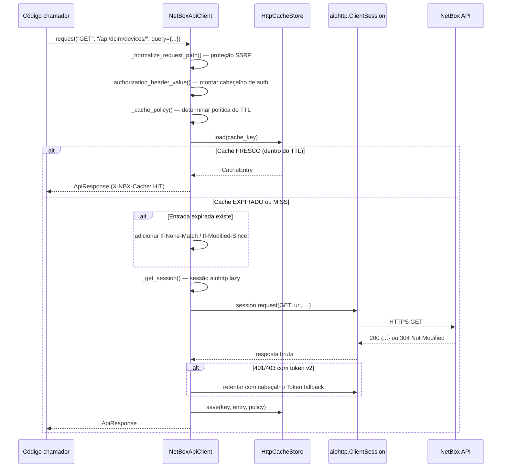
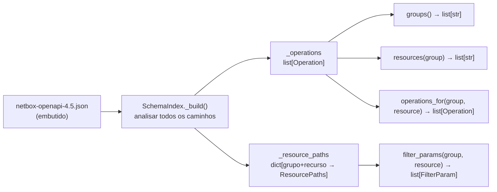
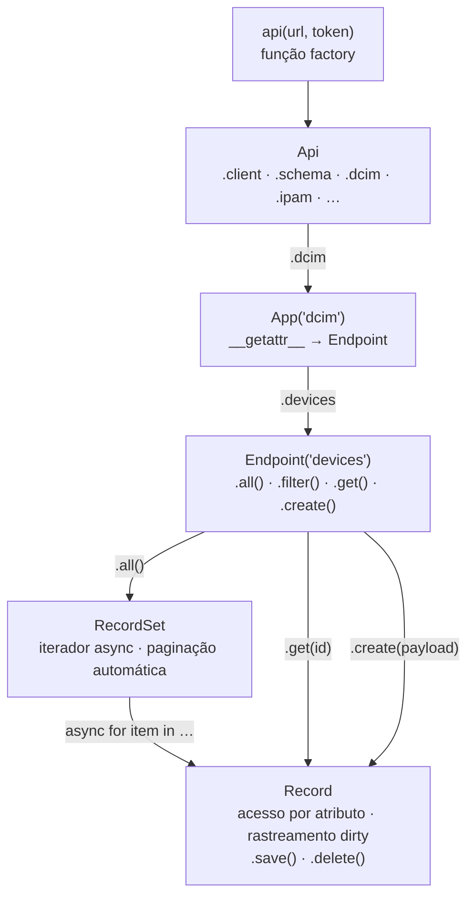
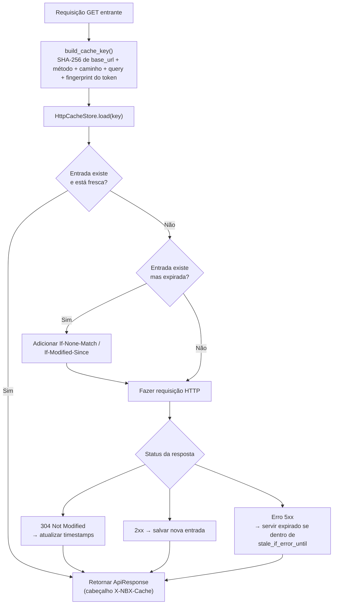

# Internos do SDK

Esta página explica como o `netbox_sdk` funciona internamente — o ciclo de vida do cliente HTTP, o sistema de configuração e perfis, a indexação do esquema OpenAPI, a hierarquia de objetos da fachada, clientes tipados por versão, o cache HTTP em disco e a camada de serviços.

---

## Ciclo de vida das requisições do NetBoxApiClient

`NetBoxApiClient` em `netbox_sdk/client.py` é o cliente HTTP async central. Toda requisição passa pelo mesmo pipeline, independentemente de qual camada de API (raw, facade ou typed) a iniciou.


```mermaid
sequenceDiagram
    participant Caller as Código chamador
    participant Client as NetBoxApiClient
    participant Cache as HttpCacheStore
    participant Session as aiohttp.ClientSession
    participant NB as NetBox API

    Caller->>Client: request("GET", "/api/dcim/devices/", query={...})
    Client->>Client: _normalize_request_path() — proteção SSRF
    Client->>Client: authorization_header_value() — montar cabeçalho de auth
    Client->>Client: _cache_policy() — determinar política de TTL
    Client->>Cache: load(cache_key)
    alt Cache FRESCO (dentro do TTL)
        Cache-->>Client: CacheEntry
        Client-->>Caller: ApiResponse (X-NBX-Cache: HIT)
    else Cache EXPIRADO ou MISS
        alt Entrada expirada existe
            Client->>Client: adicionar If-None-Match / If-Modified-Since
        end
        Client->>Client: _get_session() — sessão aiohttp lazy
        Client->>Session: session.request(GET, url, ...)
        Session->>NB: HTTPS GET
        NB-->>Session: 200 {...} ou 304 Not Modified
        Session-->>Client: resposta bruta
        alt 401/403 com token v2
            Client->>Session: retentar com cabeçalho Token fallback
        end
        Client->>Cache: save(key, entry, policy)
        Client-->>Caller: ApiResponse
    end
```

### Criação lazy de sessão

A `aiohttp.ClientSession` é criada na primeira requisição e reutilizada em todas as chamadas subsequentes. Um padrão de lock com dupla verificação lida com a afinidade de loop de eventos:

```python title="netbox_sdk/client.py"
async def _get_session(self) -> aiohttp.ClientSession:
    current_loop_id = id(asyncio.get_running_loop())

    # Caminho rápido: sessão já válida para este loop — sem lock necessário
    if (
        self._session is not None
        and not self._session_closed()
        and self._session_loop_id == current_loop_id
    ):
        return self._session

    async with self._get_lock():
        # Reverificar sob lock caso outra coroutine acabou de criar a sessão
        if self._session is None or session_closed or self._session_loop_id != current_loop_id:
            ...
            self._session = aiohttp.ClientSession(timeout=..., connector=...)
            self._session_loop_id = current_loop_id
        return self._session
```

### Proteção SSRF

Todos os caminhos de requisição passam por `_normalize_request_path()`, que rejeita URLs absolutas, query strings e fragmentos embutidos no argumento de caminho:

```python title="netbox_sdk/client.py"
def _normalize_request_path(self, path: str) -> str:
    parsed = urlsplit(path.strip())
    if parsed.scheme or parsed.netloc:
        raise ValueError("O caminho da requisição deve ser relativo à URL base configurada")
    if parsed.query or parsed.fragment:
        raise ValueError("O caminho da requisição não deve incluir parâmetros de query ou fragmentos")
    return parsed.path if parsed.path.startswith("/") else f"/{parsed.path}"
```

### Fallback de token v2 para v1

Quando um token v2 `nbt_` recebe 401/403 com "invalid v2 token" no corpo, o cliente retenta transparentemente com um cabeçalho v1 `Token <secret>`:

```python title="netbox_sdk/client.py"
def _should_retry_with_v1(self, response: ApiResponse) -> bool:
    if self.config.token_version != "v2" or not self.config.token_secret:
        return False
    if response.status not in {401, 403}:
        return False
    return "invalid v2 token" in response.text.lower()
```

---

## Sistema de configuração e perfis

`Config` em `netbox_sdk/config.py` é um modelo Pydantic que normaliza e valida parâmetros de conexão antes de passá-los ao `NetBoxApiClient`.

### Campos e validadores

| Campo | Tipo | Descrição |
|---|---|---|
| `base_url` | `str \| None` | URL base do NetBox — normalizada para `http://` ou `https://` apenas |
| `token_version` | `str` | `"v1"` (legacy `Token`) ou `"v2"` (bearer `nbt_`) |
| `token_key` | `str \| None` | Prefixo de chave de token v2 (antes de `.`) |
| `token_secret` | `str \| None` | Valor do token — CR/LF/null removidos para evitar injeção de cabeçalho |
| `timeout` | `float` | Timeout HTTP em segundos (padrão: 30.0) |
| `ssl_verify` | `bool` | Verificação de certificado TLS (padrão: `True`) |
| `demo_username` | `str \| None` | Usuário para login automático no perfil de demonstração |
| `demo_password` | `str \| None` | Senha para login automático no perfil de demonstração |

### Persistência de múltiplos perfis

Perfis são armazenados como `{"profiles": {"default": {...}, "demo": {...}}}` em `~/.config/netbox-sdk/config.json` com permissões `0o600`:

```python title="netbox_sdk/config.py (padrão)"
# Carregar o perfil ativo
config = load_profile_config(profile="default")

# Salvar credenciais atualizadas
save_config(config, profile="default")
```

### Substituição por variáveis de ambiente

| Variável | Campo Config |
|---|---|
| `NETBOX_URL` | `base_url` |
| `NETBOX_TOKEN_KEY` | `token_key` |
| `NETBOX_TOKEN_SECRET` | `token_secret` |
| `NETBOX_SSL_VERIFY` | `ssl_verify` |
| `DEMO_USERNAME` | `demo_username` |
| `DEMO_PASSWORD` | `demo_password` |

---

## SchemaIndex (Parsing de OpenAPI)

`SchemaIndex` em `netbox_sdk/schema.py` analisa o JSON OpenAPI fornecido em um índice em memória otimizado para consultas rápidas de grupo/recurso/operação.


```mermaid
flowchart LR
    JSON["netbox-openapi-4.5.json\n(embutido)"]
    BUILD["SchemaIndex._build()\nanalisar todos os caminhos"]
    OPS["_operations\nlist[Operation]"]
    RPATHS["_resource_paths\ndict[grupo+recurso → ResourcePaths]"]
    GROUPS["groups() → list[str]"]
    RES["resources(group) → list[str]"]
    OPFOR["operations_for(group, resource) → list[Operation]"]
    FILTER["filter_params(group, resource) → list[FilterParam]"]

    JSON --> BUILD
    BUILD --> OPS
    BUILD --> RPATHS
    OPS --> GROUPS
    OPS --> RES
    OPS --> OPFOR
    RPATHS --> FILTER
```

### Descoberta de Plugins

`enrich_schema_index_with_runtime_resources()` é a chamada de alto nível preferida: percorre o endpoint `/api/plugins/` ao vivo, analisa cada caminho descoberto e chama `add_discovered_resource()` no índice fornecido. Retorna `True` se o índice foi alterado.

```python
from netbox_sdk.plugin_discovery import enrich_schema_index_with_runtime_resources

changed = await enrich_schema_index_with_runtime_resources(schema_index, client)
# True quando pelo menos um novo recurso foi registrado
```

Para controle de mais baixo nível, `discover_plugin_resource_paths()` retorna uma lista de tuplas `(list_path, detail_path)`:

```python
from netbox_sdk.plugin_discovery import discover_plugin_resource_paths

paths = await discover_plugin_resource_paths(client)
# [("/api/plugins/gpon/olts/", "/api/plugins/gpon/olts/{id}/"), ...]

for list_path, detail_path in paths:
    # analise grupo/recurso a partir de list_path e chame add_discovered_resource manualmente
    ...
```

### Esquemas embutidos por versão

Esquemas OpenAPI versionados são fornecidos com o pacote em `netbox_sdk/reference/openapi/`. `load_openapi_schema()` usa o esquema NetBox 4.6 por padrão, a menos que uma linha de release suportada seja fornecida explicitamente.

| Arquivo | Versão do NetBox |
|---|---|
| `netbox-openapi.json` | Alias legado de compatibilidade |
| `netbox-openapi-4.6.json` | NetBox 4.6 |
| `netbox-openapi-4.5.json` | NetBox 4.5 |
| `netbox-openapi-4.4.json` | NetBox 4.4 |
| `netbox-openapi-4.3.json` | NetBox 4.3 |

---

## Hierarquia de objetos da fachada

`netbox_sdk/facade.py` fornece uma API async compatível com PyNetBox. A função `api()` constrói o objeto `Api` raiz; acessos de atributo subsequentes criam `App` → `Endpoint` → `Record` / `RecordSet`.


```mermaid
flowchart TB
    APIFN["api(url, token)\nfunção factory"]
    API["Api\n.client · .schema · .dcim · .ipam · …"]
    APP["App('dcim')\n__getattr__ → Endpoint"]
    ENDPOINT["Endpoint('devices')\n.all() · .filter() · .get() · .create()"]
    RECORDSET["RecordSet\niterador async · paginação automática"]
    RECORD["Record\nacesso por atributo · rastreamento dirty\n.save() · .delete()"]

    APIFN --> API
    API -->|".dcim"| APP
    APP -->|".devices"| ENDPOINT
    ENDPOINT -->|".all()"| RECORDSET
    RECORDSET -->|"async for item in …"| RECORD
    ENDPOINT -->|".get(id)"| RECORD
    ENDPOINT -->|".create(payload)"| RECORD
```

### Operações CRUD

```python title="netbox_sdk/facade.py (uso)"
nb = api("https://netbox.example.com", token="...")

# Listar todos — iteração async com paginação automática
async for device in nb.dcim.devices.all():
    print(device.name, device.status)

# Filtrar com parâmetros de query
records = nb.dcim.devices.filter(site="nyc-dc1", status="active")
async for device in records:
    print(device)

# Obter por ID
device = await nb.dcim.devices.get(42)

# Criar
tag = await nb.extras.tags.create({
    "name": "proxmox",
    "slug": "proxmox",
    "color": "ff5722",
})
```

### Rastreamento dirty em Record

`Record` captura um snapshot dos valores de campo na criação. Mutar um campo o adiciona a um dict `_updates`; chamar `.save()` envia apenas os campos alterados como PATCH:

```python title="netbox_sdk/facade.py (uso)"
device = await nb.dcim.devices.get(42)
device.status = "offline"          # marca "status" como dirty
device.comments = "decommissioned" # marca "comments" como dirty
await device.save()                 # PATCH {status, comments} apenas
```

---

## API Tipada (Clientes por versão)

`typed_api()` em `netbox_sdk/typed_api.py` retorna um cliente tipado por versão, respaldado por modelos Pydantic gerados para completação completa em IDE e validação em runtime.

```python title="Uso"
from netbox_sdk import typed_api

nb = typed_api("https://netbox.example.com", token="...", netbox_version="4.5")

# Validação Pydantic completa em request e response
device = await nb.dcim.devices.retrieve(42)
device.name    # str — a IDE conhece o tipo
device.status  # enum DeviceStatus
```

---

## Cache HTTP

`HttpCacheStore` em `netbox_sdk/http_cache.py` fornece um cache JSON baseado em disco armazenado em `~/.config/netbox-sdk/http-cache/`.


```mermaid
flowchart TD
    REQ["Requisição GET entrante"]
    KEY["build_cache_key()\nSHA-256 de base_url + método + caminho + query + fingerprint do token"]
    LOAD["HttpCacheStore.load(key)"]
    FRESH{"Entrada existe\ne está fresca?"}
    STALE{"Entrada existe\nmas expirada?"}
    COND["Adicionar If-None-Match /\nIf-Modified-Since"]
    HTTP["Fazer requisição HTTP"]
    STATUS{"Status da resposta"}
    S304["304 Not Modified\n→ atualizar timestamps"]
    S2XX["2xx → salvar nova entrada"]
    S5XX["Erro 5xx\n→ servir expirado se dentro de\nstale_if_error_until"]
    RETURN["Retornar ApiResponse\n(cabeçalho X-NBX-Cache)"]

    REQ --> KEY --> LOAD --> FRESH
    FRESH -->|Sim| RETURN
    FRESH -->|Não| STALE
    STALE -->|Sim| COND --> HTTP
    STALE -->|Não| HTTP
    HTTP --> STATUS
    STATUS --> S304 --> RETURN
    STATUS --> S2XX --> RETURN
    STATUS --> S5XX --> RETURN
```

### Políticas de cache

| Tipo de requisição | TTL fresco | TTL stale-if-error |
|---|---|---|
| GET lista (ex.: `/api/dcim/devices/`) | 60 s | 300 s |
| GET detalhe com query | 30 s | 60 s |
| GET detalhe sem query | 15 s | 60 s |
| Não-GET (POST/PUT/PATCH/DELETE) | Não cacheado | — |

Arquivos de cache usam permissões `0o600` (leitura/escrita apenas do dono) para proteger os fingerprints de token.

### Invalidação por escrita e fencing por geração

Uma requisição não-GET purga toda entrada cacheada para seu caminho (e o caminho da coleção que o contém) via `HttpCacheStore.invalidate_path()`, indexada por um arquivo de índice por caminho em vez da chave de cache completa — assim a invalidação independe de qual token, query string ou cabeçalhos de escopo produziram a entrada cacheada. A invalidação roda após **qualquer** tentativa de escrita concluída, independentemente do status da resposta, e também após uma exceção levantada ao emitir ou ler a escrita (queda de conexão, timeout, resposta malformada). Um status não-2xx não é prova de que a mutação não ocorreu: um plugin ou endpoint bruto pode aplicar a escrita no servidor e só então falhar durante o processamento pós-commit (por exemplo, um 500 vindo do tratamento de signal/webhook depois que a linha já foi gravada), então restringir a invalidação a respostas 2xx confirmadas deixaria essa mutação já aplicada invisível para o cache e permitiria que uma leitura de verificação servisse a entrada anterior à escrita, incentivando uma nova tentativa duplicada e insegura. Falhas de invalidação (por exemplo, um erro de filesystem no arquivo de índice) são capturadas e registradas como aviso em vez de propagadas — uma falha de manutenção de cache nunca deve sobrepor um resultado HTTP confirmado, reportando erroneamente uma escrita bem-sucedida como falha ou mascarando a exceção real da requisição atrás de um `OSError` não relacionado.

`_invalidate_related_cache()` purga cada caminho afetado (o caminho exato, o caminho da coleção e — para escritas em lote — o caminho de detalhe de cada item) de forma independente, capturando e registrando uma falha em um único caminho em vez de envolver o lote inteiro em um único `try`/`except`. Uma escrita pode afetar vários caminhos de cache distintos, e uma falha ao purgar o primeiro deles (por exemplo, contenção transitória de lock) nunca deve abortar a tentativa nos demais: pular os caminhos restantes após uma falha antecipada deixaria esses caminhos — mais importante ainda, a listagem da coleção que os contém — totalmente cacheados e capazes de servir um acerto de cache aparentemente fresco imediatamente após a escrita ter sucesso, mesmo que o caminho exato que falhou esteja registrado e conhecidamente obsoleto.

Um GET iniciado antes de uma escrita ainda pode estar em andamento quando o `invalidate_path()` dessa escrita é executado. Sem um fence, a própria chamada `save()` do GET — que ocorre depois da invalidação — poderia ressuscitar a resposta anterior à escrita como uma nova entrada de cache fresca, escondendo uma mutação bem-sucedida da próxima leitura durante todo o TTL dessa entrada. `HttpCacheStore` fecha essa corrida com um contador de geração por caminho:

- `path_generation(path)` retorna a geração atual do caminho; o cliente a captura imediatamente antes de emitir um GET cacheável.
- `invalidate_path(path)` incrementa a geração (e limpa a lista de chaves) em vez de apagar o arquivo de índice, para que um fence capturado antes da invalidação ainda possa ser comparado com ela depois.
- `save(..., path=path, expected_generation=<capturada>)` reverifica a geração sob o mesmo lock por caminho usado por `invalidate_path()`. Se a geração avançou, a entrada ainda é retornada para satisfazer a própria requisição em andamento do chamador, mas nem o arquivo de entrada nem o registro no índice são gravados — a resposta nunca é persistida.
- `refresh(..., path=path, expected_generation=<capturada>)` aplica o mesmo fence a uma revalidação 304. Um 304 só confirma que a representação bateu com o ETag/Last-Modified enviado a partir da entrada anterior à escrita; se uma escrita concorrente invalidou o caminho enquanto a requisição condicional estava em andamento, essa confirmação está obsoleta e `refresh()` não pode ressuscitar a entrada purgada, assim como `save()` não poderia. Quando o cliente detecta essa corrida diretamente (a geração do caminho avançou desde o início da requisição condicional e a resposta volta como 304), ele descarta os cabeçalhos `If-None-Match`/`If-Modified-Since` e reemite a requisição de forma incondicional antes de persistir, em vez de confiar no 304 não confiável. A geração usada pelo fence dessa requisição de substituição é capturada imediatamente **antes** de a requisição incondicional ser emitida, espelhando o mesmo padrão de captura-antes-da-requisição usado para o primeiro GET — capturá-la apenas depois que a resposta de substituição chega deixaria aberta uma segunda janela de corrida: uma nova escrita concorrente que chegasse enquanto a nova busca incondicional ainda está em andamento seria adotada como se fosse o fence, permitindo que essa resposta de substituição já duplamente obsoleta passasse pela verificação e fosse persistida como uma entrada fresca.

Isso torna a gravação da entrada e o registro no índice atômicos em relação à invalidação concorrente, fechando a mesma janela de corrida que um lock isolado (que serializa escritores, mas não protege leitores contra uma escrita que já foi concluída) não fecha.

A leitura-modificação-escrita do índice por caminho é serializada por `HttpCacheStore._locked_index()`. Em plataformas com `fcntl` (Linux, macOS) isso é um `flock()` padrão. Onde `fcntl` não está disponível, um fallback portátil (`_portable_lock`) usa criação atômica de arquivo com `O_CREAT | O_EXCL` — semântica de criação exclusiva garantida em todo filesystem suportado — limitado por um timeout que levanta `TimeoutError` em vez de travar para sempre ou permitir silenciosamente que dois escritores disputem o mesmo arquivo de índice.

### Canonicalização de caminho

Toda garantia de fencing acima depende de a chave de cache, o fence de geração, `invalidate_path()` e a requisição de saída concordarem sobre o *mesmo* caminho de requisição. `NetBoxApiClient.build_url()` resolve segmentos `.`/`..` do caminho via `urljoin()` antes de a requisição sair pela rede, então uma requisição através de um alias não normalizado mas equivalente (por exemplo, `/api/dcim/../ipam/prefixes/5/`) ainda chega ao recurso canônico (`/api/ipam/prefixes/5/`) na rede. `_normalize_request_path()` executa a mesma resolução de segmentos `.`/`..` e é chamada uma única vez, logo no início de `_request_impl()`, antes de qualquer cálculo relacionado a cache — assim a chave de cache, a captura da geração e toda chamada a `invalidate_path()` subsequente sempre usam o mesmo caminho canônico que a requisição realmente usou, nunca o texto literal do alias. Sem isso, uma escrita emitida através desse alias mutaria o recurso canônico enquanto invalidaria entradas de cache do caminho-alias nunca cacheado, deixando as entradas cacheadas canônicas (que uma leitura normal atingiria) obsoletas e ainda servíveis. O validador `CallInput._validate_path()` em `netbox_mcp/models.py` rejeita, de forma independente, segmentos `.`/`..` decodificados diretamente na fronteira da ferramenta MCP, então uma chamada bruta via `nbx-mcp` sempre atinge exatamente o recurso que seu caminho descreve.

A resolução de segmentos `.`/`..` sozinha não é suficiente: o aiohttp constrói a requisição real de saída via `yarl.URL(str, encoded=False)`, que decodifica percent-encoding de *cada* segmento delimitado por `/` (sem tratar um `%2f` codificado como separador) antes de resolver qualquer segmento cuja forma decodificada seja `.`/`..`. Um alias com percent-encoding como `/api/dcim/%2e%2e/ipam/prefixes/5/` também resolve para `/api/ipam/prefixes/5/` na rede, mesmo que nenhum segmento bruto seja um ponto literal que `posixpath.normpath()` sozinho detectaria. `_normalize_request_path()` decodifica cada segmento com `urllib.parse.unquote()` e substitui apenas os segmentos cuja forma decodificada é exatamente `.`/`..` antes da resolução existente baseada em `posixpath.normpath()` — espelhando o algoritmo real do yarl por segmento, não apenas seu subconjunto de pontos literais. Sem isso, uma escrita através de um alias com percent-encoding mutaria o recurso canônico na rede enquanto invalidaria entradas de cache associadas ao texto literal codificado, deixando a entrada cacheada canônica obsoleta e servível por uma leitura de verificação.

### Commits de cache consistentes a falhas

`save()` e `refresh()` registram a chave no índice por caminho *antes* de gravar o arquivo de entrada — não o contrário. Cada gravação individual (`_write_entry`, `_write_index_state`) já é atômica por si só (arquivo temporário + `os.replace()`), mas confirmar uma entrada é inerentemente uma operação de dois arquivos, e uma falha ou `OSError` entre as duas gravações precisa degradar para um resultado seguro. `load()` só verifica se o arquivo de entrada existe — nunca consulta o índice — enquanto `invalidate_path()` só percorre chaves já registradas no índice. Gravar a entrada primeiro (a ordem usada antes desta correção) poderia deixar um arquivo de entrada órfão em disco que `load()` serviria de bom grado, mas que `invalidate_path()` jamais conseguiria descobrir para purgar em uma escrita posterior — um acerto obsoleto invisível à invalidação e servível indefinidamente. Registrar o índice primeiro faz com que a única interrupção possível deixe uma chave de índice sem arquivo de entrada correspondente, o que `load()` já trata como um cache miss comum.

### Locking portátil seguro contra falhas

O lock de fallback portátil (`_portable_lock`, usado em plataformas sem `fcntl`, notavelmente Windows) é um arquivo de criação exclusiva `O_CREAT | O_EXCL`. Diferente de `flock()`, nada o libera automaticamente se o processo detentor morrer — e `path_generation()` é chamado incondicionalmente antes de toda requisição GET cacheável, então um lock abandonado bloquearia toda requisição futura por esse caminho pelo timeout completo de 30 segundos, para sempre, já que nada mais jamais remove o arquivo. Duas mudanças tornam isso seguro contra falhas:

- **Recuperação de lock obsoleto baseada em PID.** `_portable_lock` agora grava o PID do processo criador no arquivo de lock ao criá-lo. Um processo em espera que encontra `FileExistsError` chama `_reclaim_stale_lock()`, que lê o PID registrado e o verifica via `_pid_is_alive()` (`os.kill(pid, 0)` em POSIX; `OpenProcess`/`CloseHandle` no Windows). Um dono confirmadamente morto tem seu lock removido e recuperado imediatamente, sem esperar `poll_interval` ou o timeout. Um arquivo de lock que essa verificação não consegue atribuir a um PID vivo ou morto — vazio, em meio a uma gravação, ou de uma versão do SDK anterior ao registro de PID — é deliberadamente deixado intacto para o timeout limitado resolver, então um lock ambíguo nunca é removido à força de um processo que ainda pode detê-lo.
- **Degradação graciosa na falha de aquisição do lock.** `path_generation()` captura `TimeoutError` e retorna o sentinel `_LOCK_UNAVAILABLE_GENERATION` (`-1`, que nunca colide com uma geração real já que estas começam em 0 e só aumentam) em vez de propagar a exceção, registrando um aviso `cache_lock_timeout`. `save()` e `refresh()` retornam antecipadamente ao receber esse sentinel — evitando uma segunda espera no mesmo lock obsoleto — e também envolvem seu próprio bloco travado em `try/except TimeoutError`, retornando a entrada em memória/atualizada sem persistir em vez de levantar exceção. Uma resposta já foi recebida com sucesso do NetBox neste ponto, então uma falha de cache jamais deve transformar uma requisição bem-sucedida em uma exceção levantada. `invalidate_path()` mantém deliberadamente sua propagação de erro existente inalterada — engolir silenciosamente uma falha de invalidação arrisca servir dados obsoletos pós-escrita, um modo de falha pior do que expor o erro, e a correção de recuperação por PID acima já resolve a causa raiz de "envenenamento permanente" para ela também.

### Purga segura em índice de cache corrompido

Um arquivo de índice por caminho pode existir mas falhar ao ser interpretado — truncado por uma falha em meio à gravação em um sistema de arquivos sem garantias atômicas de renomeação, editado manualmente, ou corrompido por um processo externo. `_load_index_state_or_none()` retorna `None` em vez de um estado degradado vazio quando o arquivo de índice existe mas não pode ser interpretado como JSON válido no formato esperado (ainda retornando `(0, [])`, não `None`, quando o arquivo simplesmente está ausente — o caso comum para um caminho nunca escrito antes). `save()`, `refresh()`, `path_generation()` e `invalidate_path()` leem o índice através de um único wrapper compartilhado, `_load_index_state_or_purge()`, em vez de chamar `_load_index_state_or_none()` diretamente.

Uma versão anterior deste cache degradava um índice corrompido para um estado vazio `(0, [])` de aparência segura apenas dentro de `save()`, `refresh()` e `path_generation()`, sob o raciocínio de que esses três chamadores só usam o índice para *registrar ou fazer fencing* de novas escritas. Esse raciocínio deixou passar uma corrida: `save()` e `refresh()` não apenas fazem fencing, eles também *reescrevem* o arquivo de índice por caminho — então uma escrita comum de uma chave em um caminho corrompido "curaria" o índice em disco com um novo índice de aparência válida que silenciosamente esquecia toda chave que o índice corrompido ainda registrava. Os arquivos de entrada dessas chaves esquecidas nunca eram purgados e se tornavam permanentemente inalcançáveis através do índice, mas `load()` decide acertos apenas pela existência do arquivo de entrada e nunca consulta o índice — então continuavam sendo servidos como acertos frescos indefinidamente, sobrevivendo até mesmo a uma chamada posterior de `invalidate_path()` para aquele mesmo caminho, já que a essa altura o índice não os listava mais para purgar.

`_load_index_state_or_purge()` fecha essa brecha dando aos quatro chamadores a mesma resposta segura contra falhas para um índice corrompido: ao receber `None` de `_load_index_state_or_none()`, ele chama `_purge_all_entries()`, que exclui todo arquivo `*.json` sob a raiz do cache — todo arquivo de entrada e todo índice de outros caminhos, não apenas o do caminho corrompido — em vez de tentar uma purga mais restrita e improvável, e retorna um `(0, [])` novo ao chamador. Isso é seguro sob o mesmo invariante de fencing por geração documentado acima: reiniciar a geração de todo caminho para 0 só descarta tokens de fencing em andamento, transformando qualquer `save()`/`refresh()` concorrente com fencing em um cache miss extra, nunca em um acerto obsoleto — portanto é seguro disparar essa purga de todo o armazenamento a partir de qualquer um dos quatro pontos de chamada, seja qual for o primeiro a encontrar a corrupção.

Uma versão anterior de `_purge_all_entries()` excluía todo arquivo `*.json` sem adquirir nenhum lock, sob o raciocínio (incompleto) de que o invariante de fencing por geração acima já cobria todo risco que uma purga de todo o armazenamento poderia introduzir. Faltou um caso: `save()` e `refresh()` registram uma chave no arquivo de índice de um caminho *antes* de escrever o arquivo de entrada dessa chave (veja acima), e uma purga sem lock disparada por um caminho corrompido *diferente* podia executar sua passagem de glob-e-exclusão exatamente na janela entre essas duas escritas — excluindo o índice recém-escrito depois que a chave foi registrada mas antes que o arquivo de entrada existisse. A escrita subsequente do arquivo de entrada então acabava em disco sem estar indexada: `load()` decide acertos apenas pela existência do arquivo de entrada, então ela ficava servível como um acerto fresco permanente que nenhuma chamada posterior de `invalidate_path()` para aquele caminho jamais poderia descobrir e purgar, já que o índice que a listaria já havia sumido — o mesmo modo de falha que a correção do índice corrompido acima fecha, reaberto através da escrita de um caminho não relacionado em vez de uma leitura corrompida.

`_purge_all_entries()` agora adquire o mesmo lock que `save()`, `refresh()` e `invalidate_path()` adquirem em torno do próprio par de escrita índice-depois-entrada — um caminho nominal, `_global_guard_path()`, passado pelo primitivo `_locked_index()` por caminho já existente, em vez de um segundo mecanismo de locking. Isso força as duas operações a uma ordem estrita: um escritor concorrente para outro caminho ou termina todo o seu par índice+entrada antes que uma purga possa começar (então a purga exclui os dois arquivos juntos, sem deixar nada órfão) ou só começa a escrever depois que a purga já terminou (então escreve sobre um estado já limpo). O lock é adquirido apenas em torno da seção de escrita de cada método, nunca em torno da fase de leitura-e-decisão que descobre a corrupção e chama `_purge_all_entries()` em primeiro lugar — mantê-lo ali faria a própria chamada do caminho corrompido entrar em deadlock contra si mesma ao alcançar sua própria fase de escrita.

---

## Camada de serviços

`netbox_sdk/services.py` mapeia nomes de ação voltados ao usuário para chamadas HTTP, fazendo a ponte entre o CLI e o cliente HTTP.

### ACTION_METHOD_MAP

| Ação | Método HTTP | Caminho |
|---|---|---|
| `list` | GET | `list_path` |
| `get` | GET | `detail_path` (requer `--id`) |
| `create` | POST | `list_path` |
| `update` | PUT | `detail_path` (requer `--id`) |
| `patch` | PATCH | `detail_path` (requer `--id`) |
| `delete` | DELETE | `detail_path` (requer `--id`) |

### resolve_dynamic_request()

Recebe uma tupla `(grupo, recurso, ação, id, query_params, payload)` e retorna um `ResolvedRequest(método, caminho, query, payload)`:

```python title="netbox_sdk/services.py"
class ResolvedRequest(BaseModel):
    method: str
    path: str
    query: dict[str, str]
    payload: dict[str, Any] | list[Any] | None
```

### run_dynamic_command()

Combina `resolve_dynamic_request()` com um `NetBoxApiClient` para executar a requisição completa de ponta a ponta. Usado por `netbox_cli/dynamic.py` para alimentar todos os comandos `nbx <grupo> <recurso> <ação>` gerados na inicialização a partir do esquema OpenAPI.
