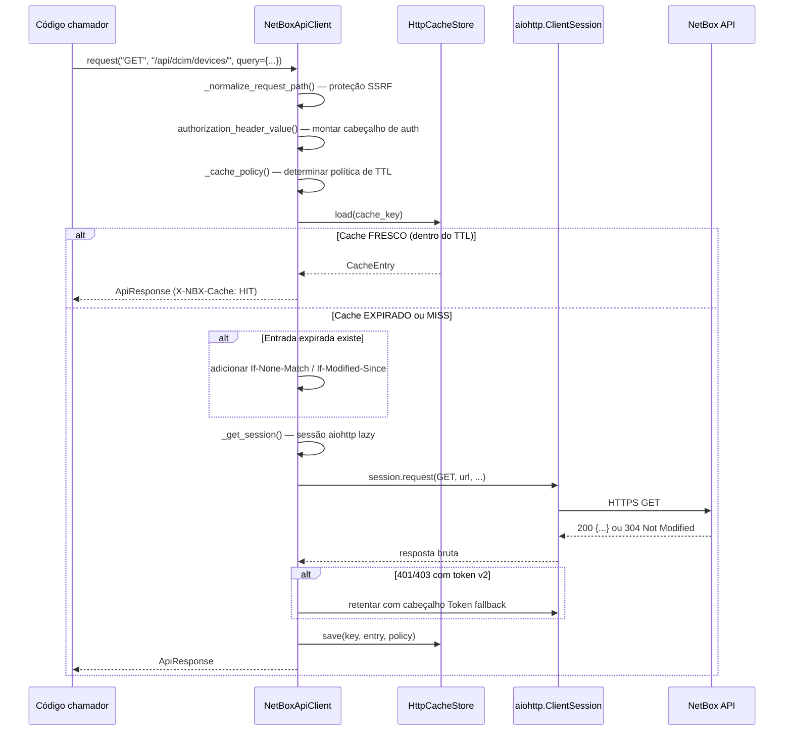
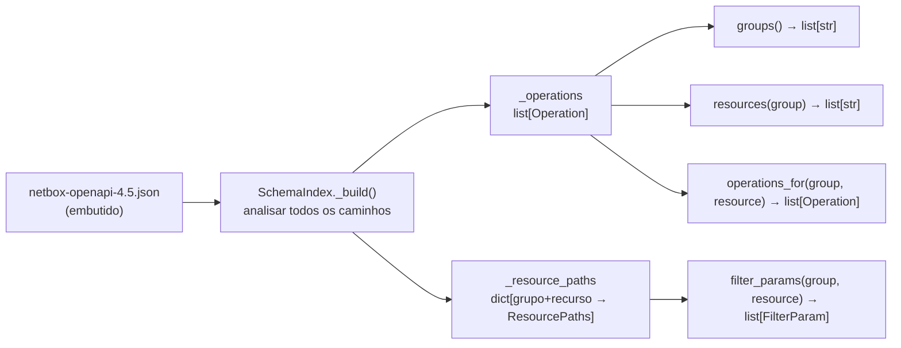
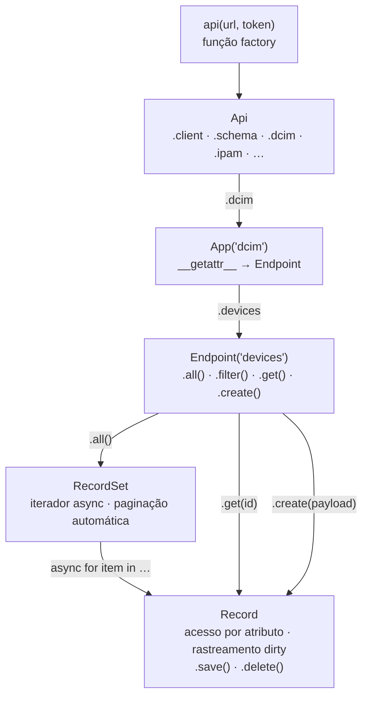
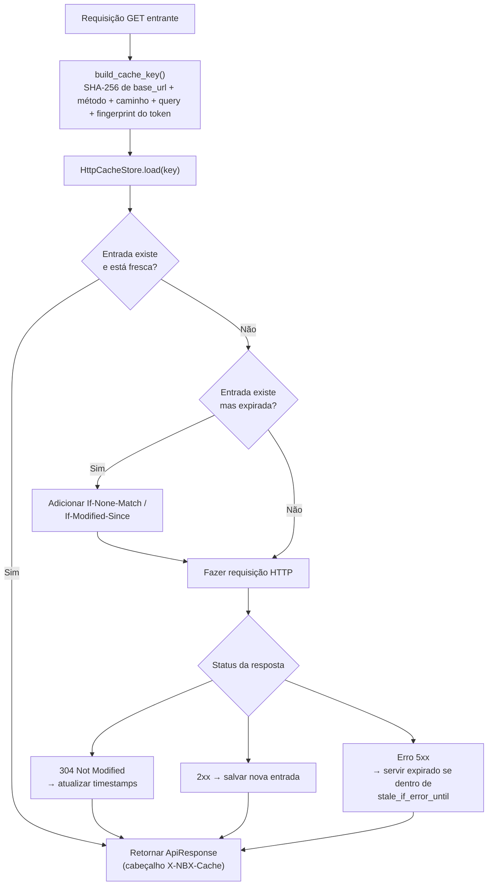

# Internos do SDK

Esta página explica como o `netbox_sdk` funciona internamente — o ciclo de vida do cliente HTTP, o sistema de configuração e perfis, a indexação do esquema OpenAPI, a hierarquia de objetos da fachada, clientes tipados por versão, o cache HTTP em disco e a camada de serviços.

---

## Ciclo de vida das requisições do NetBoxApiClient

`NetBoxApiClient` em `netbox_sdk/client.py` é o cliente HTTP async central. Toda requisição passa pelo mesmo pipeline, independentemente de qual camada de API (raw, facade ou typed) a iniciou.


```mermaid
sequenceDiagram
    participant Caller as Código chamador
    participant Client as NetBoxApiClient
    participant Cache as HttpCacheStore
    participant Session as aiohttp.ClientSession
    participant NB as NetBox API

    Caller->>Client: request("GET", "/api/dcim/devices/", query={...})
    Client->>Client: _normalize_request_path() — proteção SSRF
    Client->>Client: authorization_header_value() — montar cabeçalho de auth
    Client->>Client: _cache_policy() — determinar política de TTL
    Client->>Cache: load(cache_key)
    alt Cache FRESCO (dentro do TTL)
        Cache-->>Client: CacheEntry
        Client-->>Caller: ApiResponse (X-NBX-Cache: HIT)
    else Cache EXPIRADO ou MISS
        alt Entrada expirada existe
            Client->>Client: adicionar If-None-Match / If-Modified-Since
        end
        Client->>Client: _get_session() — sessão aiohttp lazy
        Client->>Session: session.request(GET, url, ...)
        Session->>NB: HTTPS GET
        NB-->>Session: 200 {...} ou 304 Not Modified
        Session-->>Client: resposta bruta
        alt 401/403 com token v2
            Client->>Session: retentar com cabeçalho Token fallback
        end
        Client->>Cache: save(key, entry, policy)
        Client-->>Caller: ApiResponse
    end
```

### Criação lazy de sessão

A `aiohttp.ClientSession` é criada na primeira requisição e reutilizada em todas as chamadas subsequentes. Um padrão de lock com dupla verificação lida com a afinidade de loop de eventos:

```python title="netbox_sdk/client.py"
async def _get_session(self) -> aiohttp.ClientSession:
    current_loop_id = id(asyncio.get_running_loop())

    # Caminho rápido: sessão já válida para este loop — sem lock necessário
    if (
        self._session is not None
        and not self._session_closed()
        and self._session_loop_id == current_loop_id
    ):
        return self._session

    async with self._get_lock():
        # Reverificar sob lock caso outra coroutine acabou de criar a sessão
        if self._session is None or session_closed or self._session_loop_id != current_loop_id:
            ...
            self._session = aiohttp.ClientSession(timeout=..., connector=...)
            self._session_loop_id = current_loop_id
        return self._session
```

### Proteção SSRF

Todos os caminhos de requisição passam por `_normalize_request_path()`, que rejeita URLs absolutas, query strings e fragmentos embutidos no argumento de caminho:

```python title="netbox_sdk/client.py"
def _normalize_request_path(self, path: str) -> str:
    parsed = urlsplit(path.strip())
    if parsed.scheme or parsed.netloc:
        raise ValueError("O caminho da requisição deve ser relativo à URL base configurada")
    if parsed.query or parsed.fragment:
        raise ValueError("O caminho da requisição não deve incluir parâmetros de query ou fragmentos")
    return parsed.path if parsed.path.startswith("/") else f"/{parsed.path}"
```

### Fallback de token v2 para v1

Quando um token v2 `nbt_` recebe 401/403 com "invalid v2 token" no corpo, o cliente retenta transparentemente com um cabeçalho v1 `Token <secret>`:

```python title="netbox_sdk/client.py"
def _should_retry_with_v1(self, response: ApiResponse) -> bool:
    if self.config.token_version != "v2" or not self.config.token_secret:
        return False
    if response.status not in {401, 403}:
        return False
    return "invalid v2 token" in response.text.lower()
```

---

## Sistema de configuração e perfis

`Config` em `netbox_sdk/config.py` é um modelo Pydantic que normaliza e valida parâmetros de conexão antes de passá-los ao `NetBoxApiClient`.

### Campos e validadores

| Campo | Tipo | Descrição |
|---|---|---|
| `base_url` | `str \| None` | URL base do NetBox — normalizada para `http://` ou `https://` apenas |
| `token_version` | `str` | `"v1"` (legacy `Token`) ou `"v2"` (bearer `nbt_`) |
| `token_key` | `str \| None` | Prefixo de chave de token v2 (antes de `.`) |
| `token_secret` | `str \| None` | Valor do token — CR/LF/null removidos para evitar injeção de cabeçalho |
| `timeout` | `float` | Timeout HTTP em segundos (padrão: 30.0) |
| `ssl_verify` | `bool` | Verificação de certificado TLS (padrão: `True`) |
| `demo_username` | `str \| None` | Usuário para login automático no perfil de demonstração |
| `demo_password` | `str \| None` | Senha para login automático no perfil de demonstração |

### Persistência de múltiplos perfis

Perfis são armazenados como `{"profiles": {"default": {...}, "demo": {...}}}` em `~/.config/netbox-sdk/config.json` com permissões `0o600`:

```python title="netbox_sdk/config.py (padrão)"
# Carregar o perfil ativo
config = load_profile_config(profile="default")

# Salvar credenciais atualizadas
save_config(config, profile="default")
```

### Substituição por variáveis de ambiente

| Variável | Campo Config |
|---|---|
| `NETBOX_URL` | `base_url` |
| `NETBOX_TOKEN_KEY` | `token_key` |
| `NETBOX_TOKEN_SECRET` | `token_secret` |
| `NETBOX_SSL_VERIFY` | `ssl_verify` |
| `DEMO_USERNAME` | `demo_username` |
| `DEMO_PASSWORD` | `demo_password` |

---

## SchemaIndex (Parsing de OpenAPI)

`SchemaIndex` em `netbox_sdk/schema.py` analisa o JSON OpenAPI fornecido em um índice em memória otimizado para consultas rápidas de grupo/recurso/operação.


```mermaid
flowchart LR
    JSON["netbox-openapi-4.5.json\n(embutido)"]
    BUILD["SchemaIndex._build()\nanalisar todos os caminhos"]
    OPS["_operations\nlist[Operation]"]
    RPATHS["_resource_paths\ndict[grupo+recurso → ResourcePaths]"]
    GROUPS["groups() → list[str]"]
    RES["resources(group) → list[str]"]
    OPFOR["operations_for(group, resource) → list[Operation]"]
    FILTER["filter_params(group, resource) → list[FilterParam]"]

    JSON --> BUILD
    BUILD --> OPS
    BUILD --> RPATHS
    OPS --> GROUPS
    OPS --> RES
    OPS --> OPFOR
    RPATHS --> FILTER
```

### Descoberta de Plugins

`enrich_schema_index_with_runtime_resources()` é a chamada de alto nível preferida: percorre o endpoint `/api/plugins/` ao vivo, analisa cada caminho descoberto e chama `add_discovered_resource()` no índice fornecido. Retorna `True` se o índice foi alterado.

```python
from netbox_sdk.plugin_discovery import enrich_schema_index_with_runtime_resources

changed = await enrich_schema_index_with_runtime_resources(schema_index, client)
# True quando pelo menos um novo recurso foi registrado
```

Para controle de mais baixo nível, `discover_plugin_resource_paths()` retorna uma lista de tuplas `(list_path, detail_path)`:

```python
from netbox_sdk.plugin_discovery import discover_plugin_resource_paths

paths = await discover_plugin_resource_paths(client)
# [("/api/plugins/gpon/olts/", "/api/plugins/gpon/olts/{id}/"), ...]

for list_path, detail_path in paths:
    # analise grupo/recurso a partir de list_path e chame add_discovered_resource manualmente
    ...
```

### Esquemas embutidos por versão

Esquemas OpenAPI versionados são fornecidos com o pacote em `netbox_sdk/reference/openapi/`. `load_openapi_schema()` usa o esquema NetBox 4.6 por padrão, a menos que uma linha de release suportada seja fornecida explicitamente.

| Arquivo | Versão do NetBox |
|---|---|
| `netbox-openapi.json` | Alias legado de compatibilidade |
| `netbox-openapi-4.6.json` | NetBox 4.6 |
| `netbox-openapi-4.5.json` | NetBox 4.5 |
| `netbox-openapi-4.4.json` | NetBox 4.4 |
| `netbox-openapi-4.3.json` | NetBox 4.3 |

---

## Hierarquia de objetos da fachada

`netbox_sdk/facade.py` fornece uma API async compatível com PyNetBox. A função `api()` constrói o objeto `Api` raiz; acessos de atributo subsequentes criam `App` → `Endpoint` → `Record` / `RecordSet`.


```mermaid
flowchart TB
    APIFN["api(url, token)\nfunção factory"]
    API["Api\n.client · .schema · .dcim · .ipam · …"]
    APP["App('dcim')\n__getattr__ → Endpoint"]
    ENDPOINT["Endpoint('devices')\n.all() · .filter() · .get() · .create()"]
    RECORDSET["RecordSet\niterador async · paginação automática"]
    RECORD["Record\nacesso por atributo · rastreamento dirty\n.save() · .delete()"]

    APIFN --> API
    API -->|".dcim"| APP
    APP -->|".devices"| ENDPOINT
    ENDPOINT -->|".all()"| RECORDSET
    RECORDSET -->|"async for item in …"| RECORD
    ENDPOINT -->|".get(id)"| RECORD
    ENDPOINT -->|".create(payload)"| RECORD
```

### Operações CRUD

```python title="netbox_sdk/facade.py (uso)"
nb = api("https://netbox.example.com", token="...")

# Listar todos — iteração async com paginação automática
async for device in nb.dcim.devices.all():
    print(device.name, device.status)

# Filtrar com parâmetros de query
records = nb.dcim.devices.filter(site="nyc-dc1", status="active")
async for device in records:
    print(device)

# Obter por ID
device = await nb.dcim.devices.get(42)

# Criar
tag = await nb.extras.tags.create({
    "name": "proxmox",
    "slug": "proxmox",
    "color": "ff5722",
})
```

### Rastreamento dirty em Record

`Record` captura um snapshot dos valores de campo na criação. Mutar um campo o adiciona a um dict `_updates`; chamar `.save()` envia apenas os campos alterados como PATCH:

```python title="netbox_sdk/facade.py (uso)"
device = await nb.dcim.devices.get(42)
device.status = "offline"          # marca "status" como dirty
device.comments = "decommissioned" # marca "comments" como dirty
await device.save()                 # PATCH {status, comments} apenas
```

---

## API Tipada (Clientes por versão)

`typed_api()` em `netbox_sdk/typed_api.py` retorna um cliente tipado por versão, respaldado por modelos Pydantic gerados para completação completa em IDE e validação em runtime.

```python title="Uso"
from netbox_sdk import typed_api

nb = typed_api("https://netbox.example.com", token="...", netbox_version="4.5")

# Validação Pydantic completa em request e response
device = await nb.dcim.devices.retrieve(42)
device.name    # str — a IDE conhece o tipo
device.status  # enum DeviceStatus
```

---

## Cache HTTP

`HttpCacheStore` em `netbox_sdk/http_cache.py` fornece um cache JSON baseado em disco armazenado em `~/.config/netbox-sdk/http-cache/`.


```mermaid
flowchart TD
    REQ["Requisição GET entrante"]
    KEY["build_cache_key()\nSHA-256 de base_url + método + caminho + query + fingerprint do token"]
    LOAD["HttpCacheStore.load(key)"]
    FRESH{"Entrada existe\ne está fresca?"}
    STALE{"Entrada existe\nmas expirada?"}
    COND["Adicionar If-None-Match /\nIf-Modified-Since"]
    HTTP["Fazer requisição HTTP"]
    STATUS{"Status da resposta"}
    S304["304 Not Modified\n→ atualizar timestamps"]
    S2XX["2xx → salvar nova entrada"]
    S5XX["Erro 5xx\n→ servir expirado se dentro de\nstale_if_error_until"]
    RETURN["Retornar ApiResponse\n(cabeçalho X-NBX-Cache)"]

    REQ --> KEY --> LOAD --> FRESH
    FRESH -->|Sim| RETURN
    FRESH -->|Não| STALE
    STALE -->|Sim| COND --> HTTP
    STALE -->|Não| HTTP
    HTTP --> STATUS
    STATUS --> S304 --> RETURN
    STATUS --> S2XX --> RETURN
    STATUS --> S5XX --> RETURN
```

### Políticas de cache

| Tipo de requisição | TTL fresco | TTL stale-if-error |
|---|---|---|
| GET lista (ex.: `/api/dcim/devices/`) | 60 s | 300 s |
| GET detalhe com query | 30 s | 60 s |
| GET detalhe sem query | 15 s | 60 s |
| Não-GET (POST/PUT/PATCH/DELETE) | Não cacheado | — |

Arquivos de cache usam permissões `0o600` (leitura/escrita apenas do dono) para proteger os fingerprints de token.

### Invalidação por escrita e fencing por geração

Uma requisição não-GET purga toda entrada cacheada para seu caminho (e o caminho da coleção que o contém) via `HttpCacheStore.invalidate_path()`, indexada por um arquivo de índice por caminho em vez da chave de cache completa — assim a invalidação independe de qual token, query string ou cabeçalhos de escopo produziram a entrada cacheada. A invalidação roda tanto após uma resposta 2xx confirmada **quanto** após uma exceção levantada ao emitir ou ler a escrita (queda de conexão, timeout, resposta malformada): o NetBox pode ter aplicado a mutação no servidor mesmo que o cliente nunca tenha recebido uma resposta definitiva, então uma leitura de verificação não pode servir a entrada anterior à escrita como se a escrita nunca tivesse ocorrido. Falhas de invalidação (por exemplo, um erro de filesystem no arquivo de índice) são capturadas e registradas como aviso em vez de propagadas — uma falha de manutenção de cache nunca deve sobrepor um resultado HTTP confirmado, reportando erroneamente uma escrita bem-sucedida como falha ou mascarando a exceção real da requisição atrás de um `OSError` não relacionado.

Um GET iniciado antes de uma escrita ainda pode estar em andamento quando o `invalidate_path()` dessa escrita é executado. Sem um fence, a própria chamada `save()` do GET — que ocorre depois da invalidação — poderia ressuscitar a resposta anterior à escrita como uma nova entrada de cache fresca, escondendo uma mutação bem-sucedida da próxima leitura durante todo o TTL dessa entrada. `HttpCacheStore` fecha essa corrida com um contador de geração por caminho:

- `path_generation(path)` retorna a geração atual do caminho; o cliente a captura imediatamente antes de emitir um GET cacheável.
- `invalidate_path(path)` incrementa a geração (e limpa a lista de chaves) em vez de apagar o arquivo de índice, para que um fence capturado antes da invalidação ainda possa ser comparado com ela depois.
- `save(..., path=path, expected_generation=<capturada>)` reverifica a geração sob o mesmo lock por caminho usado por `invalidate_path()`. Se a geração avançou, a entrada ainda é retornada para satisfazer a própria requisição em andamento do chamador, mas nem o arquivo de entrada nem o registro no índice são gravados — a resposta nunca é persistida.
- `refresh(..., path=path, expected_generation=<capturada>)` aplica o mesmo fence a uma revalidação 304. Um 304 só confirma que a representação bateu com o ETag/Last-Modified enviado a partir da entrada anterior à escrita; se uma escrita concorrente invalidou o caminho enquanto a requisição condicional estava em andamento, essa confirmação está obsoleta e `refresh()` não pode ressuscitar a entrada purgada, assim como `save()` não poderia. Quando o cliente detecta essa corrida diretamente (a geração do caminho avançou desde o início da requisição condicional e a resposta volta como 304), ele descarta os cabeçalhos `If-None-Match`/`If-Modified-Since` e reemite a requisição de forma incondicional antes de persistir, em vez de confiar no 304 não confiável.

Isso torna a gravação da entrada e o registro no índice atômicos em relação à invalidação concorrente, fechando a mesma janela de corrida que um lock isolado (que serializa escritores, mas não protege leitores contra uma escrita que já foi concluída) não fecha.

A leitura-modificação-escrita do índice por caminho é serializada por `HttpCacheStore._locked_index()`. Em plataformas com `fcntl` (Linux, macOS) isso é um `flock()` padrão. Onde `fcntl` não está disponível, um fallback portátil (`_portable_lock`) usa criação atômica de arquivo com `O_CREAT | O_EXCL` — semântica de criação exclusiva garantida em todo filesystem suportado — limitado por um timeout que levanta `TimeoutError` em vez de travar para sempre ou permitir silenciosamente que dois escritores disputem o mesmo arquivo de índice.

---

## Camada de serviços

`netbox_sdk/services.py` mapeia nomes de ação voltados ao usuário para chamadas HTTP, fazendo a ponte entre o CLI e o cliente HTTP.

### ACTION_METHOD_MAP

| Ação | Método HTTP | Caminho |
|---|---|---|
| `list` | GET | `list_path` |
| `get` | GET | `detail_path` (requer `--id`) |
| `create` | POST | `list_path` |
| `update` | PUT | `detail_path` (requer `--id`) |
| `patch` | PATCH | `detail_path` (requer `--id`) |
| `delete` | DELETE | `detail_path` (requer `--id`) |

### resolve_dynamic_request()

Recebe uma tupla `(grupo, recurso, ação, id, query_params, payload)` e retorna um `ResolvedRequest(método, caminho, query, payload)`:

```python title="netbox_sdk/services.py"
class ResolvedRequest(BaseModel):
    method: str
    path: str
    query: dict[str, str]
    payload: dict[str, Any] | list[Any] | None
```

### run_dynamic_command()

Combina `resolve_dynamic_request()` com um `NetBoxApiClient` para executar a requisição completa de ponta a ponta. Usado por `netbox_cli/dynamic.py` para alimentar todos os comandos `nbx <grupo> <recurso> <ação>` gerados na inicialização a partir do esquema OpenAPI.
