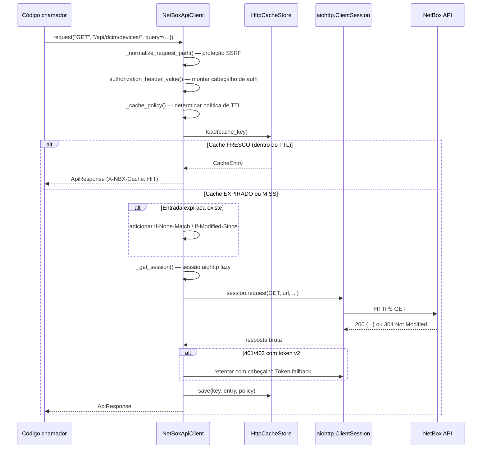
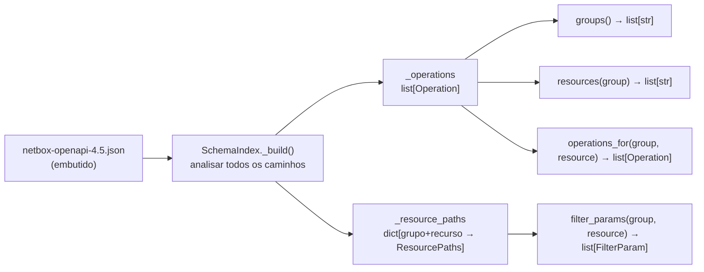
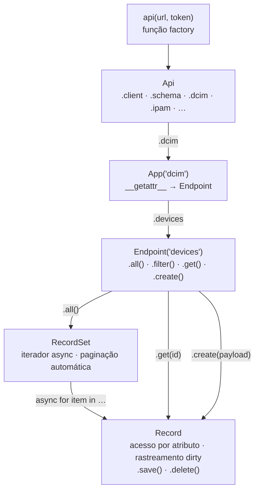
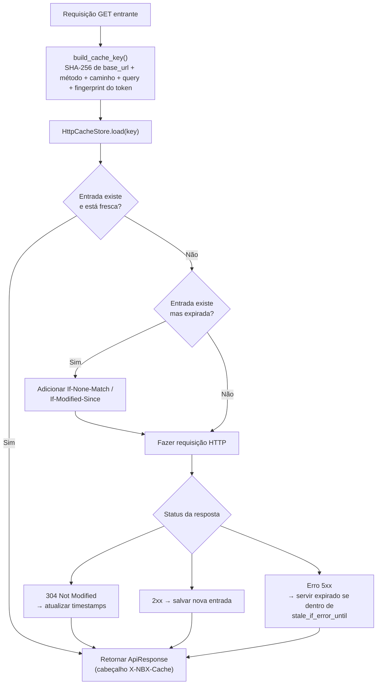

# Internos do SDK

Esta página explica como o `netbox_sdk` funciona internamente — o ciclo de vida do cliente HTTP, o sistema de configuração e perfis, a indexação do esquema OpenAPI, a hierarquia de objetos da fachada, clientes tipados por versão, o cache HTTP em disco e a camada de serviços.

---

## Ciclo de vida das requisições do NetBoxApiClient

`NetBoxApiClient` em `netbox_sdk/client.py` é o cliente HTTP async central. Toda requisição passa pelo mesmo pipeline, independentemente de qual camada de API (raw, facade ou typed) a iniciou.


```mermaid
sequenceDiagram
    participant Caller as Código chamador
    participant Client as NetBoxApiClient
    participant Cache as HttpCacheStore
    participant Session as aiohttp.ClientSession
    participant NB as NetBox API

    Caller->>Client: request("GET", "/api/dcim/devices/", query={...})
    Client->>Client: _normalize_request_path() — proteção SSRF
    Client->>Client: authorization_header_value() — montar cabeçalho de auth
    Client->>Client: _cache_policy() — determinar política de TTL
    Client->>Cache: load(cache_key)
    alt Cache FRESCO (dentro do TTL)
        Cache-->>Client: CacheEntry
        Client-->>Caller: ApiResponse (X-NBX-Cache: HIT)
    else Cache EXPIRADO ou MISS
        alt Entrada expirada existe
            Client->>Client: adicionar If-None-Match / If-Modified-Since
        end
        Client->>Client: _get_session() — sessão aiohttp lazy
        Client->>Session: session.request(GET, url, ...)
        Session->>NB: HTTPS GET
        NB-->>Session: 200 {...} ou 304 Not Modified
        Session-->>Client: resposta bruta
        alt 401/403 com token v2
            Client->>Session: retentar com cabeçalho Token fallback
        end
        Client->>Cache: save(key, entry, policy)
        Client-->>Caller: ApiResponse
    end
```

### Criação lazy de sessão

A `aiohttp.ClientSession` é criada na primeira requisição e reutilizada em todas as chamadas subsequentes. Um padrão de lock com dupla verificação lida com a afinidade de loop de eventos:

```python title="netbox_sdk/client.py"
async def _get_session(self) -> aiohttp.ClientSession:
    current_loop_id = id(asyncio.get_running_loop())

    # Caminho rápido: sessão já válida para este loop — sem lock necessário
    if (
        self._session is not None
        and not self._session_closed()
        and self._session_loop_id == current_loop_id
    ):
        return self._session

    async with self._get_lock():
        # Reverificar sob lock caso outra coroutine acabou de criar a sessão
        if self._session is None or session_closed or self._session_loop_id != current_loop_id:
            ...
            self._session = aiohttp.ClientSession(timeout=..., connector=...)
            self._session_loop_id = current_loop_id
        return self._session
```

### Proteção SSRF

Todos os caminhos de requisição passam por `_normalize_request_path()`, que rejeita URLs absolutas, query strings e fragmentos embutidos no argumento de caminho:

```python title="netbox_sdk/client.py"
def _normalize_request_path(self, path: str) -> str:
    parsed = urlsplit(path.strip())
    if parsed.scheme or parsed.netloc:
        raise ValueError("O caminho da requisição deve ser relativo à URL base configurada")
    if parsed.query or parsed.fragment:
        raise ValueError("O caminho da requisição não deve incluir parâmetros de query ou fragmentos")
    return parsed.path if parsed.path.startswith("/") else f"/{parsed.path}"
```

### Fallback de token v2 para v1

Quando um token v2 `nbt_` recebe 401/403 com "invalid v2 token" no corpo, o cliente retenta transparentemente com um cabeçalho v1 `Token <secret>`:

```python title="netbox_sdk/client.py"
def _should_retry_with_v1(self, response: ApiResponse) -> bool:
    if self.config.token_version != "v2" or not self.config.token_secret:
        return False
    if response.status not in {401, 403}:
        return False
    return "invalid v2 token" in response.text.lower()
```

---

## Sistema de configuração e perfis

`Config` em `netbox_sdk/config.py` é um modelo Pydantic que normaliza e valida parâmetros de conexão antes de passá-los ao `NetBoxApiClient`.

### Campos e validadores

| Campo | Tipo | Descrição |
|---|---|---|
| `base_url` | `str \| None` | URL base do NetBox — normalizada para `http://` ou `https://` apenas |
| `token_version` | `str` | `"v1"` (legacy `Token`) ou `"v2"` (bearer `nbt_`) |
| `token_key` | `str \| None` | Prefixo de chave de token v2 (antes de `.`) |
| `token_secret` | `str \| None` | Valor do token — CR/LF/null removidos para evitar injeção de cabeçalho |
| `timeout` | `float` | Timeout HTTP em segundos (padrão: 30.0) |
| `ssl_verify` | `bool` | Verificação de certificado TLS (padrão: `True`) |
| `demo_username` | `str \| None` | Usuário para login automático no perfil de demonstração |
| `demo_password` | `str \| None` | Senha para login automático no perfil de demonstração |

### Persistência de múltiplos perfis

Perfis são armazenados como `{"profiles": {"default": {...}, "demo": {...}}}` em `~/.config/netbox-sdk/config.json` com permissões `0o600`:

```python title="netbox_sdk/config.py (padrão)"
# Carregar o perfil ativo
config = load_profile_config(profile="default")

# Salvar credenciais atualizadas
save_config(config, profile="default")
```

### Substituição por variáveis de ambiente

| Variável | Campo Config |
|---|---|
| `NETBOX_URL` | `base_url` |
| `NETBOX_TOKEN_KEY` | `token_key` |
| `NETBOX_TOKEN_SECRET` | `token_secret` |
| `NETBOX_SSL_VERIFY` | `ssl_verify` |
| `DEMO_USERNAME` | `demo_username` |
| `DEMO_PASSWORD` | `demo_password` |

---

## SchemaIndex (Parsing de OpenAPI)

`SchemaIndex` em `netbox_sdk/schema.py` analisa o JSON OpenAPI fornecido em um índice em memória otimizado para consultas rápidas de grupo/recurso/operação.


```mermaid
flowchart LR
    JSON["netbox-openapi-4.5.json\n(embutido)"]
    BUILD["SchemaIndex._build()\nanalisar todos os caminhos"]
    OPS["_operations\nlist[Operation]"]
    RPATHS["_resource_paths\ndict[grupo+recurso → ResourcePaths]"]
    GROUPS["groups() → list[str]"]
    RES["resources(group) → list[str]"]
    OPFOR["operations_for(group, resource) → list[Operation]"]
    FILTER["filter_params(group, resource) → list[FilterParam]"]

    JSON --> BUILD
    BUILD --> OPS
    BUILD --> RPATHS
    OPS --> GROUPS
    OPS --> RES
    OPS --> OPFOR
    RPATHS --> FILTER
```

### Descoberta de Plugins

`enrich_schema_index_with_runtime_resources()` é a chamada de alto nível preferida: percorre o endpoint `/api/plugins/` ao vivo, analisa cada caminho descoberto e chama `add_discovered_resource()` no índice fornecido. Retorna `True` se o índice foi alterado.

```python
from netbox_sdk.plugin_discovery import enrich_schema_index_with_runtime_resources

changed = await enrich_schema_index_with_runtime_resources(schema_index, client)
# True quando pelo menos um novo recurso foi registrado
```

Para controle de mais baixo nível, `discover_plugin_resource_paths()` retorna uma lista de tuplas `(list_path, detail_path)`:

```python
from netbox_sdk.plugin_discovery import discover_plugin_resource_paths

paths = await discover_plugin_resource_paths(client)
# [("/api/plugins/gpon/olts/", "/api/plugins/gpon/olts/{id}/"), ...]

for list_path, detail_path in paths:
    # analise grupo/recurso a partir de list_path e chame add_discovered_resource manualmente
    ...
```

### Esquemas embutidos por versão

Esquemas OpenAPI versionados são fornecidos com o pacote em `netbox_sdk/reference/openapi/`. `load_openapi_schema()` usa o esquema NetBox 4.6 por padrão, a menos que uma linha de release suportada seja fornecida explicitamente.

| Arquivo | Versão do NetBox |
|---|---|
| `netbox-openapi.json` | Alias legado de compatibilidade |
| `netbox-openapi-4.7.json` | NetBox 4.7 (preview) |
| `netbox-openapi-4.6.json` | NetBox 4.6 |
| `netbox-openapi-4.5.json` | NetBox 4.5 |
| `netbox-openapi-4.4.json` | NetBox 4.4 |
| `netbox-openapi-4.3.json` | NetBox 4.3 |

### Registro de releases e resolução compartilhada

`netbox_sdk/versioning.py` é o único proprietário dos metadados das linhas de
release. Cada registro congelado `ReleaseLine` vincula uma linha ao status do
ciclo de vida, arquivo OpenAPI embutido, módulo de modelos gerados e módulo do
cliente tipado. Constantes existentes como `SUPPORTED_NETBOX_VERSIONS` e
`DEFAULT_NETBOX_VERSION` são visões desse registro; o padrão é retornado por
`latest_stable_line()`.

`netbox_sdk/schema_resolution.py` contém a única política de seleção usada por
SDK, CLI, TUI e MCP. `requested_netbox_version()` lê primeiro os aliases da CLI
e depois as variáveis de ambiente suportadas. `resolve_index()` aplica uma
única ordem de precedência:

1. Um argumento explícito ou pin da CLI/ambiente seleciona a linha embutida.
2. Uma instância conectada e suportada seleciona o bundle correspondente.
3. Uma instância conectada e não suportada fornece `/api/schema/` dinamicamente.
4. Falhas de detecção, busca ou documento usam a linha embutida padrão.

`bundled_index()` mantém em cache o índice-base analisado por processo, mas
cada chamada retorna `SchemaIndex.clone()`. Descobertas de plugins em runtime
permanecem, assim, locais a uma sessão de CLI, TUI, fachada ou MCP.

---

## Hierarquia de objetos da fachada

`netbox_sdk/facade.py` fornece uma API async compatível com PyNetBox. A função `api()` constrói o objeto `Api` raiz; acessos de atributo subsequentes criam `App` → `Endpoint` → `Record` / `RecordSet`.


```mermaid
flowchart TB
    APIFN["api(url, token)\nfunção factory"]
    API["Api\n.client · .schema · .dcim · .ipam · …"]
    APP["App('dcim')\n__getattr__ → Endpoint"]
    ENDPOINT["Endpoint('devices')\n.all() · .filter() · .get() · .create()"]
    RECORDSET["RecordSet\niterador async · paginação automática"]
    RECORD["Record\nacesso por atributo · rastreamento dirty\n.save() · .delete()"]

    APIFN --> API
    API -->|".dcim"| APP
    APP -->|".devices"| ENDPOINT
    ENDPOINT -->|".all()"| RECORDSET
    RECORDSET -->|"async for item in …"| RECORD
    ENDPOINT -->|".get(id)"| RECORD
    ENDPOINT -->|".create(payload)"| RECORD
```

### Operações CRUD

```python title="netbox_sdk/facade.py (uso)"
nb = api("https://netbox.example.com", token="...")

# Listar todos — iteração async com paginação automática
async for device in nb.dcim.devices.all():
    print(device.name, device.status)

# Filtrar com parâmetros de query
records = nb.dcim.devices.filter(site="nyc-dc1", status="active")
async for device in records:
    print(device)

# Obter por ID
device = await nb.dcim.devices.get(42)

# Criar
tag = await nb.extras.tags.create({
    "name": "proxmox",
    "slug": "proxmox",
    "color": "ff5722",
})
```

### Rastreamento dirty em Record

`Record` captura um snapshot dos valores de campo na criação. Mutar um campo o adiciona a um dict `_updates`; chamar `.save()` envia apenas os campos alterados como PATCH:

```python title="netbox_sdk/facade.py (uso)"
device = await nb.dcim.devices.get(42)
device.status = "offline"          # marca "status" como dirty
device.comments = "decommissioned" # marca "comments" como dirty
await device.save()                 # PATCH {status, comments} apenas
```

---

## API Tipada (Clientes por versão)

`typed_api()` em `netbox_sdk/typed_api.py` retorna um cliente tipado por versão, respaldado por modelos Pydantic gerados para completação completa em IDE e validação em runtime.

```python title="Uso"
from netbox_sdk import typed_api

nb = typed_api("https://netbox.example.com", token="...", netbox_version="4.5")

# Validação Pydantic completa em request e response
device = await nb.dcim.devices.retrieve(42)
device.name    # str — a IDE conhece o tipo
device.status  # enum DeviceStatus
```

---

## Cache HTTP

`HttpCacheStore` em `netbox_sdk/http_cache.py` fornece um cache JSON baseado em disco armazenado em `~/.config/netbox-sdk/http-cache/`.


```mermaid
flowchart TD
    REQ["Requisição GET entrante"]
    KEY["build_cache_key()\nSHA-256 de base_url + método + caminho + query + fingerprint do token"]
    LOAD["HttpCacheStore.load(key)"]
    FRESH{"Entrada existe\ne está fresca?"}
    STALE{"Entrada existe\nmas expirada?"}
    COND["Adicionar If-None-Match /\nIf-Modified-Since"]
    HTTP["Fazer requisição HTTP"]
    STATUS{"Status da resposta"}
    S304["304 Not Modified\n→ atualizar timestamps"]
    S2XX["2xx → salvar nova entrada"]
    S5XX["Erro 5xx\n→ servir expirado se dentro de\nstale_if_error_until"]
    RETURN["Retornar ApiResponse\n(cabeçalho X-NBX-Cache)"]

    REQ --> KEY --> LOAD --> FRESH
    FRESH -->|Sim| RETURN
    FRESH -->|Não| STALE
    STALE -->|Sim| COND --> HTTP
    STALE -->|Não| HTTP
    HTTP --> STATUS
    STATUS --> S304 --> RETURN
    STATUS --> S2XX --> RETURN
    STATUS --> S5XX --> RETURN
```

### Políticas de cache

| Tipo de requisição | TTL fresco | TTL stale-if-error |
|---|---|---|
| GET lista (ex.: `/api/dcim/devices/`) | 60 s | 300 s |
| GET detalhe com query | 30 s | 60 s |
| GET detalhe sem query | 15 s | 60 s |
| Não-GET (POST/PUT/PATCH/DELETE) | Não cacheado | — |

Arquivos de cache usam permissões `0o600` (leitura/escrita apenas do dono) para proteger os fingerprints de token.

### Precedência de cabeçalhos e resolução de Authorization

Cabeçalhos de requisição se sobrepõem em três camadas, da menor para a maior precedência: `persistent_headers` (nível do cliente, ex.: o branch ativo da TUI ou o override de caller encaminhado pelo MCP), `_scoped_headers` (um `contextvars.ContextVar` por tarefa, definido por `header_scope()`/`activate_branch()`) e o argumento `headers` por chamada. Nomes de cabeçalho HTTP não diferenciam maiúsculas de minúsculas, mas um `dict` comum sim, então `_extract_case_insensitive()` remove toda variante de caixa de um nome de cabeçalho (`Authorization`, `authorization`, `AUTHORIZATION`, ...) e retorna tanto o estado de presença explícita quanto o valor correspondente, além do restante sem essas variantes.

`_request_impl()` e `stream_sse()` extraem `Authorization` de cada camada **separadamente, antes de mesclá-las**, e escolhem a camada de maior precedência cuja chave estava presente. Usar presença em vez de truthiness é crítico para segurança: `headers={"Authorization": ""}` e um Authorization vazio fornecido por `header_scope()` selecionam intencionalmente um envio anônimo e não podem cair no token configurado do cliente, que pode ser privilegiado. Quando nenhuma camada fornece a chave, a credencial configurada continua sendo usada; overrides não vazios mantêm o comportamento anterior. A extração por camada também evita armadilhas da ordem de iteração de `dict` quando camadas diferentes usam caixas diferentes.

### Invalidação por escrita e fencing por geração

Uma requisição não-GET purga toda entrada cacheada para seu caminho (e o caminho da coleção que o contém) via `HttpCacheStore.invalidate_path()`, indexada por um arquivo de índice por caminho em vez da chave de cache completa — assim a invalidação independe de qual token, query string ou cabeçalhos de escopo produziram a entrada cacheada. A invalidação roda após **qualquer** tentativa de escrita concluída, independentemente do status da resposta, e também após uma exceção levantada ao emitir ou ler a escrita (queda de conexão, timeout, resposta malformada). Um status não-2xx não é prova de que a mutação não ocorreu: um plugin ou endpoint bruto pode aplicar a escrita no servidor e só então falhar durante o processamento pós-commit (por exemplo, um 500 vindo do tratamento de signal/webhook depois que a linha já foi gravada), então restringir a invalidação a respostas 2xx confirmadas deixaria essa mutação já aplicada invisível para o cache e permitiria que uma leitura de verificação servisse a entrada anterior à escrita, incentivando uma nova tentativa duplicada e insegura. Falhas de invalidação (por exemplo, um erro de filesystem no arquivo de índice) são capturadas e registradas como aviso em vez de propagadas — uma falha de manutenção de cache nunca deve sobrepor um resultado HTTP confirmado, reportando erroneamente uma escrita bem-sucedida como falha ou mascarando a exceção real da requisição atrás de um `OSError` não relacionado. Qualquer uma dessas falhas — um timeout de lock ou um erro de filesystem simples, como um `unlink` que falhou ou um disco somente leitura (`TimeoutError` é, ela própria, uma subclasse de `OSError`, então um único handler `except OSError` cobre ambos) — também publica um marcador de cache indisponível por caminho: leituras posteriores não podem reportar HIT da entrada sobrevivente e precisam concluir uma purga real antes que esse caminho volte a ser confiável ou populado.

`_invalidate_related_cache()` purga cada caminho afetado (o caminho exato, o caminho da coleção e — para escritas em lote — o caminho de detalhe de cada item) de forma independente, capturando e registrando uma falha em um único caminho em vez de envolver o lote inteiro em um único `try`/`except`. Uma escrita pode afetar vários caminhos de cache distintos, e uma falha ao purgar o primeiro deles (por exemplo, contenção transitória de lock) nunca deve abortar a tentativa nos demais: pular os caminhos restantes após uma falha antecipada deixaria esses caminhos — mais importante ainda, a listagem da coleção que os contém — totalmente cacheados e capazes de servir um acerto de cache aparentemente fresco imediatamente após a escrita ter sucesso, mesmo que o caminho exato que falhou esteja registrado e conhecidamente obsoleto.

Um GET iniciado antes de uma escrita ainda pode estar em andamento quando o `invalidate_path()` dessa escrita é executado. Sem um fence, a própria chamada `save()` do GET — que ocorre depois da invalidação — poderia ressuscitar a resposta anterior à escrita como uma nova entrada de cache fresca, escondendo uma mutação bem-sucedida da próxima leitura durante todo o TTL dessa entrada. `HttpCacheStore` fecha essa corrida com um contador de geração por caminho:

- `path_generation(path)` retorna a geração atual do caminho; o cliente a captura imediatamente antes de emitir um GET cacheável. Se a coordenação expira, seu sentinel de lock indisponível é um estado explícito de bypass: o cliente não carrega uma entrada existente nem grava no cache a resposta viva dessa requisição.
- `invalidate_path(path)` incrementa a geração (e limpa a lista de chaves) em vez de apagar o arquivo de índice, para que um fence capturado antes da invalidação ainda possa ser comparado com ela depois.
- `save(..., path=path, expected_generation=<capturada>)` reverifica a geração sob o mesmo lock por caminho usado por `invalidate_path()`. Se a geração avançou, a entrada ainda é retornada para satisfazer a própria requisição em andamento do chamador, mas nem o arquivo de entrada nem o registro no índice são gravados — a resposta nunca é persistida.
- `refresh(..., path=path, expected_generation=<capturada>)` aplica o mesmo fence a uma revalidação 304. Um 304 só confirma que a representação bateu com o ETag/Last-Modified enviado a partir da entrada anterior à escrita; se uma escrita concorrente invalidou o caminho enquanto a requisição condicional estava em andamento, essa confirmação está obsoleta e `refresh()` não pode ressuscitar a entrada purgada, assim como `save()` não poderia. Quando o cliente detecta essa corrida diretamente (a geração do caminho avançou desde o início da requisição condicional e a resposta volta como 304), ele descarta os cabeçalhos `If-None-Match`/`If-Modified-Since` e reemite a requisição de forma incondicional antes de persistir, em vez de confiar no 304 não confiável. A geração usada pelo fence dessa requisição de substituição é capturada imediatamente **antes** de a requisição incondicional ser emitida, espelhando o mesmo padrão de captura-antes-da-requisição usado para o primeiro GET — capturá-la apenas depois que a resposta de substituição chega deixaria aberta uma segunda janela de corrida: uma nova escrita concorrente que chegasse enquanto a nova busca incondicional ainda está em andamento seria adotada como se fosse o fence, permitindo que essa resposta de substituição já duplamente obsoleta passasse pela verificação e fosse persistida como uma entrada fresca. A referência `cache_entry` em memória também é descartada nesse mesmo ponto, antes de a requisição incondicional ser emitida — não depois que ela retorna. A divergência de geração já provou que aquela entrada estava obsoleta, então ela não pode sobreviver para ser servida por nenhum dos fallbacks stale-if-error dessa própria requisição (o retorno stale-if-error do handler de exceção, ou o retorno stale-on-5xx de `_finalize_cached_response()`) caso a nova busca incondicional em si levante uma exceção ou volte com um erro de servidor; descartá-la apenas após uma nova busca bem-sucedida deixaria ambos os fallbacks capazes de ressuscitar exatamente a entrada que o cliente acabou de provar não ser mais confiável.

Isso torna a gravação da entrada e o registro no índice atômicos em relação à invalidação concorrente, fechando a mesma janela de corrida que um lock isolado (que serializa escritores, mas não protege leitores contra uma escrita que já foi concluída) não fecha.

### Invalidação cross-resource em endpoints de ação

A maioria das escritas afeta apenas o caminho gravado e sua coleção pai imediata, o que a derivação padrão de `_related_cache_paths()` (caminho exato + `_collection_path_for()`) já cobre. Os endpoints de "ação de detalhe" do NetBox — sub-caminhos não-CRUD registrados por `(group, resource)` em `netbox_sdk.facade.DETAIL_ENDPOINT_SPECS`, como `available-ips`, `available-prefixes` e `available-vlans` — quebram essa suposição: `POST /api/ipam/prefixes/{id}/available-ips/` cria linhas `IPAddress` que vivem em `/api/ipam/ip-addresses/`, uma coleção inteiramente diferente do caminho do prefixo ou de seu pai. A derivação padrão purgaria apenas `/api/ipam/prefixes/{id}/available-ips/` e `/api/ipam/prefixes/{id}/`, deixando uma lista cacheada de `/api/ipam/ip-addresses/` antes da ação obsoleta até expirar naturalmente.

O `_ACTION_CROSS_RESOURCE_CACHE_PATHS` em nível de módulo em `client.py` mapeia o segmento final do caminho de cada ação mutante conhecida (`available-ips`, `available-prefixes`, `available-vlans`) para o(s) caminho(s) de coleção extra que ela realmente popula. `_trailing_action_name()` reconhece o formato final geral `... / resource / id-numérico / ação-não-numérica`, então rotas core e rotas de plugins com namespaces adicionais são tratadas da mesma forma. `_related_cache_paths()` sempre recua além da ação e do ID para invalidar a coleção real do recurso e então adiciona a(s) coleção(ões) cross-resource mapeada(s) quando a ação gravada corresponde. Ações somente leitura (`napalm`, `trace`, `units`, `elevation`, `paths`) são omitidas do mapeamento, já que um GET nunca torna nada obsoleto.

**Deliberadamente fora de escopo: campos agregados/derivados em recursos não relacionados.** Este é um cache baseado em caminho, não um cache consciente de dependências. Gravar um `Device` não invalida uma listagem cacheada de `Site`, `Rack` ou `DeviceType`, mesmo que os agregados somente leitura do NetBox (por exemplo, `device_count`) nesses objetos agora estejam obsoletos — a única invalidação cross-resource que este cache realiza é o mapeamento explícito `_ACTION_CROSS_RESOURCE_CACHE_PATHS` acima, para o caso específico de uma ação de detalhe conhecida por criar linhas em uma coleção inteiramente diferente. Estender isso para toda relação que carregue um campo derivado/agregado exigiria um grafo de dependências completo sobre o schema OpenAPI empacotado ou invalidação incondicional de todo o armazenamento a cada escrita, ambos os quais anulariam o propósito de um cache HTTP em nível de filesystem para um cliente CLI/SDK. Chamadores que precisem de um campo agregado garantidamente atualizado não devem depender de uma leitura cacheada para ele.

A leitura-modificação-escrita do índice por caminho é serializada por `HttpCacheStore._locked_index()`. Em plataformas com `fcntl` (Linux, macOS), `_acquire_flock()` faz polling de `flock(LOCK_EX | LOCK_NB)` sob o mesmo prazo limitado `timeout`/`poll_interval` que `_portable_lock` já usa, levantando `TimeoutError` se o prazo expirar, em vez de chamar a forma bloqueante e ilimitada `flock(LOCK_EX)`. Ele repete apenas erros de contenção (`EAGAIN`/`EACCES`); qualquer outro `OSError` é propagado imediatamente, em vez de ficar oculto atrás do timeout completo. Os loops de polling continuam usando pausas síncronas porque escritores do mesmo caminho exigem a semântica esperar-e-ter-sucesso: descartar um `save()` contendido faria a chave daquele chamador desaparecer do índice compartilhado. Por isso, `NetBoxApiClient` aguarda toda operação síncrona do armazenamento de cache (`path_generation`, `load`, `invalidate_path`, marcação de indisponibilidade, `refresh` e `save`) por meio de `asyncio.to_thread()`. Um lock de cache mantido pode atrasar aquela requisição até o timeout limitado sem congelar corrotinas não relacionadas, chamadores MCP ou health checks no event loop. Onde `fcntl` não está disponível, o fallback portátil (`_portable_lock`) usa criação atômica de arquivo com `O_CREAT | O_EXCL` — semântica de criação exclusiva garantida em todo filesystem suportado — limitado pelo mesmo tipo de timeout e deslocado pela mesma fronteira do cliente.

### Canonicalização de caminho

Toda garantia de fencing acima depende de a chave de cache, o fence de geração, `invalidate_path()` e a requisição de saída concordarem sobre o *mesmo* caminho de requisição. `NetBoxApiClient.build_url()` resolve segmentos `.`/`..` do caminho via `urljoin()` antes de a requisição sair pela rede, então uma requisição através de um alias não normalizado mas equivalente (por exemplo, `/api/dcim/../ipam/prefixes/5/`) ainda chega ao recurso canônico (`/api/ipam/prefixes/5/`) na rede. `_normalize_request_path()` executa a mesma resolução de segmentos `.`/`..` e é chamada uma única vez, logo no início de `_request_impl()`, antes de qualquer cálculo relacionado a cache — assim a chave de cache, a captura da geração e toda chamada a `invalidate_path()` subsequente sempre usam o mesmo caminho canônico que a requisição realmente usou, nunca o texto literal do alias. Sem isso, uma escrita emitida através desse alias mutaria o recurso canônico enquanto invalidaria entradas de cache do caminho-alias nunca cacheado, deixando as entradas cacheadas canônicas (que uma leitura normal atingiria) obsoletas e ainda servíveis. O validador `CallInput._validate_path()` em `netbox_mcp/models.py` rejeita, de forma independente, segmentos `.`/`..` decodificados diretamente na fronteira da ferramenta MCP, então uma chamada bruta via `nbx-mcp` sempre atinge exatamente o recurso que seu caminho descreve.

A resolução de segmentos `.`/`..` sozinha não é suficiente: o aiohttp constrói a requisição real de saída via `yarl.URL(str)` (o padrão, `encoded=False`), que decodifica todo caractere "não reservado" da RFC 3986 (`ALPHA / DIGIT / "-" / "." / "_" / "~"`) em toda a URL — não apenas segmentos de ponto literais ou com percent-encoding — antes de resolver qualquer segmento `.`/`..` resultante. Então aliases sem nenhum segmento de ponto, como `/api/%64cim/device%73/5/` (`%64` decodifica para `d`, `%73` decodifica para `s`), também resolvem para `/api/dcim/devices/5/` na rede. `_normalize_request_path()` reproduz isso canonicalizando via `yarl.URL(f"http://netbox-sdk.invalid{normalized}").raw_path` — depois, não em vez, do colapso de barras repetidas já existente baseado em `posixpath.normpath()`, já que o parsing do yarl sozinho não colapsa sequências `//` (só `urljoin()`, usado depois em `build_url()`, faz isso). Separadores de caminho com percent-encoding (`%2F` e `%5C`, sem diferenciar maiúsculas/minúsculas) são diferentes: NetBox, plugins e proxies reversos podem decodificá-los antes do roteamento mesmo quando o yarl preserva a forma codificada na rede, tornando ambíguo o caminho literal do cache. Por isso `_normalize_request_path()` os rejeita antes de construir a URL, acessar o cache ou despachar na rede, em vez de adivinhar qual camada da implantação dividirá o segmento. Outras codificações, inclusive aliases de caracteres não reservados e valores de query codificados passados separadamente por `query`, mantêm o comportamento existente. Sem essas regras, uma escrita através de um alias codificado poderia mutar o recurso canônico enquanto invalida entradas associadas a outro texto literal, deixando a entrada cacheada canônica obsoleta e servível por uma leitura de verificação.

### Commits de cache consistentes a falhas

`save()` e `refresh()` registram a chave no índice por caminho *antes* de gravar o arquivo de entrada — não o contrário. Cada gravação individual (`_write_entry`, `_write_index_state`) já é atômica por si só (arquivo temporário + `os.replace()`), mas confirmar uma entrada é inerentemente uma operação de dois arquivos, e uma falha ou `OSError` entre as duas gravações precisa degradar para um resultado seguro. `load()` só verifica se o arquivo de entrada existe — nunca consulta o índice — enquanto `invalidate_path()` só percorre chaves já registradas no índice. Gravar a entrada primeiro (a ordem usada antes desta correção) poderia deixar um arquivo de entrada órfão em disco que `load()` serviria de bom grado, mas que `invalidate_path()` jamais conseguiria descobrir para purgar em uma escrita posterior — um acerto obsoleto invisível à invalidação e servível indefinidamente. Registrar o índice primeiro faz com que a única interrupção possível deixe uma chave de índice sem arquivo de entrada correspondente, o que `load()` já trata como um cache miss comum.

### Locking portátil seguro contra falhas

O lock de fallback portátil (`_portable_lock`, usado em plataformas sem `fcntl`, notavelmente Windows) é um arquivo de criação exclusiva `O_CREAT | O_EXCL`. Diferente de `flock()`, nada o libera automaticamente se o processo detentor morrer — e `path_generation()` é chamado incondicionalmente antes de toda requisição GET cacheável, então um lock abandonado bloquearia toda requisição futura por esse caminho pelo timeout completo de 30 segundos, para sempre, já que nada mais jamais remove o arquivo. Duas mudanças tornam isso seguro contra falhas:

- **Recuperação de lock obsoleto com segurança de propriedade.** `_portable_lock` grava o PID do processo criador mais um token único de aquisição no arquivo de lock (e continua aceitando arquivos legados contendo somente PID). Um processo em espera verifica o PID via `_pid_is_alive()` (`os.kill(pid, 0)` em POSIX; `OpenProcess`/`CloseHandle` no Windows). Recuperadores do registro exato de um dono confirmadamente morto são serializados por um arquivo de claim criado com `O_CREAT | O_EXCL`, associado a esse registro; eles releem o registro enquanto detêm o claim e criam o lock substituto antes de liberar o claim. Assim, dois processos que observaram o mesmo arquivo obsoleto não podem remover o substituto vivo recém-criado um do outro. Registros vazios ou em meio à gravação continuam ambíguos e são deixados para o timeout limitado.
- **Degradação graciosa e segura contra dados obsoletos na falha de aquisição do lock.** `path_generation()` captura `TimeoutError` e retorna o sentinel `_LOCK_UNAVAILABLE_GENERATION` (`-1`, que nunca colide com uma geração real já que estas começam em 0 e só aumentam) em vez de propagar a exceção, registrando um aviso `cache_lock_timeout`. O cliente trata esse sentinel como um estado explícito de bypass do cache: pula a busca de HIT fresco, a revalidação condicional e a persistência da requisição. `save()` e `refresh()` também retornam sua entrada em memória sem persistir quando sua própria tentativa de lock expira. Se `invalidate_path()` expira após uma escrita, ele ainda propaga internamente para preservar o caminho de aviso existente, mas antes cria um marcador único de indisponibilidade por caminho visível a toda instância de cache que compartilha a raiz. Uma chamada posterior de `path_generation()` precisa repetir a invalidação com sucesso e remover os marcadores que observou antes de voltar a confiar no caminho; um timeout concorrente mais novo cria outro marcador e não pode ser apagado pela recuperação anterior.

### Purga segura em índice de cache corrompido

Um arquivo de índice por caminho pode existir mas falhar ao ser interpretado — truncado por uma falha em meio à gravação em um sistema de arquivos sem garantias atômicas de renomeação, editado manualmente, ou corrompido por um processo externo. `_load_index_state_or_none()` retorna `None` em vez de um estado degradado vazio quando o arquivo de índice existe mas não pode ser interpretado como JSON válido no formato esperado (ainda retornando `(0, [])`, não `None`, quando o arquivo simplesmente está ausente — o caso comum para um caminho nunca escrito antes). `save()`, `refresh()`, `path_generation()` e `invalidate_path()` leem o índice através de um único wrapper compartilhado, `_load_index_state_or_purge()`, em vez de chamar `_load_index_state_or_none()` diretamente.

Uma versão anterior deste cache degradava um índice corrompido para um estado vazio `(0, [])` de aparência segura apenas dentro de `save()`, `refresh()` e `path_generation()`, sob o raciocínio de que esses três chamadores só usam o índice para *registrar ou fazer fencing* de novas escritas. Esse raciocínio deixou passar uma corrida: `save()` e `refresh()` não apenas fazem fencing, eles também *reescrevem* o arquivo de índice por caminho — então uma escrita comum de uma chave em um caminho corrompido "curaria" o índice em disco com um novo índice de aparência válida que silenciosamente esquecia toda chave que o índice corrompido ainda registrava. Os arquivos de entrada dessas chaves esquecidas nunca eram purgados e se tornavam permanentemente inalcançáveis através do índice, mas `load()` decide acertos apenas pela existência do arquivo de entrada e nunca consulta o índice — então continuavam sendo servidos como acertos frescos indefinidamente, sobrevivendo até mesmo a uma chamada posterior de `invalidate_path()` para aquele mesmo caminho, já que a essa altura o índice não os listava mais para purgar.

`_load_index_state_or_purge()` fecha essa brecha dando aos quatro chamadores a mesma resposta segura contra falhas para um índice corrompido: ao receber `None` de `_load_index_state_or_none()`, ele chama `_purge_all_entries(corrupted_index_path)` e retorna `(0, [], purged=True)` ao chamador.

Uma correção posterior fechou uma segunda corrida nesse caminho de recuperação: a geração reiniciada era sempre `0`, e nada a distinguia de um `0` real e confiável — um GET que capturasse `expected_generation=0` em um caminho que *nunca* havia sido invalidado podia perder uma corrida contra uma escrita concorrente que avançasse o caminho para a geração `1`, e se o índice fosse então encontrado corrompido (por qualquer motivo não relacionado) no momento em que o `save()`/`refresh()` daquele GET rodasse, o `0` recuperado corresponderia ao seu valor capturado obsoleto e permitiria que a resposta anterior à escrita persistisse com um TTL novo, ocultando a mutação já confirmada. `_load_index_state_or_purge()` agora também chama `_mark_path_unavailable(path)` como parte da recuperação, e todo chamador (`save()`, `refresh()`, `path_generation()`) verifica a flag `purged` e a trata exatamente como uma indisponibilidade por timeout de lock — `save()`/`refresh()` retornam sua entrada em memória sem persistir, e `path_generation()` retorna `_LOCK_UNAVAILABLE_GENERATION` — em vez de confiar no `0` reiniciado como valor de fence. `invalidate_path()` não precisa dessa verificação: ele sempre escreve uma geração nova e incrementada independentemente de `purged`, e o marcador que `_load_index_state_or_purge()` acabou de definir se autocura na próxima chamada de `path_generation()` para aquele caminho, através do fluxo existente de bypass-e-limpeza por timeout de lock.

Uma versão anterior de `_purge_all_entries()` excluía todo arquivo `*.json` sob a raiz do cache incondicionalmente — todo arquivo de entrada e todo índice de outros caminhos, não apenas o do caminho corrompido — sob o raciocínio de que o invariante de fencing por geração acima tornava seguro um reset de todo o armazenamento a partir de qualquer um dos quatro pontos de chamada. Esse raciocínio deixou passar uma corrida própria: reiniciar a geração de um caminho não relacionado e saudável de volta para 0 podia permitir que um GET em andamento para esse caminho — que havia capturado a geração 0 antes de perder uma corrida contra a própria escrita concorrente daquele caminho que a avançou para 1 — tivesse seu `save()` já obsoleto passando pelo fence mesmo assim: o 0 reiniciado é indistinguível do valor anterior à escrita que o GET originalmente capturou — ressuscitando dados que a escrita já havia invalidado.

`_purge_all_entries(corrupted_index_path)` agora recupera *apenas* o caminho corrompido (mais qualquer outro arquivo de índice que falhe ao ser interpretado de forma independente durante a varredura): ele constrói um conjunto `known_keys` a partir de todo outro índice `idx-*.json` ainda interpretável (deixando a geração e as entradas desses índices completamente intocadas), exclui o próprio `corrupted_index_path`, e remove apenas os arquivos de entrada não listados por nenhum índice saudável sobrevivente. Como `save()`/`refresh()` sempre registram uma chave no índice *antes* de escrever o arquivo de entrada, uma entrada só pode ficar não listada por todo índice válido se o índice que a listava for justamente aquele do qual se está recuperando — então essa varredura nunca pode descartar por engano a entrada de um caminho saudável.

Índices corrompidos secundários precisam de uma proteção adicional. A varredura conhece apenas seus nomes em disco (`idx-<digest>.json`), não os caminhos de requisição em texto puro; portanto, excluí-los diretamente transformaria uma geração anteriormente invalidada em um índice ausente comum, interpretado como geração `0`. `_purge_all_entries()` agora extrai o digest e publica um marcador `unavailable-<digest>-*.marker` antes de remover cada índice secundário corrompido. O nome do índice e o prefixo do marcador usam o mesmo SHA-256 do caminho de requisição, então verificações posteriores baseadas no caminho encontram esse marcador sem reverter o hash. `load(..., path=path)`, `save()` e `refresh()` rejeitam o caminho marcado; `path_generation()` conclui `invalidate_path()` e avança o índice substituto antes de limpar o marcador. Se o marcador não puder ser persistido, o índice corrompido permanece no lugar como sentinel, em vez de ser convertido em um índice ausente aparentemente confiável.

Toda a passagem de varredura-e-exclusão ainda roda sob o mesmo lock de `_global_guard_path()` que `save()`, `refresh()` e `invalidate_path()` adquirem em torno do próprio par de escrita índice-depois-entrada, então ela continua serializada contra um escritor concorrente de um caminho *diferente e saudável* do mesmo jeito que a correção de locking original pretendia: esse escritor ou termina todo o seu par índice+entrada antes que uma purga possa começar, ou só começa a escrever depois que a purga já terminou. O lock é adquirido apenas em torno da seção de escrita de cada método, nunca em torno da fase de leitura-e-decisão que descobre a corrupção e chama `_purge_all_entries()` em primeiro lugar — mantê-lo ali faria a própria chamada do caminho corrompido entrar em deadlock contra si mesma ao alcançar sua própria fase de escrita.

---

## Camada de serviços

`netbox_sdk/services.py` mapeia nomes de ação voltados ao usuário para chamadas HTTP, fazendo a ponte entre o CLI e o cliente HTTP.

### ACTION_METHOD_MAP

| Ação | Método HTTP | Caminho |
|---|---|---|
| `list` | GET | `list_path` |
| `get` | GET | `detail_path` (requer `--id`) |
| `create` | POST | `list_path` |
| `update` | PUT | `detail_path` (requer `--id`) |
| `patch` | PATCH | `detail_path` (requer `--id`) |
| `delete` | DELETE | `detail_path` (requer `--id`) |

### resolve_dynamic_request()

Recebe uma tupla `(grupo, recurso, ação, id, query_params, payload)` e retorna um `ResolvedRequest(método, caminho, query, payload)`:

```python title="netbox_sdk/services.py"
class ResolvedRequest(BaseModel):
    method: str
    path: str
    query: dict[str, str]
    payload: dict[str, Any] | list[Any] | None
```

### run_dynamic_command()

Combina `resolve_dynamic_request()` com um `NetBoxApiClient` para executar a requisição completa de ponta a ponta. Usado por `netbox_cli/dynamic.py` para alimentar todos os comandos `nbx <grupo> <recurso> <ação>` gerados na inicialização a partir do esquema OpenAPI.
