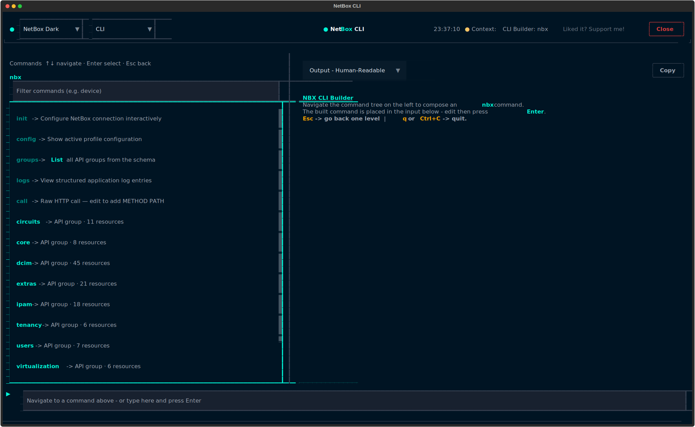
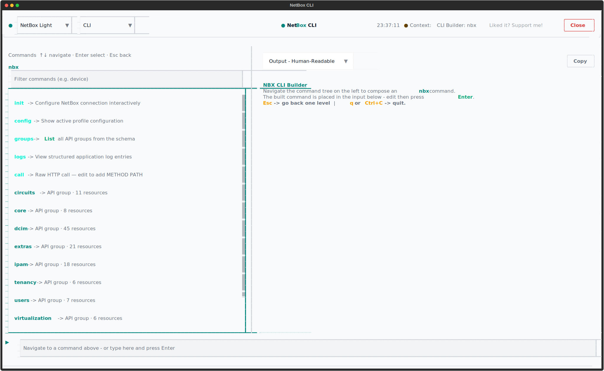
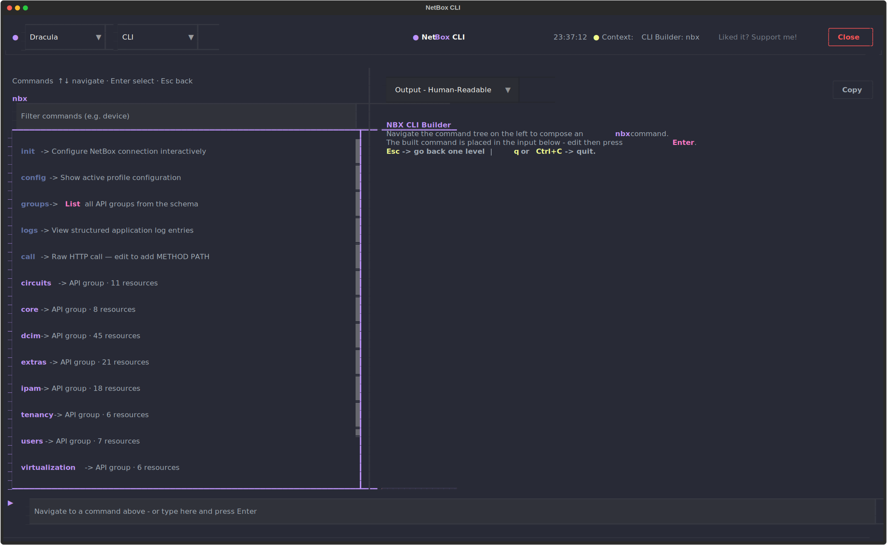
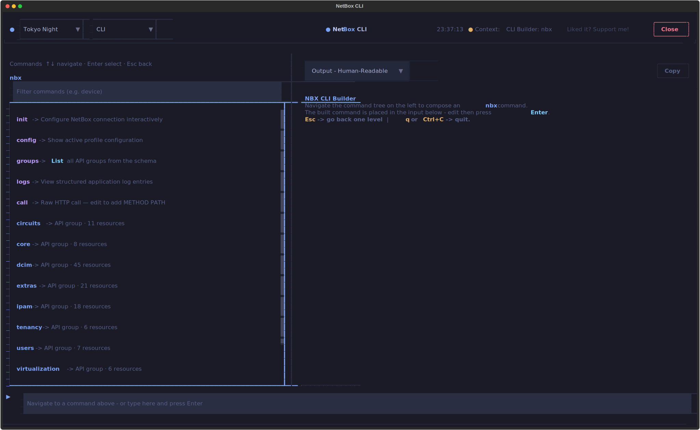
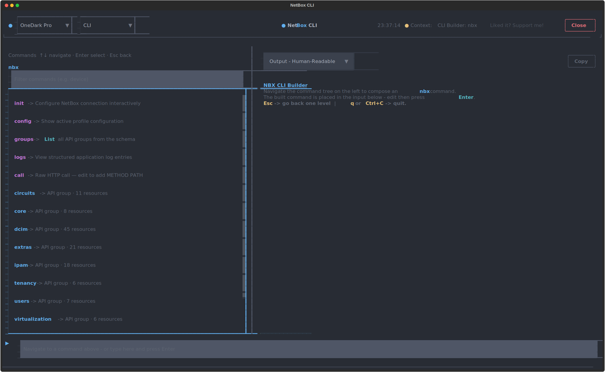

# Screenshots: CLI TUI

The CLI TUI is an interactive CLI interface with a command palette. It provides a rich terminal experience for executing `nbx` commands with real-time feedback, autocomplete suggestions, and visual command history. This combines the power of the CLI with the usability of a TUI.

## Launch Command

```bash
nbx cli tui
nbx cli tui --theme dracula
```

## Theme Selection

=== "NetBox Dark"

    

=== "NetBox Light"

    

=== "Dracula"

    

=== "Tokyo Night"

    

=== "One Dark Pro"

    
