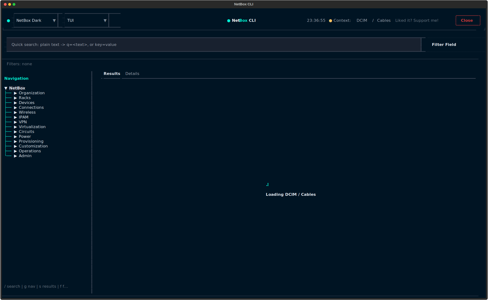
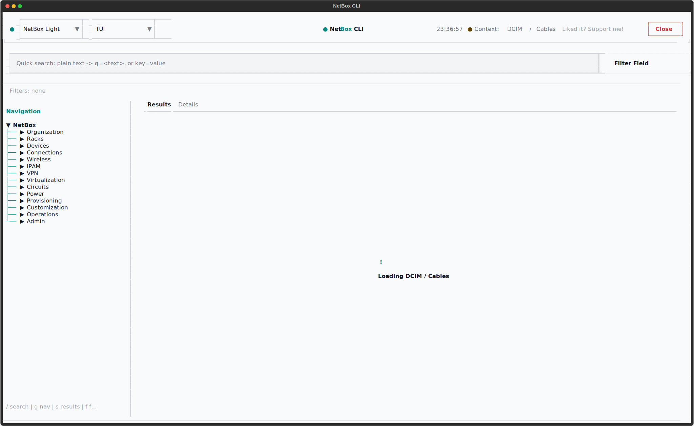
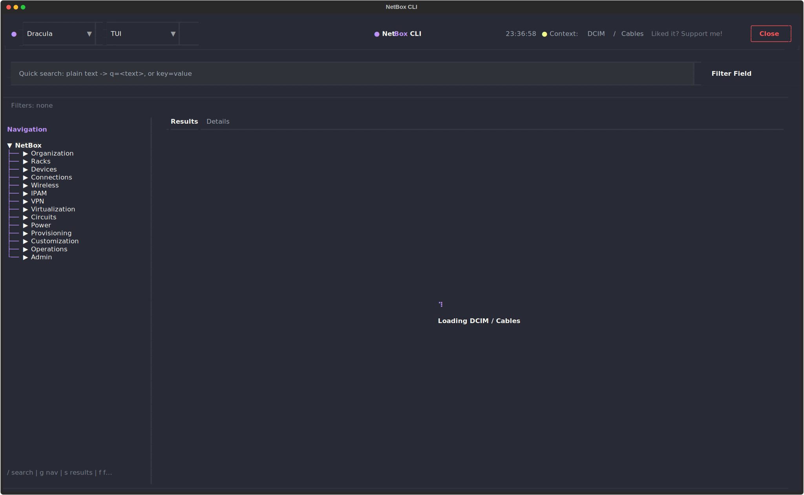
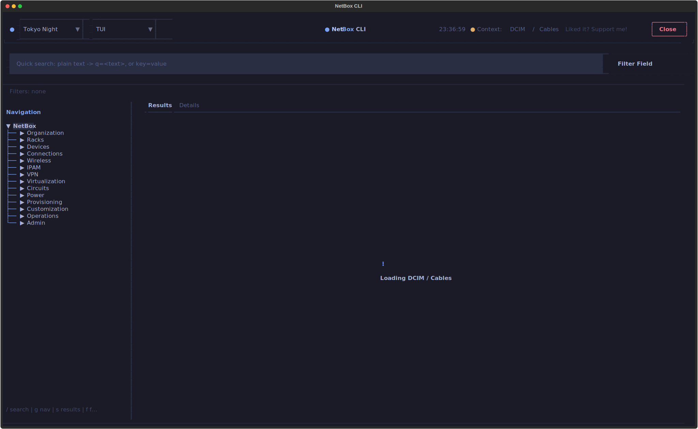
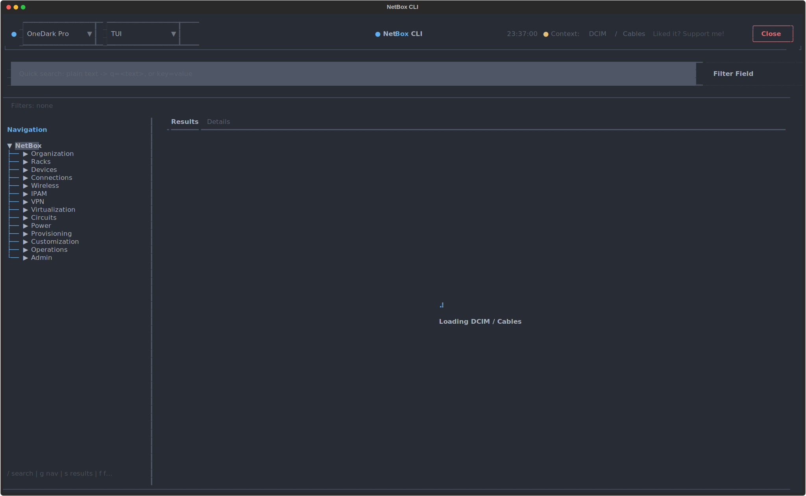

# Screenshots: Default TUI

The Default TUI is the main browsing interface for NetBox resources. It mirrors the NetBox web UI layout with a navigation tree on the left and a tabbed workspace in the center. The TUI discovers plugin resources dynamically and can browse any REST API under `/api/plugins/`.

## Launch Command

```bash
nbx tui                    # default profile
nbx demo tui               # demo profile (demo.netbox.dev)
nbx tui --theme dracula    # with specific theme
```

## Theme Selection

=== "NetBox Dark"

    

=== "NetBox Light"

    

=== "Dracula"

    

=== "Tokyo Night"

    

=== "One Dark Pro"

    