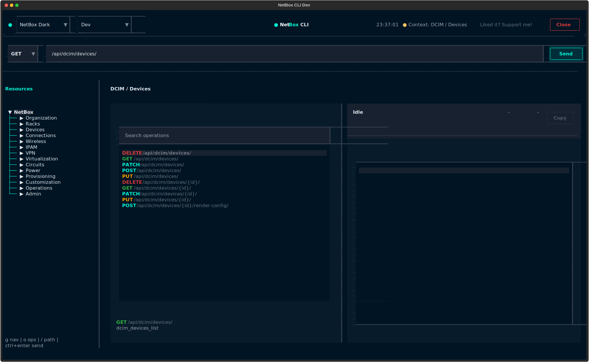
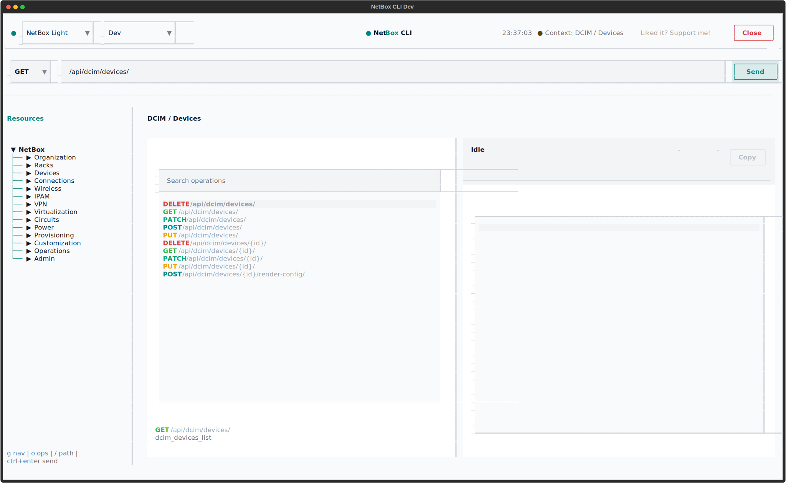
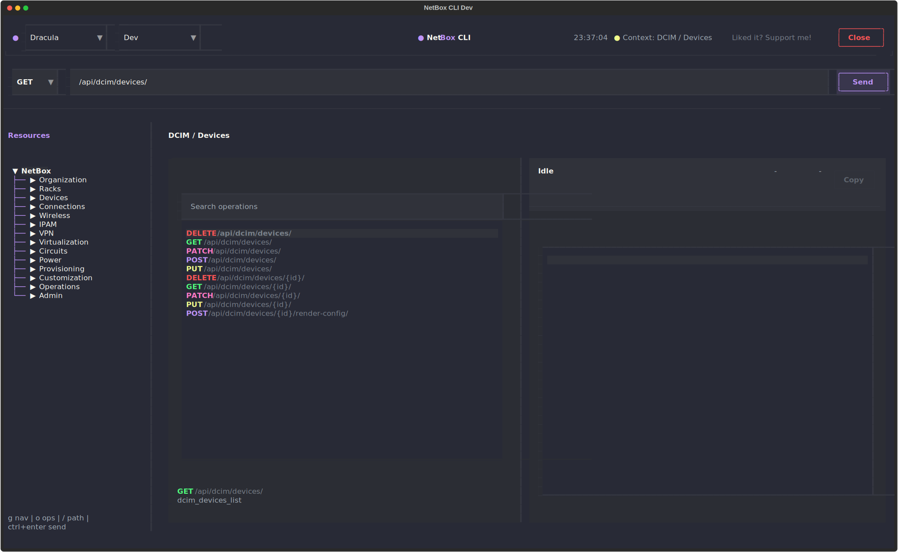
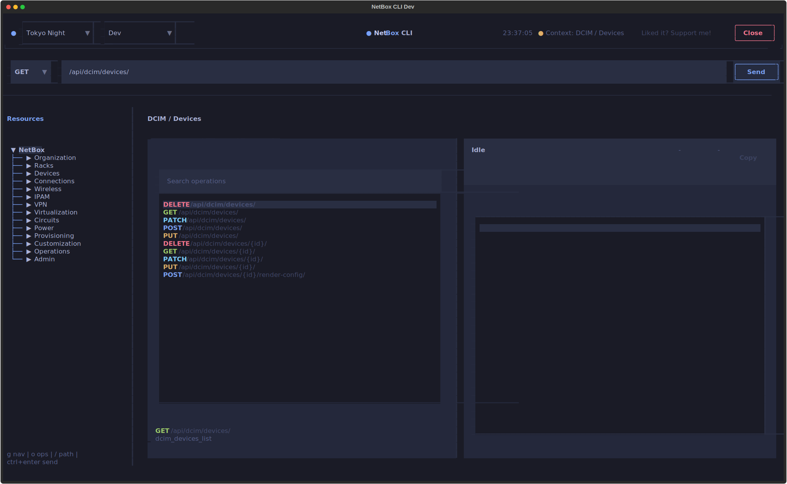
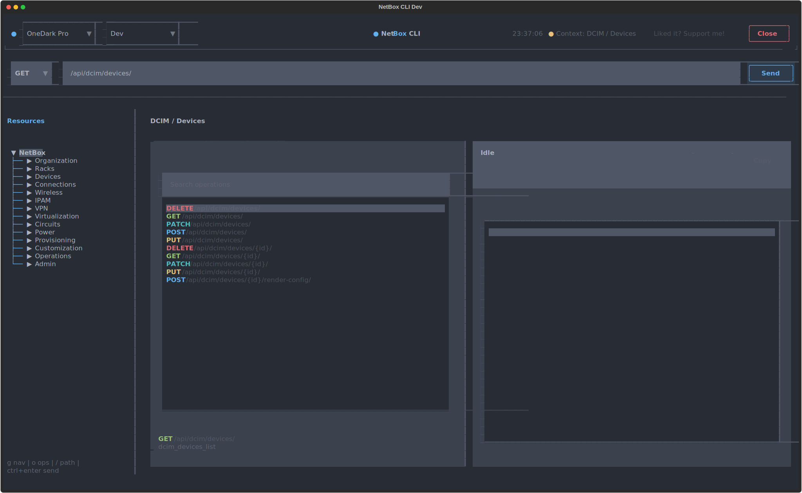

# Screenshots: Dev TUI

The Dev TUI is a developer request workbench for API exploration. It provides an interactive interface for testing and debugging NetBox API requests, examining responses, and exploring the OpenAPI schema. This is particularly useful for understanding how the API works and for developing integrations.

## Launch Command

```bash
nbx dev tui              # default profile
nbx demo dev tui        # demo profile (demo.netbox.dev)
nbx dev tui --theme dracula
```

## Theme Selection

=== "NetBox Dark"

    

=== "NetBox Light"

    

=== "Dracula"

    

=== "Tokyo Night"

    

=== "One Dark Pro"

    