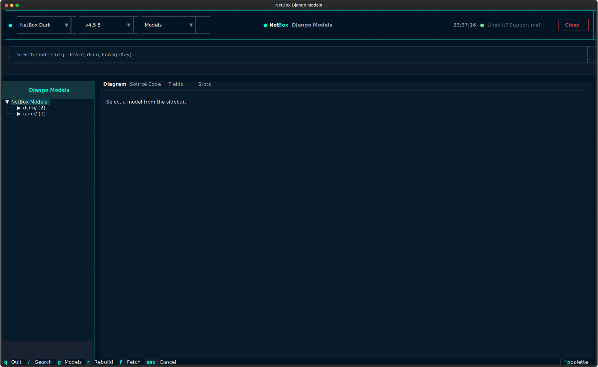
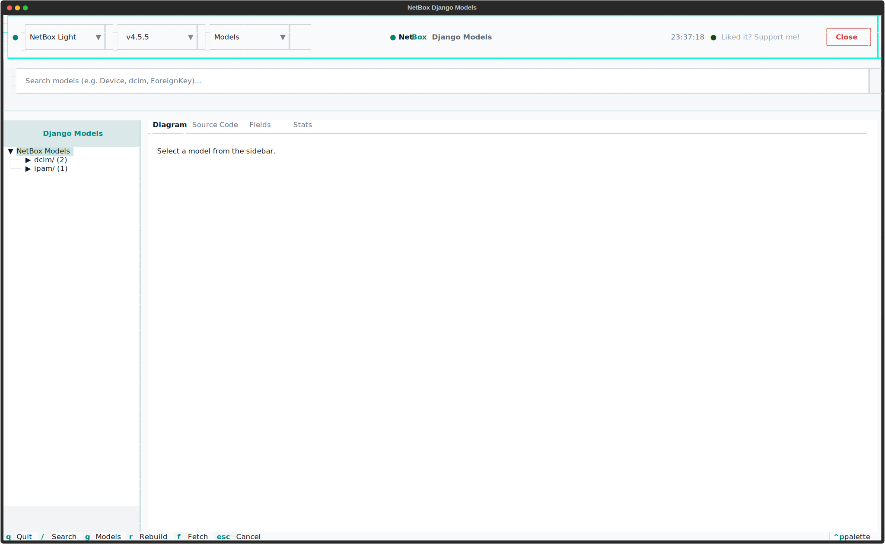
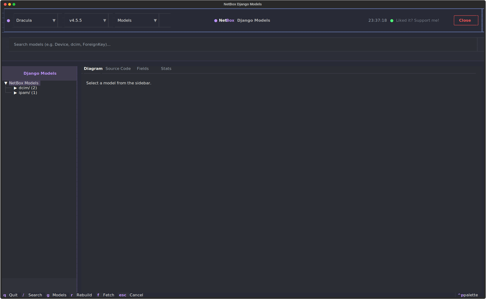
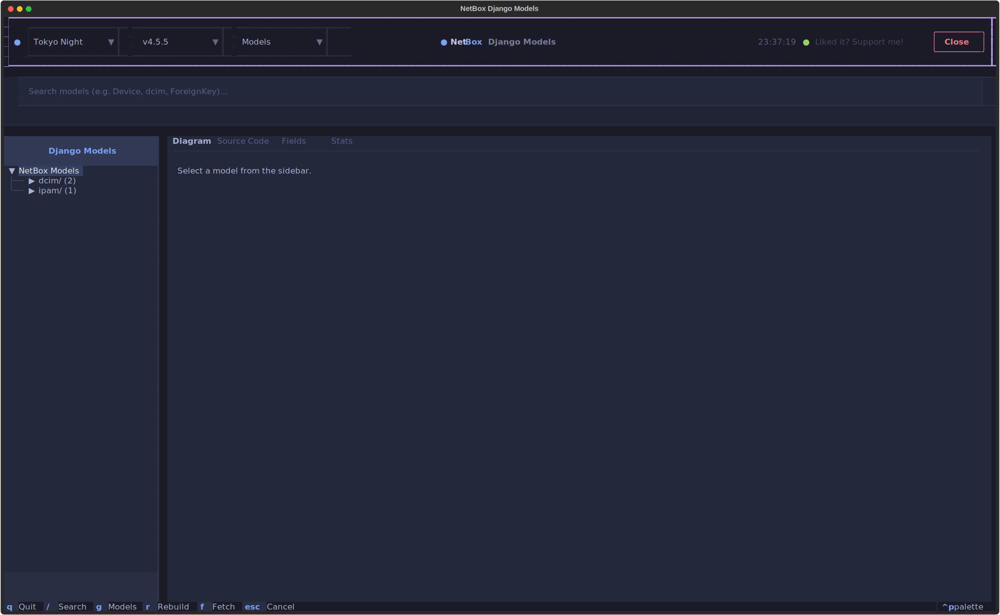
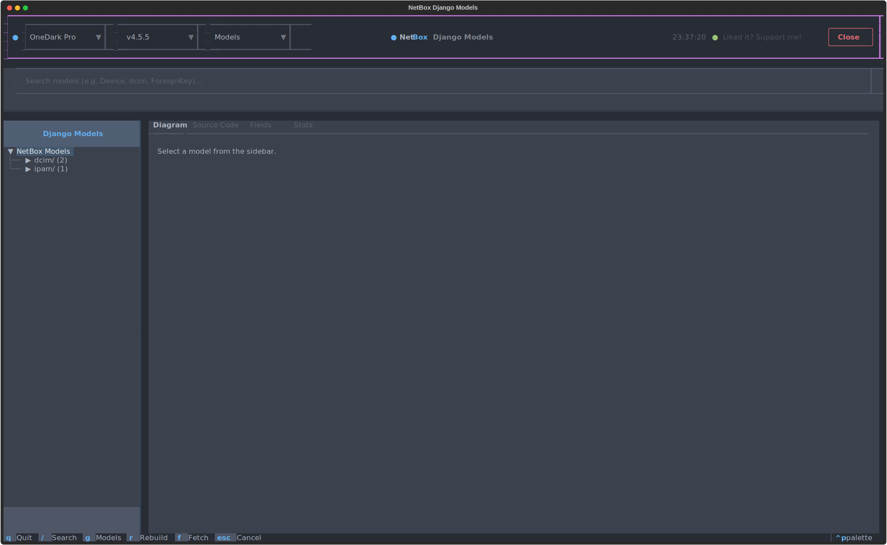

# Screenshots: Django Models Browser

The Django models browser is the contributor-oriented TUI for inspecting
NetBox's internal Django model graph, relationships, and source excerpts.

## Launch Command

```bash
nbx dev django-model tui
```

## Theme Selection

=== "NetBox Dark"

    

=== "NetBox Light"

    

=== "Dracula"

    

=== "Tokyo Night"

    

=== "One Dark Pro"

    
