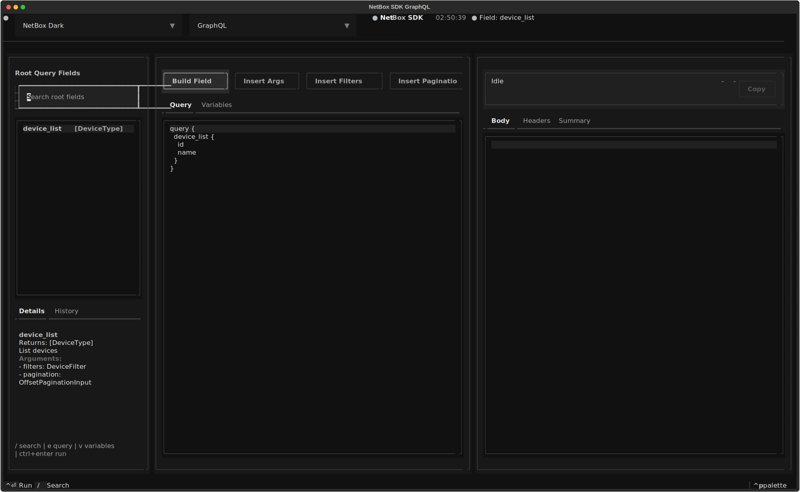
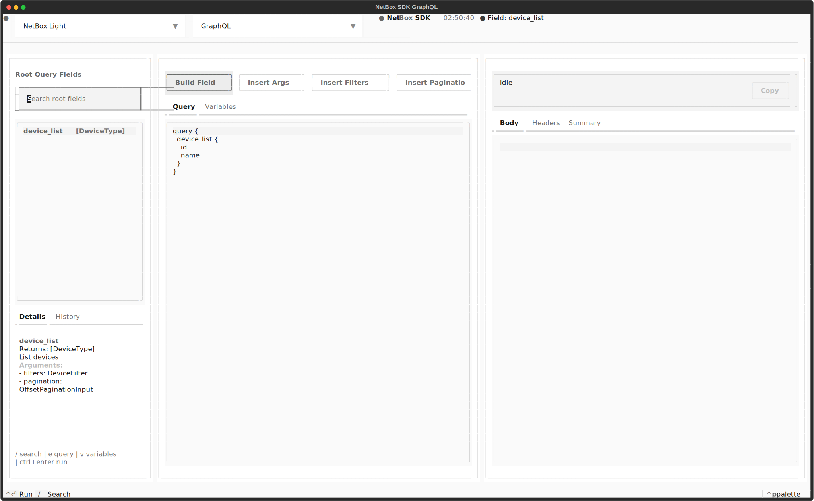
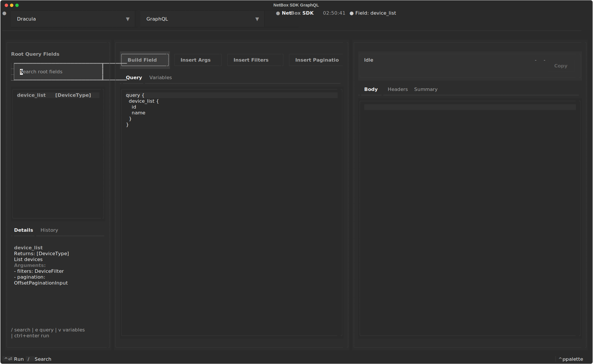
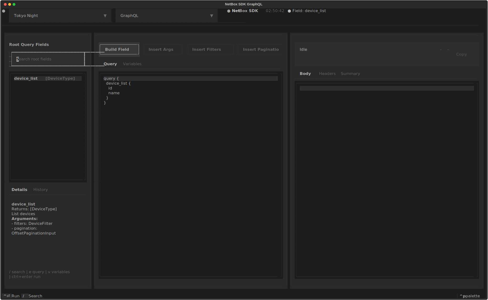
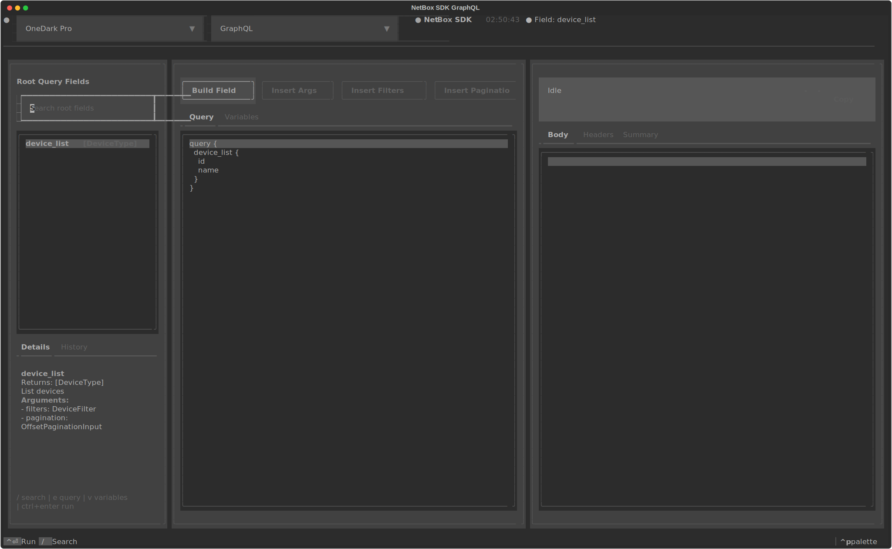

# Screenshots: GraphQL TUI

The GraphQL TUI is an interactive GraphQL explorer for NetBox. It combines live
schema browsing, guided query assembly, variables editing, and formatted
response viewing in a dedicated full-screen terminal interface.

## Launch Command

```bash
nbx graphql tui              # default profile
nbx demo graphql tui         # demo profile (demo.netbox.dev)
nbx graphql tui --theme dracula
```

## What the screenshots show

The screenshot harness seeds the GraphQL TUI with a deterministic introspection
payload and example query so the gallery stays stable across theme captures
while still representing the actual GraphQL TUI layout.

## Theme Selection

=== "NetBox Dark"

    

=== "NetBox Light"

    

=== "Dracula"

    

=== "Tokyo Night"

    

=== "One Dark Pro"

    
