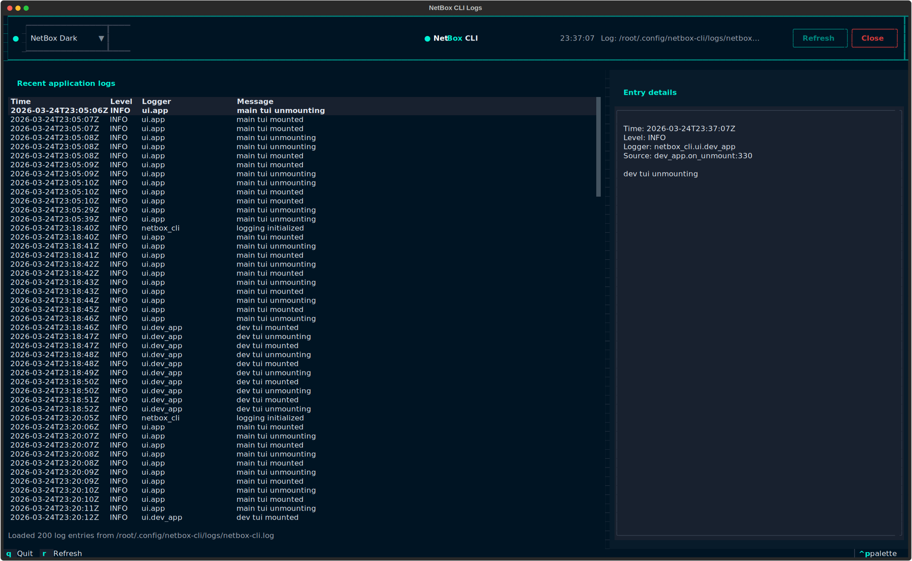
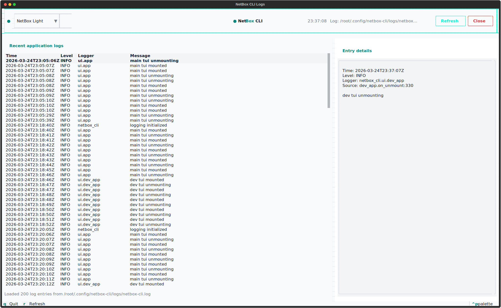
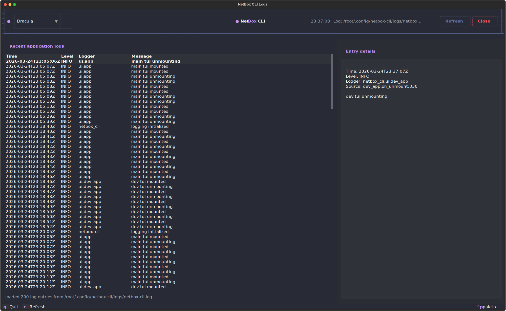
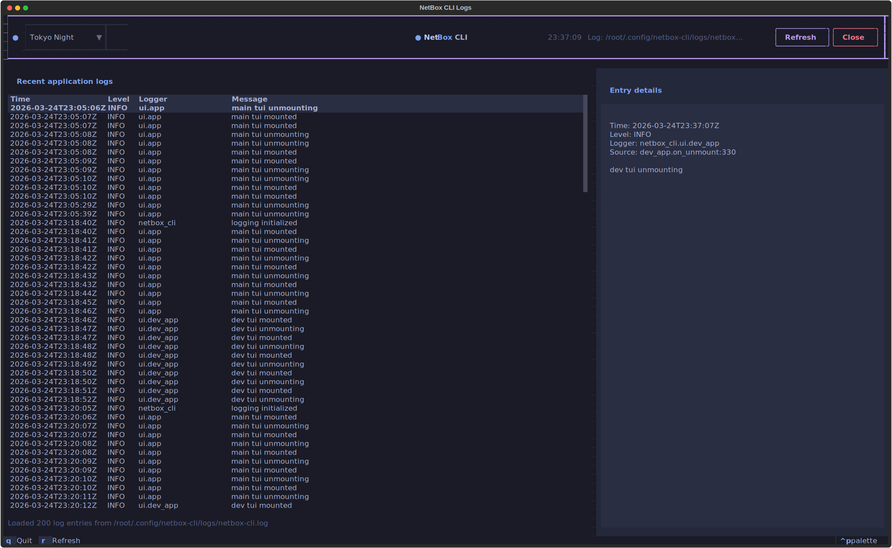
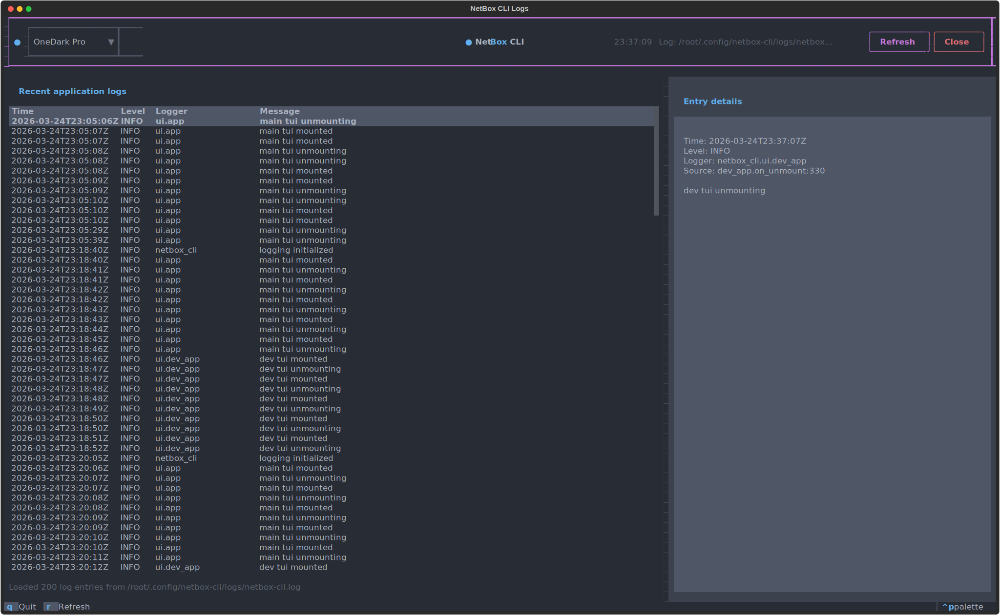

# Screenshots: Logs TUI

The Logs TUI is a log viewer for debugging and diagnostics. It provides a real-time view of application logs with filtering, search, and analysis capabilities. This is essential for troubleshooting issues, monitoring application behavior, and understanding system events.

## Launch Command

```bash
nbx logs tui
nbx logs tui --theme dracula
```

## Theme Selection

=== "NetBox Dark"

    

=== "NetBox Light"

    

=== "Dracula"

    

=== "Tokyo Night"

    

=== "One Dark Pro"

    